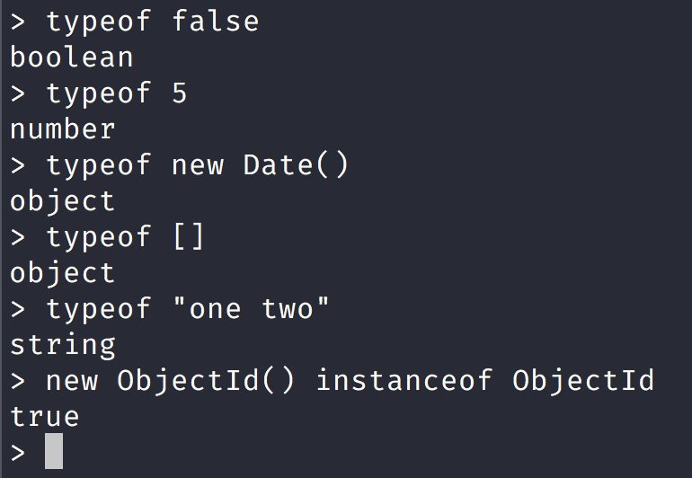
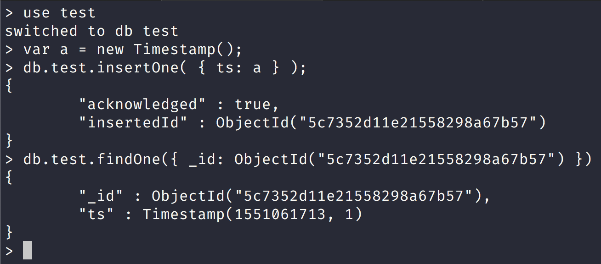
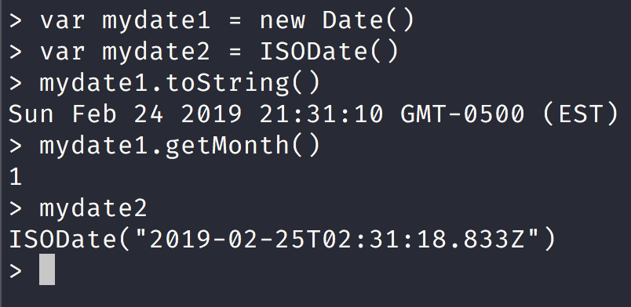

NoSQL Workshop - BSON Data Types

## Sections:

* [BSON Types](#bson-types)
* [ObjectId](#objectid)
* [String](#string)
* [Timestamps](#timestamps)
* [Date](#date)
* [Bread Crumb Navigation](#bread-crumb-navigation)

#### BSON Types

> BSON is a binary serialization format used to store documents and make remote procedure calls in MongoDB.

Each BSON type has both integer and string identifiers as listed in the following table:

| Type | Number | Alias | Notes |
| --- | --- | --- | --- |
| Double | 1 | "double" | None |
| String | 2 | "string" | None |
| Object | 3 | "object" | None |
| Array | 4	| "array"  | None |
| Binary data | 5 | binData"  | None |
| Undefined | 6	| "undefined" | Deprecated. |
| ObjectId | 7 | "objectId" | None |
| Boolean | 8 | "bool" | None |
| Date | 9	| "date" | None |
| Null | 10	| "null" | None |
| Regular Expression | 11 | "regex" | None |
| DBPointer | 12 | "dbPointer" | Deprecated. |
| JavaScript | 13 | "javascript" | None |
| Symbol | 14 | "symbol" | Deprecated. |
| JavaScript (with scope) | 15 | "javascriptWithScope" | None |
| 32-bit integer | 16 | "int" | None |
| Timestamp | 17 | "timestamp" | None |
| 64-bit integer | 18 | "long" | None |
| Decimal128 | | 19 | "decimal" New in version 3.4. | None |
| Min key | -1 | "minKey" | None |
| Max key | 127 | "maxKey" | None |

> You can use these values with the $type operator to query documents by their BSON type. The $type aggregation operator returns the type of an operator expression using one of the listed BSON type strings.

We can check the type using the mongo shell like this:

###### ObjectId

[ObjectId](https://docs.mongodb.com/manual/reference/bson-types/#objectid)

* * * > ObjectIds are small, likely unique, fast to generate, and ordered. ObjectId values consist of 12 bytes, where the first four bytes are a timestamp that reflect the ObjectId’s creation. Specifically:
* * * 
* * * * a 4-byte value representing the seconds since the Unix epoch,
* a 5-byte random value, and
* a 3-byte counter, starting with a random value.

> In MongoDB, each document stored in a collection requires a unique _id field that acts as a primary key. If an inserted document omits the _id field, the MongoDB driver automatically generates an ObjectId for the _id field.

This also applies to documents inserted through update operations with upsert: true.

MongoDB clients should add an _id field with a unique ObjectId. 

Using ObjectIds for the _id field provides the following additional benefits:

* in the mongo shell, you can access the creation time of the ObjectId, using the ObjectId.getTimestamp() method.

* sorting on an _id field that stores ObjectId values is roughly equivalent to sorting by creation time.

###### String

[String](https://docs.mongodb.com/manual/reference/bson-types/#string)

> BSON strings are UTF-8. In general, drivers for each programming language convert from the language’s string format to UTF-8 when serializing and deserializing BSON. This makes it possible to store most international characters in BSON strings with ease. In addition, MongoDB $regex queries support UTF-8 in the regex string.

###### Timestamps

[Timestamps](https://docs.mongodb.com/manual/reference/bson-types/#timestamps)

> BSON has a special timestamp type for internal MongoDB use and is not associated with the regular Date type. Timestamp values are a 64 bit value where:

* the first 32 bits are a time_t value (seconds since the Unix epoch)
* the second 32 bits are an incrementing ordinal for operations within a given second.

###### Date

[Date](https://docs.mongodb.com/manual/reference/bson-types/#date)

> BSON Date is a 64-bit integer that represents the number of milliseconds since the Unix epoch (Jan 1, 1970). This results in a representable date range of about 290 million years into the past and future.

> The official BSON specification refers to the BSON Date type as the UTC datetime.

#### Bread Crumb Navigation
_________________________

Previous | Next
:------- | ---:
← [BSON Specification](./bson-specification.md) | [Mongo Shell](./mongo-shell.md) →
