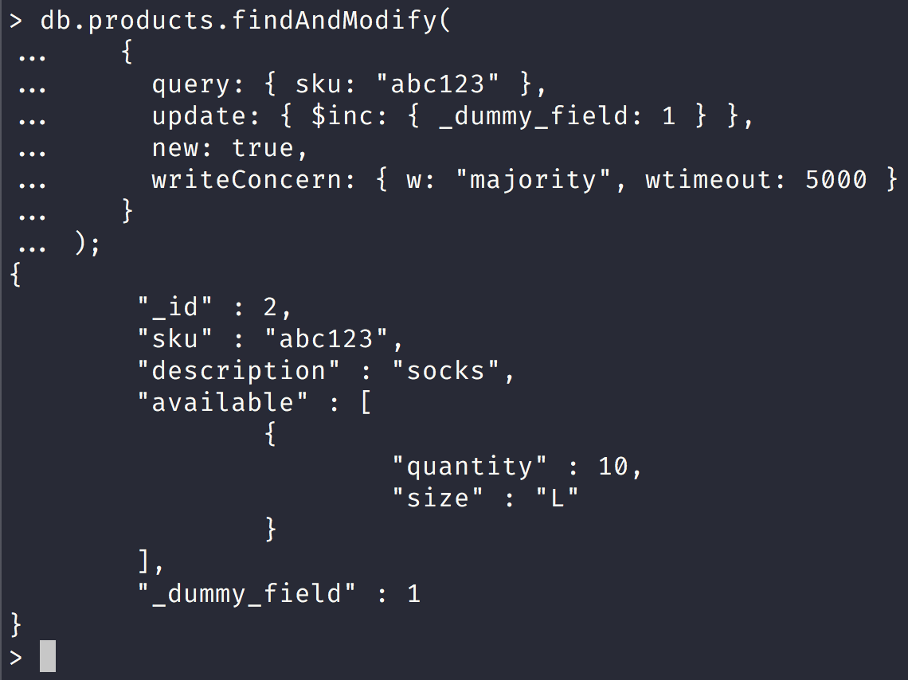
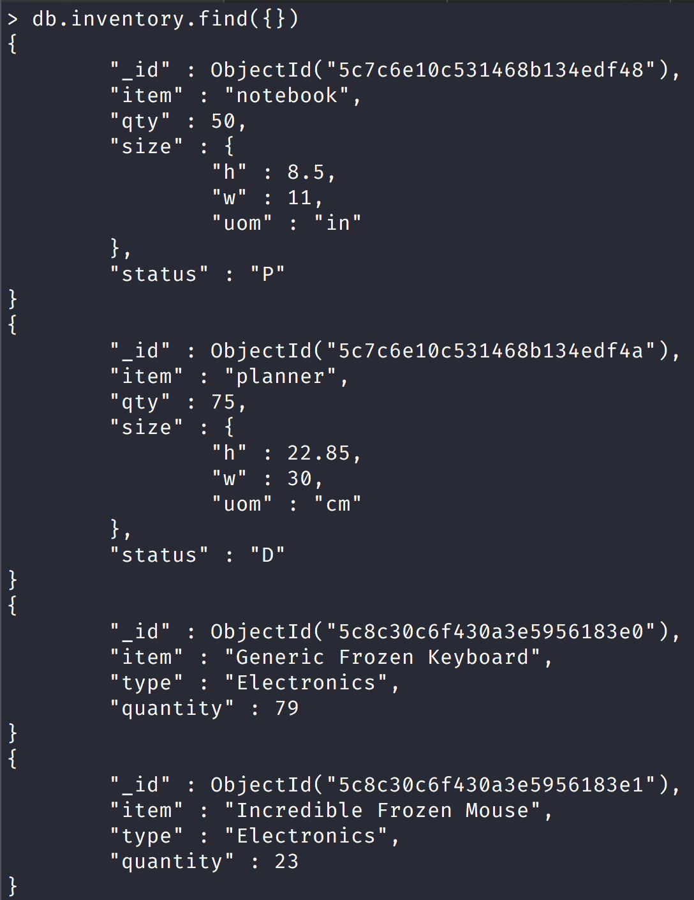

NoSQL Workshop - Mongo Crud Concepts

## Sections:

* [Atomicity and Transactions](#atomicity-and-transactions)
* [Read Isolation, Consistency, and Recency](#read-isolation\,-consistency,-and-recency)
* [Distributed Queries](#distributed-queries)
* [Linearizable Reads via findAndModify](#linearizable-reads-via-findandmodify)
* [Query Plans](#query-plans)
* [Query Optimization](#query-optimization)
* [Analyze Query Performance](#analyze-query-performance)
* [Write Operation Performance](#write-operation-performance)
* [Tailable Cursors](#tailable)
* [Bread Crumb Navigation](#bread-crumb-navigation)

###### Atomicity and Transactions

> In MongoDB, a write operation is atomic on the level of a single document, even if the operation modifies multiple embedded documents within a single document.

###### Multi-Document Transactions

> When a single write operation (e.g. db.collection.updateMany()) modifies multiple documents, the modification of each document is atomic, but the operation as a whole is not atomic.

> When performing multi-document write operations, whether through a single write operation or multiple write operations, other operations may interleave.

> Starting in version 4.0, for situations that require atomicity for updates to multiple documents or consistency between reads to multiple documents, MongoDB provides multi-document transactions for replica sets.

###### Concurrency Control

> Concurrency control allows multiple applications to run concurrently without causing data inconsistency or conflicts.

> One approach is to create a unique index on a field that can only have unique values. This prevents insertions or updates from creating duplicate data. Create a unique index on multiple fields to force uniqueness on that combination of field values. For examples of use cases, see update() and Unique Index and findAndModify() and Unique Index.


###### Read Isolation, Consistency, and Recency

Please read the offical docs at [Read Isolation Consistency Recency](https://docs.mongodb.com/manual/core/read-isolation-consistency-recency/)

###### Distributed Queries

Please read the official docs at [Distributed Queries](https://docs.mongodb.com/manual/core/distributed-queries/)

###### Linearizable Reads via findAndModify

Please run the following script to populate products collection:

```bash
mongo scripts/create-products-collection.js
```

[Perform Findandmodify Linearizable Reads](https://docs.mongodb.com/manual/tutorial/perform-findAndModify-linearizable-reads/#use-findandmodify-to-read-committed-data)

> Use the db.collection.findAndModify() method to make a trivial update to the document you want to read and return the modified document. A write concern of { w: "majority" } is required. To specify the document to read, you must use an exact match query that is supported by a unique index.



> The following findAndModify() operation specifies an exact match on the uniquely indexed field sku and increments the field named _dummy_field in the matching document. While not necessary, the write concern for this command also includes a wtimeout value of 5000 milliseconds to prevent the operation from blocking forever if the write cannot propagate to a majority of voting members.

> Even in situations where two nodes in the replica set believe that they are the primary, only one will be able to complete the write with w: "majority". As such, the findAndModify() method with "majority" write concern will be successful only when the client has connected to the true primary to perform the operation.

###### Query Plans

Please read the official docs at [Query Plans](https://docs.mongodb.com/manual/core/query-plans/)

###### Query Optimization

Please read the official docs at [Query Optimization](https://docs.mongodb.com/manual/core/query-optimization/)

###### Analyze Query Performance

[Evaluate The Performance Of A Query](https://docs.mongodb.com/manual/tutorial/analyze-query-plan/#evaluate-the-performance-of-a-query)

*Consider a collection inventory with the following documents:*



We can view the execution plan with no index by using the `.explain()` method:

```js
db.inventory.find({ 
    quantity: { 
        $gte: 50, $lte: 100 
    } 
}).explain("executionStats")
{
	"queryPlanner" : {
		"plannerVersion" : 1,
		"namespace" : "nosql_workshop.inventory",
		"indexFilterSet" : false,
		"parsedQuery" : {
			"$and" : [
				{
					"quantity" : {
						"$lte" : 100
					}
				},
				{
					"quantity" : {
						"$gte" : 50
					}
				}
			]
		},
		"winningPlan" : {
			"stage" : "COLLSCAN",
			"filter" : {
				"$and" : [
					{
						"quantity" : {
							"$lte" : 100
						}
					},
					{
						"quantity" : {
							"$gte" : 50
						}
					}
				]
			},
			"direction" : "forward"
		},
		"rejectedPlans" : [ ]
	},
	"executionStats" : {
		"executionSuccess" : true,
		"nReturned" : 23,
		"executionTimeMillis" : 0,
		"totalKeysExamined" : 0,
		"totalDocsExamined" : 52,
		"executionStages" : {
			"stage" : "COLLSCAN",
			"filter" : {
				"$and" : [
					{
						"quantity" : {
							"$lte" : 100
						}
					},
					{
						"quantity" : {
							"$gte" : 50
						}
					}
				]
			},
			"nReturned" : 23,
			"executionTimeMillisEstimate" : 0,
			"works" : 54,
			"advanced" : 23,
			"needTime" : 30,
			"needYield" : 0,
			"saveState" : 0,
			"restoreState" : 0,
			"isEOF" : 1,
			"invalidates" : 0,
			"direction" : "forward",
			"docsExamined" : 52
		}
	},
	"serverInfo" : {
		"host" : "dd931d64603e",
		"port" : 27017,
		"version" : "4.0.5",
		"gitVersion" : "3739429dd92b92d1b0ab120911a23d50bf03c412"
	},
	"ok" : 1
}
```

[Query With Index](https://docs.mongodb.com/manual/tutorial/analyze-query-plan/#query-with-index)

> To support the query on the quantity field, add an index on the quantity field:

```js
db.inventory.createIndex({ quantity: 1 })
```

Let us look at the execution plan for a query with an index now:

```js
db.inventory.find(
...    { quantity: { $gte: 50, $lte: 100 } }
... ).explain("executionStats")
{
	"queryPlanner" : {
		"plannerVersion" : 1,
		"namespace" : "nosql_workshop.inventory",
		"indexFilterSet" : false,
		"parsedQuery" : {
			"$and" : [
				{
					"quantity" : {
						"$lte" : 100
					}
				},
				{
					"quantity" : {
						"$gte" : 50
					}
				}
			]
		},
		"winningPlan" : {
			"stage" : "FETCH",
			"inputStage" : {
				"stage" : "IXSCAN",
				"keyPattern" : {
					"quantity" : 1
				},
				"indexName" : "quantity_1",
				"isMultiKey" : false,
				"multiKeyPaths" : {
					"quantity" : [ ]
				},
				"isUnique" : false,
				"isSparse" : false,
				"isPartial" : false,
				"indexVersion" : 2,
				"direction" : "forward",
				"indexBounds" : {
					"quantity" : [
						"[50.0, 100.0]"
					]
				}
			}
		},
		"rejectedPlans" : [ ]
	},
	"executionStats" : {
		"executionSuccess" : true,
		"nReturned" : 23,
		"executionTimeMillis" : 0,
		"totalKeysExamined" : 23,
		"totalDocsExamined" : 23,
		"executionStages" : {
			"stage" : "FETCH",
			"nReturned" : 23,
			"executionTimeMillisEstimate" : 0,
			"works" : 24,
			"advanced" : 23,
			"needTime" : 0,
			"needYield" : 0,
			"saveState" : 0,
			"restoreState" : 0,
			"isEOF" : 1,
			"invalidates" : 0,
			"docsExamined" : 23,
			"alreadyHasObj" : 0,
			"inputStage" : {
				"stage" : "IXSCAN",
				"nReturned" : 23,
				"executionTimeMillisEstimate" : 0,
				"works" : 24,
				"advanced" : 23,
				"needTime" : 0,
				"needYield" : 0,
				"saveState" : 0,
				"restoreState" : 0,
				"isEOF" : 1,
				"invalidates" : 0,
				"keyPattern" : {
					"quantity" : 1
				},
				"indexName" : "quantity_1",
				"isMultiKey" : false,
				"multiKeyPaths" : {
					"quantity" : [ ]
				},
				"isUnique" : false,
				"isSparse" : false,
				"isPartial" : false,
				"indexVersion" : 2,
				"direction" : "forward",
				"indexBounds" : {
					"quantity" : [
						"[50.0, 100.0]"
					]
				},
				"keysExamined" : 23,
				"seeks" : 1,
				"dupsTested" : 0,
				"dupsDropped" : 0,
				"seenInvalidated" : 0
			}
		}
	},
	"serverInfo" : {
		"host" : "dd931d64603e",
		"port" : 27017,
		"version" : "4.0.5",
		"gitVersion" : "3739429dd92b92d1b0ab120911a23d50bf03c412"
	},
	"ok" : 1
}
```

Now let us look at query with compound indexes of:

```js
db.inventory.createIndex({ quantity: 1, type: 1 });
db.inventory.createIndex({ type: 1, quantity: 1 });
```

Here is an explain query with a hint 

```js
db.inventory.find({ 
    quantity: { 
        $gte: 100, $lte: 300 
    }, 
    type: "food" 
}).hint({ quantity: 1, type: 1 }).explain("executionStats")
```

###### Tailable Cursors

Please read the official docs at [Tailable Cursors](https://docs.mongodb.com/manual/core/tailable-cursors/)

###### Bread Crumb Navigation
_________________________

Previous | Next
:------- | ---:
← [Mongo CRUD Operations Part III](./mongo-crud-operations-part3.md) | [MongoDB Aggregation](./mongodb-aggregation.md) →
