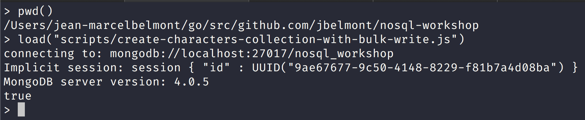

NoSQL Workshop - Mongo Crud Operations Part II

## Sections:

* [Bulk Write Operations](#bulk_write_operations)
* [Retryable Writes](#retryable_writes)
* [SQL to MongoDB Mapping Chart](#sql_to_mongodb_mapping_chart)
* [Text Search](#text_search)
* [Geospatial Queries](#geospatial_queries)
* [Read Isolation (Read Concern)](#read_isolation_(read_concern))
* [Write Acknowledgement (Write Concern)](#write_acknowledgement_(write_concern))
* [Bread Crumb Navigation](#bread-crumb-navigation)

*All of this information is gathered from the official mongodb docs in https://docs.mongodb.com/manual/crud/*

#### Bulk Write Operations

> MongoDB provides clients the ability to perform write operations in bulk. Bulk write operations affect a single collection. MongoDB allows applications to determine the acceptable level of acknowledgement required for bulk write operations.


###### Overview

> The db.collection.bulkWrite() method provides the ability to perform bulk insert, update, and remove operations. MongoDB also supports bulk insert through the db.collection.insertMany().

###### Ordered vs Unordered Operations

> Bulk write operations can be either ordered or unordered.

> With an ordered list of operations, MongoDB executes the operations serially. If an error occurs during the processing of one of the write operations, MongoDB will return without processing any remaining write operations in the list.

> With an unordered list of operations, MongoDB can execute the operations in parallel, but this behavior is not guaranteed. If an error occurs during the processing of one of the write operations, MongoDB will continue to process remaining write operations in the list.

> Executing an ordered list of operations on a sharded collection will generally be slower than executing an unordered list since with an ordered list, each operation must wait for the previous operation to finish.

*By default, bulkWrite() performs ordered operations. To specify unordered write operations, set ordered : false in the options document.*

###### bulkWrite() Methods

[bulkwrite methods](https://docs.mongodb.com/manual/core/bulk-write-operations/#bulkwrite-methods)

bulkWrite() supports the following write operations:

* insertOne
* updateOne
* updateMany
* replaceOne
* deleteOne
* deleteMany

*Each write operation is passed to bulkWrite() as a document in an array.*

For example, the following performs multiple write operations:

Let us run the following script in the mongo shell:

```js
"use strict";

db = connect("localhost:27017/nosql_workshop");

try {
    db.characters.bulkWrite(
       [
          { insertOne :
             {
                "document" :
                {
                   "_id" : 4, "char" : "Dithras", "class" : "barbarian", "lvl" : 4
                }
             }
          },
          { insertOne :
             {
                "document" :
                {
                   "_id" : 5, "char" : "Taeln", "class" : "fighter", "lvl" : 3
                }
             }
          },
          { updateOne :
             {
                "filter" : { "char" : "Eldon" },
                "update" : { $set : { "status" : "Critical Injury" } }
             }
          },
          { deleteOne :
             { "filter" : { "char" : "Brisbane"} }
          },
          { replaceOne :
             {
                "filter" : { "char" : "Meldane" },
                "replacement" : { "char" : "Tanys", "class" : "oracle", "lvl" : 4 }
             }
          }
       ]
    );
 } catch (e) {
    print(e);
 }
```

In a mongo shell session and assuming that you are in the nosql-workshop folder run the following command:



Since we ran this script in the mongo shell you won't see what happened but here is a summary:

```json
{
   "acknowledged" : true,
   "deletedCount" : 1,
   "insertedCount" : 2,
   "matchedCount" : 2,
   "upsertedCount" : 0,
   "insertedIds" : {
      "0" : 4,
      "1" : 5
   },
   "upsertedIds" : {

   }
}
```

#### SQL to MongoDB Mapping Chart

###### Terminology and Concepts

The following table presents the various SQL terminology and concepts and the corresponding MongoDB terminology and concepts.


| SQL | Terms/Concepts	MongoDB Terms/Concepts | 
| --- | --- |
| database | [database](https://docs.mongodb.com/manual/reference/glossary/#term-database) | 
| table | [collection](https://docs.mongodb.com/manual/reference/glossary/#term-collection) | 
| row | [document](https://docs.mongodb.com/manual/reference/glossary/#term-document) or [BSON](https://docs.mongodb.com/manual/reference/glossary/#term-bson) document | 
| column | [field](https://docs.mongodb.com/manual/reference/glossary/#term-field) | 
| index | [index](https://docs.mongodb.com/manual/reference/glossary/#term-index) | 
| table joins | [$lookup](https://docs.mongodb.com/manual/reference/operator/aggregation/lookup/#pipe._S_lookup), embedded documents | 
| primary key => Specify any unique column or column combination as primary key. | [primary key](https://docs.mongodb.com/manual/reference/glossary/#term-primary-key) => In MongoDB, the primary key is automatically set to the _id field. | 
| aggregation (e.g. group by) | aggregation pipeline => [See the SQL to Aggregation Mapping Chart](https://docs.mongodb.com/manual/reference/sql-aggregation-comparison/) | 
| transactions | [transactions](https://docs.mongodb.com/manual/core/transactions/) | 

###### Executables

[Executables](https://docs.mongodb.com/manual/reference/sql-comparison/#executables)

> The following table presents some database executables and the corresponding MongoDB executables. This table is not meant to be exhaustive.

| Type | MongoDB | MySQL | Oracle | Informix | DB2 | 
| --- | --- | --- | --- | --- | --- |
| Database Server |	mongod | mysqld | oracle | IDS | DB2 Server | 
| Database Client | mongo | mysql | sqlplus | DB-Access | DB2 Client | 


###### SQL to Mongo Shell Examples

Content

#### Text Search

Content

#### Geospatial Queries

Content

#### Read Isolation (Read Concern)

Content

#### Write Acknowledgement (Write Concern)

Content

#### Bread Crumb Navigation
_________________________

Previous | Next
:------- | ---:
← [Mongo CRUD Operations](./mongo-crud-operations.md) | [MongoDB Aggregation](./mongodb-aggregation.md) →
