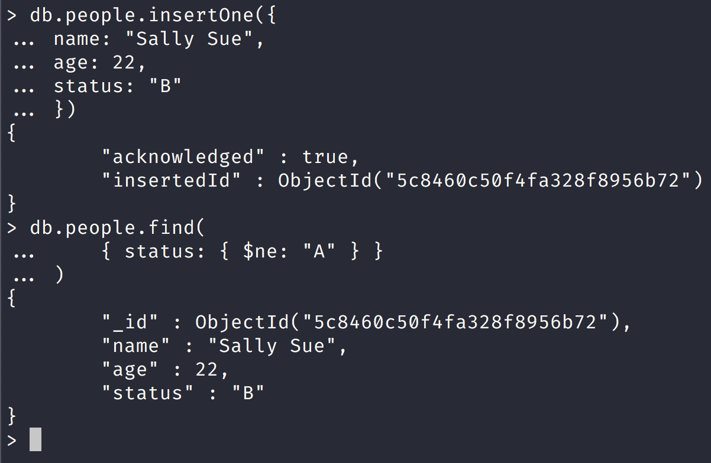
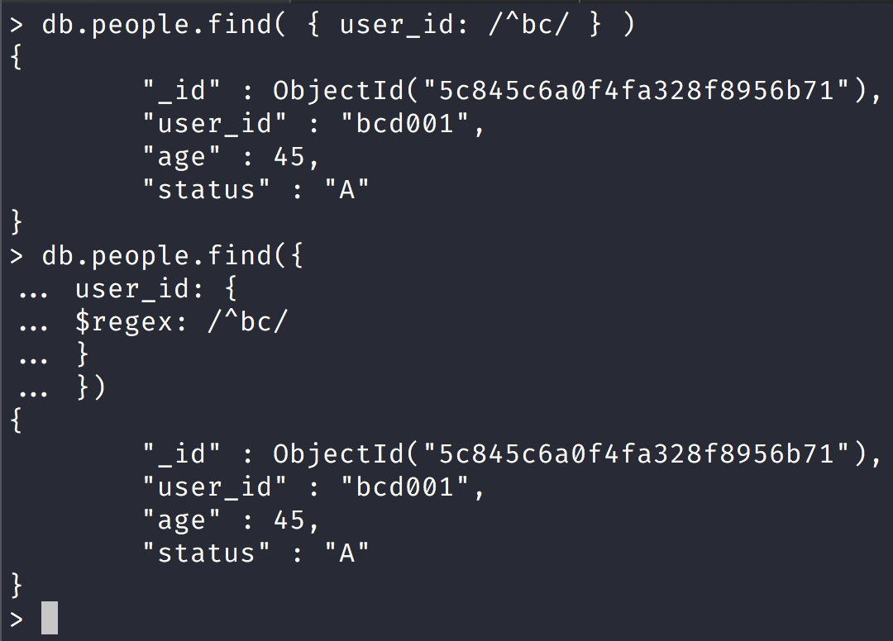

NoSQL Workshop - Mongo Crud Operations Part II

## Sections:

* [Bulk Write Operations](#bulk-write-operations)
* [Retryable Writes](#retryable-writes)
* [SQL to MongoDB Mapping Chart](#sql-to-mongodb-mapping-chart)
* [Bread Crumb Navigation](#bread-crumb-navigation)

*All of this information is gathered from the official mongodb docs in https://docs.mongodb.com/manual/crud/*

## Bulk Write Operations

> MongoDB provides clients the ability to perform write operations in bulk. Bulk write operations affect a single collection. MongoDB allows applications to determine the acceptable level of acknowledgement required for bulk write operations.


#### Overview

> The db.collection.bulkWrite() method provides the ability to perform bulk insert, update, and remove operations. MongoDB also supports bulk insert through the db.collection.insertMany().

#### Ordered vs Unordered Operations

> Bulk write operations can be either ordered or unordered.

> With an ordered list of operations, MongoDB executes the operations serially. If an error occurs during the processing of one of the write operations, MongoDB will return without processing any remaining write operations in the list.

> With an unordered list of operations, MongoDB can execute the operations in parallel, but this behavior is not guaranteed. If an error occurs during the processing of one of the write operations, MongoDB will continue to process remaining write operations in the list.

> Executing an ordered list of operations on a sharded collection will generally be slower than executing an unordered list since with an ordered list, each operation must wait for the previous operation to finish.

*By default, bulkWrite() performs ordered operations. To specify unordered write operations, set ordered : false in the options document.*

#### bulkWrite() Methods

[bulkwrite methods](https://docs.mongodb.com/manual/core/bulk-write-operations/#bulkwrite-methods)

bulkWrite() supports the following write operations:

* insertOne
* updateOne
* updateMany
* replaceOne
* deleteOne
* deleteMany

*Each write operation is passed to bulkWrite() as a document in an array.*

For example, the following performs multiple write operations:

Let us run the following script in the mongo shell:

```js
"use strict";

db = connect("localhost:27017/nosql_workshop");

try {
    db.characters.bulkWrite(
       [
          { insertOne :
             {
                "document" :
                {
                   "_id" : 4, "char" : "Dithras", "class" : "barbarian", "lvl" : 4
                }
             }
          },
          { insertOne :
             {
                "document" :
                {
                   "_id" : 5, "char" : "Taeln", "class" : "fighter", "lvl" : 3
                }
             }
          },
          { updateOne :
             {
                "filter" : { "char" : "Eldon" },
                "update" : { $set : { "status" : "Critical Injury" } }
             }
          },
          { deleteOne :
             { "filter" : { "char" : "Brisbane"} }
          },
          { replaceOne :
             {
                "filter" : { "char" : "Meldane" },
                "replacement" : { "char" : "Tanys", "class" : "oracle", "lvl" : 4 }
             }
          }
       ]
    );
 } catch (e) {
    print(e);
 }
```

In a mongo shell session and assuming that you are in the nosql-workshop folder run the following command:


Since we ran this script in the mongo shell you won't see what happened but here is a summary:

```json
{
   "acknowledged" : true,
   "deletedCount" : 1,
   "insertedCount" : 2,
   "matchedCount" : 2,
   "upsertedCount" : 0,
   "insertedIds" : {
      "0" : 4,
      "1" : 5
   },
   "upsertedIds" : {

   }
}
```

## SQL to MongoDB Mapping Chart

#### Terminology and Concepts

The following table presents the various SQL terminology and concepts and the corresponding MongoDB terminology and concepts.


| SQL | Terms/Concepts	MongoDB Terms/Concepts | 
| --- | --- |
| database | [database](https://docs.mongodb.com/manual/reference/glossary/#term-database) | 
| table | [collection](https://docs.mongodb.com/manual/reference/glossary/#term-collection) | 
| row | [document](https://docs.mongodb.com/manual/reference/glossary/#term-document) or [BSON](https://docs.mongodb.com/manual/reference/glossary/#term-bson) document | 
| column | [field](https://docs.mongodb.com/manual/reference/glossary/#term-field) | 
| index | [index](https://docs.mongodb.com/manual/reference/glossary/#term-index) | 
| table joins | [$lookup](https://docs.mongodb.com/manual/reference/operator/aggregation/lookup/#pipe._S_lookup), embedded documents | 
| primary key => Specify any unique column or column combination as primary key. | [primary key](https://docs.mongodb.com/manual/reference/glossary/#term-primary-key) => In MongoDB, the primary key is automatically set to the _id field. | 
| aggregation (e.g. group by) | aggregation pipeline => [See the SQL to Aggregation Mapping Chart](https://docs.mongodb.com/manual/reference/sql-aggregation-comparison/) | 
| transactions | [transactions](https://docs.mongodb.com/manual/core/transactions/) | 

#### Executables

[Executables](https://docs.mongodb.com/manual/reference/sql-comparison/#executables)

> The following table presents some database executables and the corresponding MongoDB executables. This table is not meant to be exhaustive.

| Type | MongoDB | MySQL | Oracle | Informix | DB2 | 
| --- | --- | --- | --- | --- | --- |
| Database Server |	mongod | mysqld | oracle | IDS | DB2 Server | 
| Database Client | mongo | mysql | sqlplus | DB-Access | DB2 Client | 


## SQL to Mongo Shell Examples

#### Create and Alter

###### SQL Schema Statements vs Mongo Schema

```sql
CREATE TABLE people (
    id MEDIUMINT NOT NULL AUTO_INCREMENT,
    user_id Varchar(30),
    age Number,
    status char(1),
    PRIMARY KEY (id)
)
```

###### MongoDB Schema Statements

```js
db.people.insertOne({
    user_id: "abc123",
    age: 55,
    status: "A"
})
```

Notice that in the screenshot below that mongodb implicitly created the _id field for us:


We can also directly create a new collection like this:

```js
db.createCollection("people2")
{ "ok" : 1 }
```

```sql
ALTER TABLE people
ADD join_date DATETIME
```

> Collections do not describe or enforce the structure of its documents; i.e. there is no structural alteration at the collection level.

> However, at the document level, updateMany() operations can add fields to existing documents using the $set operator.

Notice that in the screenshot below we modified 51 documents and set a new field of join_date

[images/mongo-set](../images/mongo-set.png)

```sql
ALTER TABLE people
DROP COLUMN join_date
```

> Collections do not describe or enforce the structure of its documents; i.e. there is no structural alteration at the collection level.

> However, at the document level, updateMany() operations can remove fields from documents using the $unset operator.

Notice in the screenshot below that we removed the join_date field from multiple documents:


```sql
CREATE INDEX idx_user_id_asc
ON people(user_id)
```

We can create indexes in mongodb like this:

`db.people.createIndex( { user_id: 1 } )`

Here is the ack document response:


```sql
CREATE INDEX idx_user_id_asc_age_desc
ON people(user_id, age DESC)
```

We can also create multiple indexes as well:

`db.people.createIndex( { user_id: 1, age: -1 } )`

```sql
DROP TABLE people
```

```js
db.people2.drop()
true
```

###### MongoDB Insert vs SQL Insert

```sql
INSERT INTO people(user_id, age, status)
VALUES ("bcd001", 45, "A")
```


###### SQL SELECT vs MongoDB Select find

```sql
SELECT *
FROM people
```


Notice in the screenshot above that the query returns everything!

```sql
SELECT id, user_id, status
FROM people
```


Notice that here we utilize mongo projections to get only certain fields!

```sql
SELECT user_id, status
FROM people
```


Notice that in the screenshot above that the default _id field was not returned!

```sql
SELECT *
FROM people
WHERE status = "A"
```

This sql example uses the where clause condition:


```sql
SELECT user_id, status
FROM people
WHERE status = "A"
```


Notice that here we use a filter condition and projection.

```sql
SELECT *
FROM people
WHERE status != "A"
```

Here we use negation sql example



Notice that in this screenshot we create a new document with a status of 'B' and then our query finds one result with the `$ne` operator.

```sql
SELECT *
FROM people
WHERE status = "A"
AND age = 50
```


Notice that in the screenshot above we just add another key/value pair for the and operation.

```sql
SELECT *
FROM people
WHERE status = "A"
OR age = 50
```


Notice that we specify the `$or` operator and our search will either return a status of 'A' or age = 50

```sql
SELECT *
FROM people
WHERE age > 25
```

Here our sql query is for any person with age greater than 25

```js
db.people.find(
    { age: { $gt: 25 } }
)
```

Here we use the `$gt` operator to find any persons greater than 25 in our query document.

```sql
SELECT *
FROM people
WHERE age < 25
```

Here our sql query looks for any person who is less than 25.

```js
db.people.find(
   { age: { $lt: 25 } }
)
```

```sql
SELECT *
FROM people
WHERE age > 25
AND   age <= 50
```

In this sql query we look for any person who is older than 25 but no older than 50 years old.

```js
db.people.find(
   { age: { $gt: 25, $lte: 50 } }
)
```

Notice here that we just add the `$gt` and `$lte` operators to do the same query in mongodb.

```sql
SELECT *
FROM people
WHERE user_id like "%bc%"
```

In this sql query we look for any user_id that has the letters bc in them such as `abc` `bc12` and so on.


Notice here that we use a regex pattern delineated by `//` in the screenshot above.


Notice that here we directly use the `$regex` operator.

```sql
SELECT *
FROM people
WHERE user_id like "bc%"
```

In this sql query we look for any user_id that begin with bc such as `bc123` and so on.



Notice in the screenshot above that we look only get one document back.

```sql
SELECT *
FROM people
WHERE status = "A"
ORDER BY user_id ASC
```

In this sql query we look for people with a status of A and then sort the results back in ascending order by user_id.


```sql
SELECT *
FROM people
WHERE status = "A"
ORDER BY user_id DESC
```


Notice that in this screenshot we got 2 documents with user_id at the top ordered in descending order.

```sql
SELECT COUNT(*)
FROM people
```

In this sql query we get the total count of people in the people table.


Notice that we can get the count by calling count directly on the people collection or by finding all the documents and then calling the count method in mongodb.

```sql
SELECT COUNT(user_id)
FROM people
```

In this sql query we get the total count of people with a user_id field.


Notice that we use a filter query document checking for the existence of the user_id field and pass that to the count method or we can pass this query filter document to the find method and then call count.

This is because the method `db.collection.count`:

```js
function (query, options) {
    query = this.find(query);

    // Apply options and return the result of the find
    return QueryHelpers._applyCountOptions(query, options).count(true);
}
```

*Notice that under the hood the count method calls the query method as well!*

```sql
SELECT COUNT(*)
FROM people
WHERE age > 30
```

In this sql query we get the count of all people who are over the age of 30.


Notice that in this screenshot we utilize the `$gt` operator in the find query document or in the count method.

```sql
SELECT DISTINCT(status)
FROM people
```

In this sql query we get only retrieve distinct status values from the people table.


Here we call the aggregate method and either use the `$group` operator or we can call the `distinct` method.

*db.collection.aggregate:*

```js
function (pipeline, aggregateOptions) {
    if (!(pipeline instanceof Array)) {
        // Support legacy varargs form. Also handles db.foo.aggregate().
        pipeline = Array.from(arguments);
        aggregateOptions = {};
    } else if (aggregateOptions === undefined) {
        aggregateOptions = {};
    }

    const cmdObj = this._makeCommand("aggregate", {pipeline: pipeline});

    return this._db._runAggregate(cmdObj, aggregateOptions);
}
```

Notice that the aggregate method will turn the pipeline into an array.

*db.people.distinct:*

```js
function (keyString, query, options) {
    var opts = Object.extend({}, options || {});
    var keyStringType = typeof keyString;
    var queryType = typeof query;

    if (keyStringType != "string") {
        throw new Error("The first argument to the distinct command must be a string but was a " +
                        keyStringType);
    }

    if (query != null && queryType != "object") {
        throw new Error("The query argument to the distinct command must be a document but was a " +
                        queryType);
    }

    // Distinct command
    var cmd = {distinct: this.getName(), key: keyString, query: query || {}};

    // Set maxTimeMS if provided
    if (opts.maxTimeMS) {
        cmd.maxTimeMS = opts.maxTimeMS;
    }

    if (opts.collation) {
        cmd.collation = opts.collation;
    }

    // Execute distinct command
    var res = this.runReadCommand(cmd);
    if (!res.ok) {
        throw _getErrorWithCode(res, "distinct failed: " + tojson(res));
    }

    return res.values;
}
```

Notice that distinct is the key we pass into it.

```sql
SELECT *
FROM people
LIMIT 1
```

In this sql query we select all fields from the people table and only return one result.


Here we have 2 ways to return one result, we can call `.findOne` or call the limit method and pass one.

```sql
SELECT *
FROM people
LIMIT 5
SKIP 10
```

In this sql query we select all rows in the people table and return 5 results and skip the first 10.

```js
> db.people.find().limit(5)
{
	"_id" : ObjectId("5c8451d7823b98ccd9efabb6"),
	"name" : "Erica Johnson",
	"age" : 25,
	"status" : "A"
}
{
	"_id" : ObjectId("5c8451d7823b98ccd9efabb7"),
	"name" : "Delta Sauer",
	"age" : 26,
	"status" : "A"
}
{
	"_id" : ObjectId("5c8451d7823b98ccd9efabb8"),
	"name" : "Donna Green",
	"age" : 27,
	"status" : "A"
}
{
	"_id" : ObjectId("5c8451d7823b98ccd9efabb9"),
	"name" : "Aniya Hammes",
	"age" : 28,
	"status" : "A"
}
{
	"_id" : ObjectId("5c8451d7823b98ccd9efabba"),
	"name" : "Jeanette Deckow",
	"age" : 29,
	"status" : "A"
}
> db.people.find().limit(5).skip(10)
{
	"_id" : ObjectId("5c8451d7823b98ccd9efabc0"),
	"name" : "Jordyn McClure",
	"age" : 35,
	"status" : "A"
}
{
	"_id" : ObjectId("5c8451d7823b98ccd9efabc1"),
	"name" : "Gunner Huels",
	"age" : 36,
	"status" : "A"
}
{
	"_id" : ObjectId("5c8451d7823b98ccd9efabc2"),
	"name" : "Lura Gaylord",
	"age" : 37,
	"status" : "A"
}
{
	"_id" : ObjectId("5c8451d7823b98ccd9efabc3"),
	"name" : "Adolfo Donnelly",
	"age" : 38,
	"status" : "A"
}
{
	"_id" : ObjectId("5c8451d7823b98ccd9efabc4"),
	"name" : "Rico Abbott",
	"age" : 39,
	"status" : "A"
}
```

Notice here that we start at 35 when we pass in 10 to the skip method because it skips the first 10 documents in mongodb.

*db.collection.find().skip() definition:*

```js
function (skip) {
    this._checkModify();
    this._skip = skip;
    return this;
}
```

The method definition of the skip method.

```sql
EXPLAIN SELECT *
FROM people
WHERE status = "A"
```

The EXPLAIN keyword is used throughout various SQL databases and provides information about how your SQL database executes a query. 

In MySQL and in PostgresSQL:

* EXPLAIN can be used in front of a query beginning with SELECT, INSERT, DELETE, REPLACE, and UPDATE.

So in the sql query above we are getting the query execution plan for the select query.


###### SQL Update vs Mongo Update 

```sql
UPDATE people
SET status = "C"
WHERE age > 25
```

In this sql query we update all people that have status of "C" and whose age > 25


Here we set all the mongoDB documents for all the people who are over the age of 25 and set the status to "C".

```sql
UPDATE people
SET age = age + 3
WHERE status = "A"
```

In this sql query we increment the age by 3 for people whose status is "A"


Here we increment only one person age by 3.

###### SQL Delete vs Mongo Delete

```sql
DELETE FROM people
WHERE status = "D"
```

In this sql query we delete all people whose status is "D"


In the screenshot above we insert 2 new documents in the people collection and then remove the new documents by passing in a filter in the delete method.

```sql
DELETE FROM people
```

In this sql query we delete all the people from the people table.


Notice in the screenshot that we deleted every document in the people collection so be careful using deleteMany and pass a filter query or if you know what you are doing then execute it.

#### Bread Crumb Navigation
_________________________

Previous | Next
:------- | ---:
← [Mongo CRUD Operations](./mongo-crud-operations.md) | [Mongo CRUD Operations Part III](./mongo-crud-operations-part3.md) →