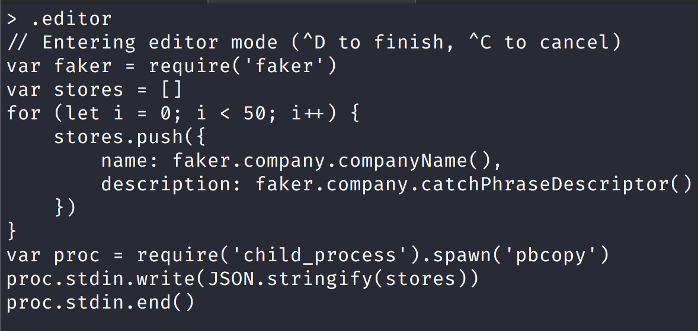
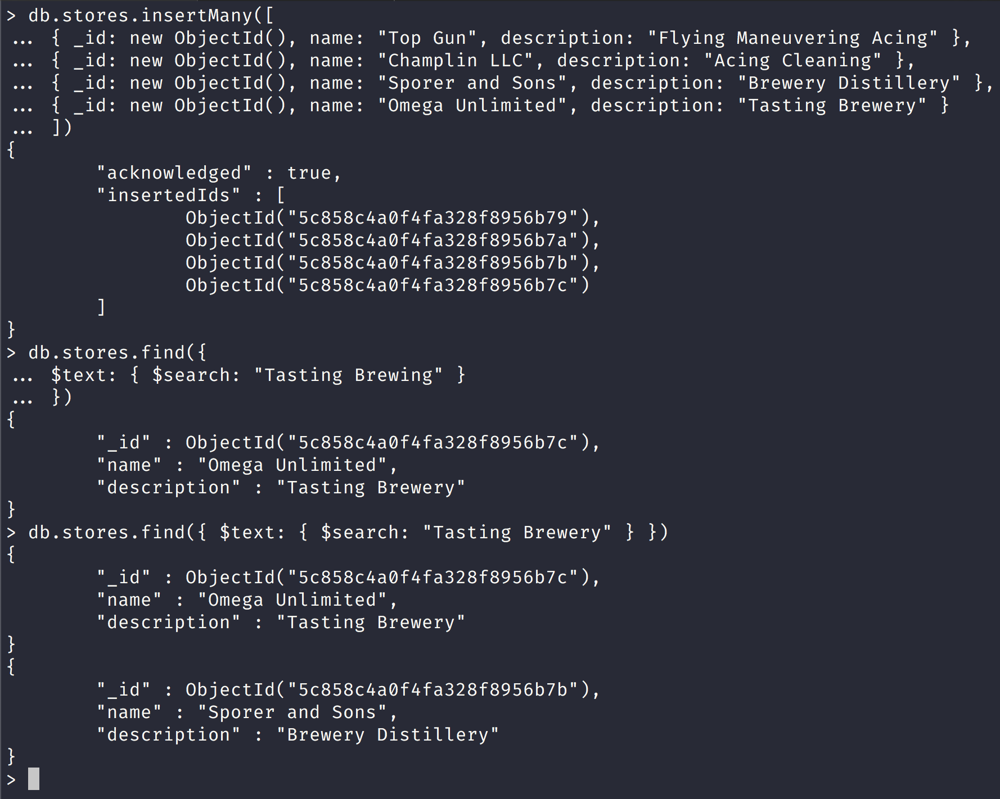
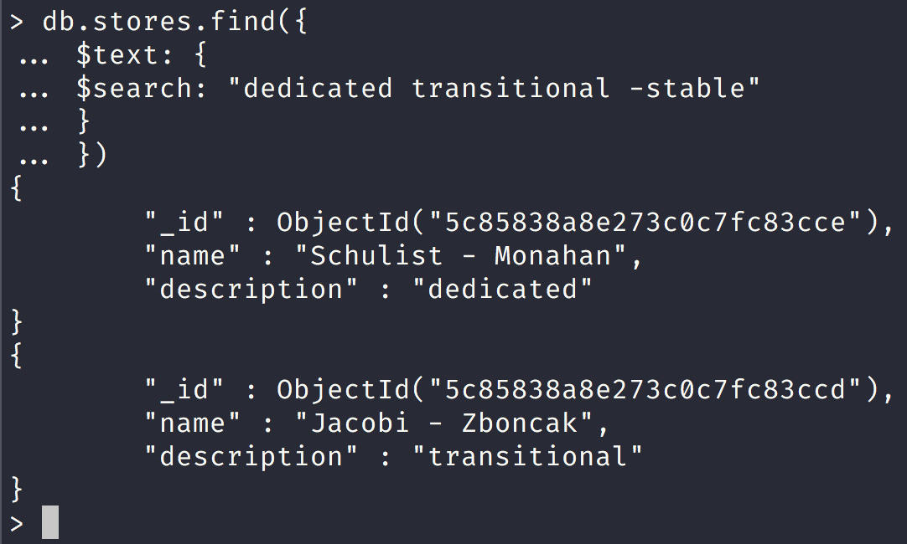
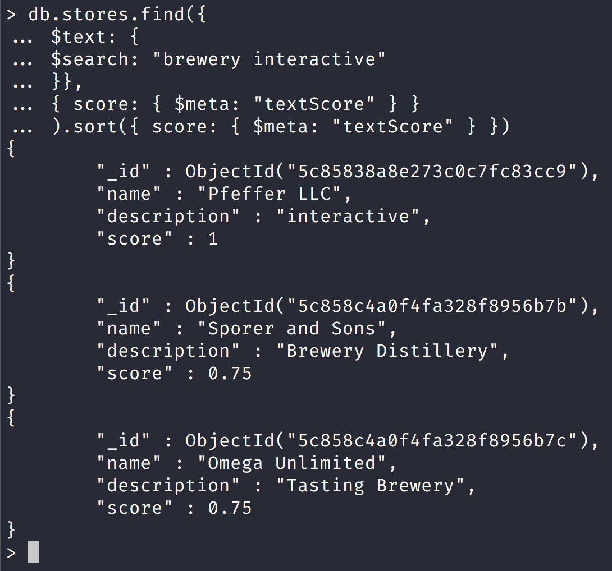
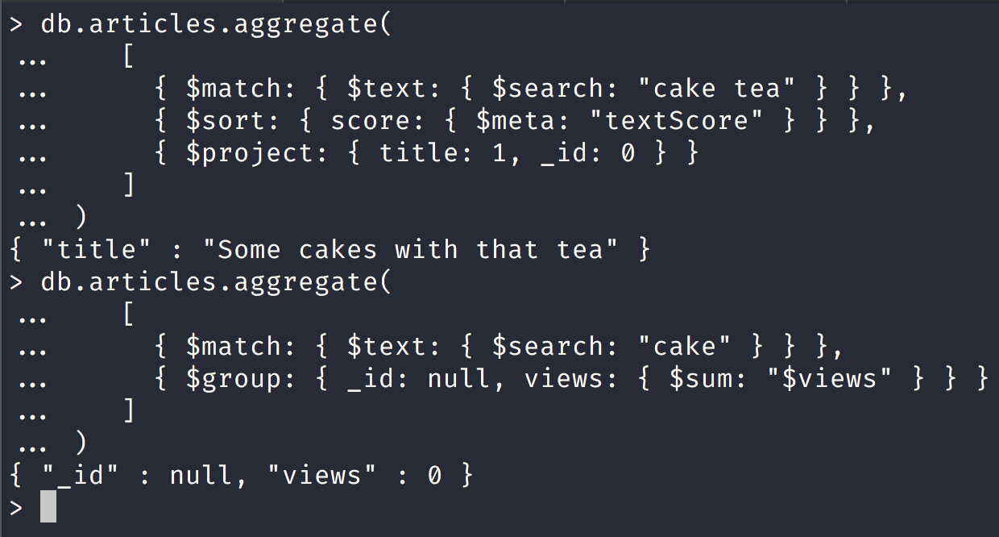
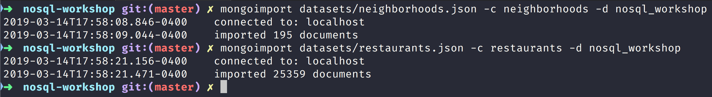
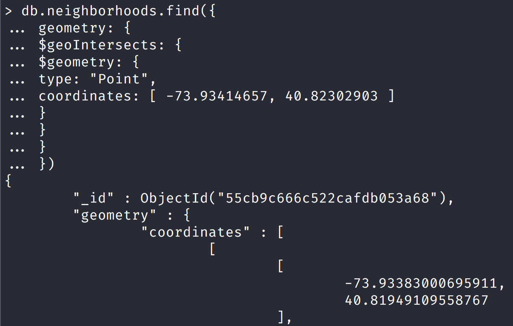
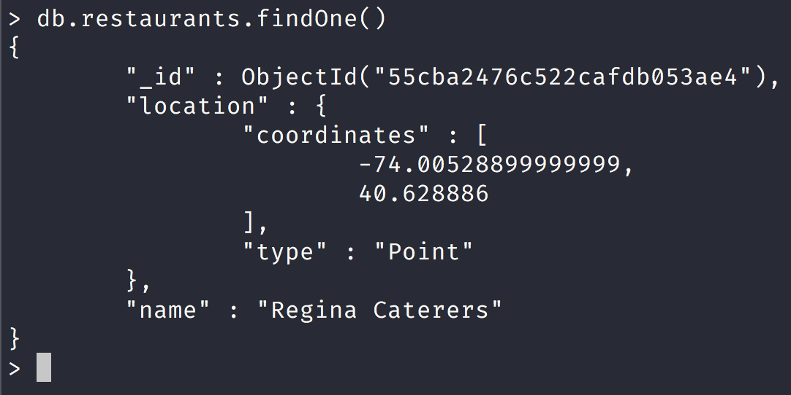

NoSQL Workshop - Mongo Crud Operations Part III

## Sections:

* [Text Search](#text_search)
* [Geospatial Queries](#geospatial_queries)
* [Read Isolation (Read Concern)](#read_isolation_(read_concern))
* [Write Acknowledgement (Write Concern)](#write_acknowledgement_(write_concern))
* [Bread Crumb Navigation](#bread-crumb-navigation)

*All of this information is gathered from the official mongodb docs in https://docs.mongodb.com/manual/crud/*

#### Text Search

MongoDB supports query operations that perform a text search of string content. 

To perform text search, MongoDB uses a text index and the $text operator.

###### Mongo Script to populate stores collection

We will create a new stores collection and use the node.js repl and faker.js to generate dummy data.



We will then use the data in the system clipboard and use the following script to populate the new stores collection:

```js
"use strict";

let db = connect("localhost:27017/nosql_workshop");

let stores = [
    {"name":"Quigley - Gutmann","description":"well-modulated"},{"name":"Christiansen LLC","description":"attitude-oriented"},{"name":"Streich - Larkin","description":"multimedia"},{"name":"Homenick - Rau","description":"methodical"},{"name":"Beatty, Schmitt and Daugherty","description":"content-based"},{"name":"Leannon - Kuvalis","description":"background"},{"name":"Schiller and Sons","description":"coherent"},{"name":"Leffler, Schamberger and Little","description":"bi-directional"},{"name":"Feeney Group","description":"discrete"},{"name":"Blick Group","description":"tertiary"},{"name":"Mohr Group","description":"analyzing"},{"name":"Marquardt - Mosciski","description":"stable"},{"name":"Pfeffer LLC","description":"interactive"},{"name":"Berge, Skiles and Nienow","description":"zero defect"},{"name":"Hansen - Eichmann","description":"human-resource"},{"name":"Osinski - Yost","description":"context-sensitive"},{"name":"Jacobi - Zboncak","description":"transitional"},{"name":"Schulist - Monahan","description":"dedicated"},{"name":"Mills - Harvey","description":"needs-based"},{"name":"Cummings Inc","description":"6th generation"},{"name":"Sporer Group","description":"mission-critical"},{"name":"Breitenberg, Hane and Auer","description":"grid-enabled"},{"name":"Marquardt - Orn","description":"maximized"},{"name":"Wintheiser - Grimes","description":"full-range"},{"name":"Frami, Wolff and White","description":"stable"},{"name":"Collier - Waelchi","description":"executive"},{"name":"Homenick LLC","description":"next generation"},{"name":"Shields, Oberbrunner and Johnson","description":"modular"},{"name":"Bashirian Inc","description":"uniform"},{"name":"Erdman Inc","description":"zero tolerance"},{"name":"Zieme - Grant","description":"neutral"},{"name":"Breitenberg - O'Connell","description":"optimizing"},{"name":"Schumm, Kuhn and Streich","description":"maximized"},{"name":"McClure, Grant and Kuhlman","description":"global"},{"name":"Miller - Flatley","description":"client-server"},{"name":"Zieme, Bauch and Ziemann","description":"5th generation"},{"name":"Altenwerth Inc","description":"actuating"},{"name":"Quitzon Inc","description":"value-added"},{"name":"Douglas - Schiller","description":"eco-centric"},{"name":"Breitenberg - Oberbrunner","description":"static"},{"name":"Jacobs - Kub","description":"24/7"},{"name":"Aufderhar, Nikolaus and Breitenberg","description":"intermediate"},{"name":"Leannon, Crist and Weimann","description":"optimal"},{"name":"Brown - Lind","description":"clear-thinking"},{"name":"Hudson - Schroeder","description":"needs-based"},{"name":"Frami and Sons","description":"asynchronous"},{"name":"Padberg Inc","description":"grid-enabled"},{"name":"Heathcote - Spinka","description":"mission-critical"},{"name":"Little, Thompson and Lockman","description":"clear-thinking"},{"name":"Johnston Inc","description":"solution-oriented"}
];

stores.map(store => {
    db.stores.insertOne({
        _id: new ObjectId(),
        name: store.name,
        description: store.description
    });
});
```

Remember to run the script from the root of the github repository and run it like this:

```bash
mongo scripts/create-stores-collection.js
```

You should have 50 store documents in the stores collection now which you can confirm with the following query:

```js
db.stores.count()
50
```

###### Text Index

[Text Index](https://docs.mongodb.com/manual/text-search/#text-index)

> MongoDB provides text indexes to support text search queries on string content. Text indexes can include any field whose value is a string or an array of string elements.

> To perform text search queries, you must have a text index on your collection. A collection can only have one text search index, but that index can cover multiple fields.


* Notice that the stores collection already had an index. 

* Each MongoDB collection has a default index on the _id field by default. 

* So that is why we now have 2 indexes on the stores collection.

###### $text operator

[Text Operator](https://docs.mongodb.com/manual/text-search/#text-operator)

Now that we have created a text index with the previous mongoDB command we can actually use the text index by using the $text query operator to perform text searches on a collection with a text index.

> $text will tokenize the search string using whitespace and most punctuation as delimiters, and perform a logical OR of all such tokens in the search string.


Notice that here we use the [$text operator](https://docs.mongodb.com/manual/reference/operator/query/text/#op._S_text) and the [$search operator](https://docs.mongodb.com/manual/reference/operator/query/text/#op._S_text)

We get only one search result with the text search of "multimedia".

| Field | Type | Description | 
| --- | --- | --- |
| `$search` | string | A string of terms that MongoDB parses and uses to query the text index. MongoDB performs a logical OR search of the terms unless specified as a phrase. See Behavior for more information on the field. | 
| `$language` | string | Optional. The language that determines the list of stop words for the search and the rules for the stemmer and tokenizer. If not specified, the search uses the default language of the index. For supported languages, see Text Search Languages. If you specify a language value of "none", then the text search uses simple tokenization with no list of stop words and no stemming. |
| `$caseSensitive` | boolean | Optional. A boolean flag to enable or disable case sensitive search. Defaults to false; i.e. the search defers to the case insensitivity of the text index. For more information, see Case Insensitivity. New in version 3.2. |
| `$diacriticSensitive` | boolean | Optional. A boolean flag to enable or disable diacritic sensitive search against version 3 text indexes. Defaults to false; i.e. the search defers to the diacritic insensitivity of the text index. Text searches against earlier versions of the text index are inherently diacritic sensitive and cannot be diacritic insensitive. As such, the $diacriticSensitive option has no effect with earlier versions of the text index. For more information, see Diacritic Insensitivity. New in version 3.2. |

Notice that the `$search` operator does a logical OR search let us look at this in detail in the following screenshot:



Notice that we inserted 4 new documents into the stores collection and then we searched for "Brewing", and "Tasting" and only got 1 result but when we searched for "Tasting" and "Brewery" in the `$search` text we got 2 documents back.

###### Exact Phrase Mongo Text Search

[Exact Phrase](https://docs.mongodb.com/manual/text-search/#exact-phrase)

> You can also search for exact phrases by wrapping them in double-quotes. If the $search string includes a phrase and individual terms, text search will only match documents that include the phrase.

Remember that you must escape the double quotes in order to include them as part of the search.


Notice here that we wrapped the text in double quotes and we got an exact search for just a company that does "Tasting" and "Brewery".

###### Term Exclusion in Mongo Text Search

[Term Exclusion](https://docs.mongodb.com/manual/text-search/#term-exclusion)

> To exclude a word, you can prepend a "-" character. 



Notice here that we 2 results and in our term exclusion we explicitly told MongoDB to exclude any search result with the word "stable".

####### Sorting in Mongo Text Search

[Sorting](https://docs.mongodb.com/manual/text-search/#sorting)

> MongoDB will return its results in unsorted order by default. However, text search queries will compute a relevance score for each document that specifies how well a document matches the query.

To sort the results in order of relevance score, you must explicitly project the [$meta](https://docs.mongodb.com/manual/reference/operator/projection/meta/#proj._S_meta) textScore field and sort on it:

| Keyword | Description | Sort Order | 
| --- | --- | --- |
| "textScore" | Returns the score associated with the corresponding $text query for each matching document. The text score signifies how well the document matched the search term or terms. If not used in conjunction with a $text query, returns a score of 0. | Descending |



Notice that we get a score of 1 for the document with `"description" : "interactive"` as it is matched exactly while `"description" : "Brewery Distillery"` and `"description" : "Tasting Brewery"` documents both got a score of *0.75* for a close match but not an exact match.

*Text search is also available in the aggregation pipeline.*

###### Text Search in the Aggregation Pipeline

[Text Search in the Aggregation Pipeline](https://docs.mongodb.com/manual/tutorial/text-search-in-aggregation/#text-search-in-the-aggregation-pipeline)

> In the aggregation pipeline, text search is available via the use of the $text query operator in the $match stage.

*Restrictions*

> text search in the aggregation pipeline has the following restrictions in addition to [$text operator restrictions](https://docs.mongodb.com/manual/reference/operator/query/text/#text-query-operator-behavior):

* The [$match](https://docs.mongodb.com/manual/reference/operator/aggregation/match/#pipe._S_match) stage that includes a [$text](https://docs.mongodb.com/manual/reference/operator/query/text/#op._S_text) must be the first stage in the pipeline.
* A text operator can only occur once in the stage.
* The text operator expression cannot appear in [$or](https://docs.mongodb.com/manual/reference/operator/aggregation/or/#exp._S_or) or [$not](https://docs.mongodb.com/manual/reference/operator/aggregation/not/#exp._S_not) expressions.
* The text search, by default, does not return the matching documents in order of matching scores. * Use the [$meta](https://docs.mongodb.com/manual/reference/operator/aggregation/meta/#exp._S_meta) aggregation expression in the $sort stage.

Let us create a new collection with the following mongo script:

```js
"use strict";

let db = connect("localhost:27017/nosql_workshop");

let articles = [{"text":"Abshire LLC","title":"Intuitive system-worthy conglomeration"},{"text":"Murphy LLC","title":"Programmable grid-enabled methodology"},{"text":"Torp, Block and Effertz","title":"Progressive foreground benchmark"},{"text":"Mraz, Wunsch and McClure","title":"Operative attitude-oriented application"},{"text":"Kemmer, Murphy and Boyer","title":"Re-engineered demand-driven orchestration"},{"text":"Zieme, Weimann and Barton","title":"Advanced didactic pricing structure"},{"text":"Nader LLC","title":"Multi-lateral regional groupware"},{"text":"Lakin, Kshlerin and Fritsch","title":"Synergized mission-critical firmware"},{"text":"Durgan - Walker","title":"Synergized foreground artificial intelligence"},{"text":"Lang, Howe and Marks","title":"Adaptive web-enabled middleware"},{"text":"Heller, Huels and Rice","title":"Balanced contextually-based model"},{"text":"Keebler, Kiehn and Moore","title":"Intuitive responsive moderator"},{"text":"Purdy, Keebler and Rogahn","title":"Cloned fresh-thinking core"},{"text":"Walsh, Emmerich and Conroy","title":"Profit-focused bi-directional migration"},{"text":"Upton - Hermiston","title":"Secured multimedia open system"},{"text":"VonRueden, Roberts and Schultz","title":"Virtual mission-critical pricing structure"},{"text":"Mayert Inc","title":"Optional 5th generation firmware"},{"text":"Kulas, Sawayn and Dickinson","title":"Innovative upward-trending solution"},{"text":"Kilback, Tillman and Franecki","title":"Fully-configurable static challenge"},{"text":"Abshire - Kris","title":"Reduced optimal firmware"},{"text":"Waters, Bode and Windler","title":"Centralized 6th generation Graphical User Interface"},{"text":"Oberbrunner, Steuber and Stiedemann","title":"User-friendly foreground customer loyalty"},{"text":"Koch LLC","title":"Team-oriented explicit complexity"},{"text":"O'Conner - Cummerata","title":"Persevering tangible attitude"},{"text":"Bashirian and Sons","title":"Fully-configurable bandwidth-monitored instruction set"},{"text":"Will and Sons","title":"Seamless mobile middleware"},{"text":"Parker, Purdy and Wehner","title":"Fundamental mission-critical software"},{"text":"Grant Group","title":"Seamless 24 hour definition"},{"text":"Stokes Group","title":"Advanced executive middleware"},{"text":"Mosciski Group","title":"Realigned even-keeled initiative"},{"text":"Lockman - Walker","title":"Innovative high-level workforce"},{"text":"Mertz Group","title":"Ameliorated scalable extranet"},{"text":"Skiles, Stoltenberg and Dooley","title":"Persevering optimizing Graphic Interface"},{"text":"McCullough and Sons","title":"Centralized regional attitude"},{"text":"Glover - Howe","title":"Self-enabling next generation core"},{"text":"Mohr, Funk and Zulauf","title":"Realigned high-level customer loyalty"},{"text":"Dietrich - O'Conner","title":"Fundamental exuding software"},{"text":"Ruecker, Ebert and Quigley","title":"Organic 3rd generation hierarchy"},{"text":"Price - Nitzsche","title":"Adaptive systematic parallelism"},{"text":"Reichert Group","title":"Vision-oriented heuristic knowledge user"},{"text":"Green - Jakubowski","title":"Synergized next generation alliance"},{"text":"Feil and Sons","title":"Sharable multi-state capacity"},{"text":"Cassin - Terry","title":"Team-oriented reciprocal open system"},{"text":"Hudson Group","title":"Intuitive solution-oriented functionalities"},{"text":"Sanford Group","title":"Enhanced actuating initiative"},{"text":"Carter, Christiansen and Bins","title":"Cloned exuding adapter"},{"text":"O'Keefe Group","title":"Business-focused static database"},{"text":"Price - Aufderhar","title":"Expanded methodical architecture"},{"text":"Goodwin, Hansen and Carter","title":"Down-sized local analyzer"},{"text":"Hartmann, Baumbach and Nicolas","title":"Automated web-enabled ability"}];

articles.map(article => {
    db.articles.insertOne({
        _id: new ObjectId(),
        text: article.text,
        title: article.title
    });
});

// create the text index on the text field.
db.articles.createIndex({ subject: "text" });
```

Remember to run the script at the root of the repository like this:

```bash
mongo scripts/create-articles-collection.js
```

###### Calculate the Total Views for Articles that Contains a Word

[Calculate the Total Views for Articles that Contains a Word](https://docs.mongodb.com/manual/tutorial/text-search-in-aggregation/#calculate-the-total-views-for-articles-that-contains-a-word)

The following aggregation searches for the term "foreground" in the $match stage and calculates the total views for the matching documents in the $group stage.

###### Return Results Sorted by Text Search Score

> To sort by the text search score, include a [$meta](https://docs.mongodb.com/manual/reference/operator/aggregation/meta/#exp._S_meta) expression in the [$sort](https://docs.mongodb.com/manual/reference/operator/aggregation/sort/#pipe._S_sort) stage. 

The following example matches on either the term cake or tea, sorts by the textScore in descending order, and returns only the title field in the results set.



Notice that in the first query we used $project and returned one document that matched the query and the second query we got zero views

###### Match on Text Score

[Match on Text Score](https://docs.mongodb.com/manual/tutorial/text-search-in-aggregation/#match-on-text-score)

> The "textScore" metadata is available for projections, sorts, and conditions subsequent the $match stage that includes the $text operation.

The following example matches on either the term cake or tea, projects the title and the score fields, and then returns only those documents with a score greater than 1.0.


###### Specify a Language for Text Search

[Specify a Language for Text Search](https://docs.mongodb.com/manual/tutorial/text-search-in-aggregation/#specify-a-language-for-text-search)

Let us add another document to the articles collection to do aggregate search in spanish:

```js
db.articles.insertOne({
    _id: new ObjectId(),
    "subject": "sabor tener",
    "title": "tengo hambre"
})
```


Notice that we didn't get any views for this query

#### Geospatial Queries

*MongoDB supports query operations on geospatial data.*

###### Geospatial Data

In MongoDB, you can store geospatial data as GeoJSON objects or as legacy coordinate pairs.

###### GeoJSON Data

[GeoJSON](https://docs.mongodb.com/manual/geospatial-queries/#geospatial-geojson)

> To specify GeoJSON data, use an embedded document with:

* a field named type that specifies the GeoJSON object type and

* a field named coordinates that specifies the object’s coordinates.

If specifying latitude and longitude coordinates, list the longitude first and then latitude:

* Valid longitude values are between -180 and 180, both inclusive.
* Valid latitude values are between -90 and 90 (both inclusive).

###### Geospatial Indexes

MongoDB provides the following geospatial index types to support the geospatial queries.

[2d sphere](https://docs.mongodb.com/manual/geospatial-queries/#dsphere)

> 2dsphere indexes support queries that calculate geometries on an earth-like sphere.

To create a 2dsphere index, use the db.collection.createIndex() method and specify the string literal "2dsphere" as the index type:

`db.collection.createIndex( { <location field> : "2dsphere" } )`

where the &#60;location field&#62; is a field whose value is either a GeoJSON object or a legacy coordinates pair.

For more information on the 2dsphere index, see 2dsphere Indexes.

[2d](https://docs.mongodb.com/manual/geospatial-queries/#d)

2d indexes support queries that calculate geometries on a two-dimensional plane. Although the index can support $nearSphere queries that calculate on a sphere, if possible, use the 2dsphere index for spherical queries.

To create a 2d index, use the `db.collection.createIndex()` method, specifying the location field as the key and the string literal "2d" as the index type:

`db.collection.createIndex( { <location field> : "2d" } )`

[Geospatial Indexes and Sharded Collections](https://docs.mongodb.com/manual/geospatial-queries/#geospatial-indexes-and-sharded-collections)

> You cannot use a geospatial index as a shard key when sharding a collection. However, you can create a geospatial index on a sharded collection by using a different field as the shard key.


###### Geospatial Queries

*Geospatial Query Operators:*

| Name | Description | 
| --- | --- |
| $geoIntersects | Selects geometries that intersect with a GeoJSON geometry. The 2dsphere index supports $geoIntersects. | 
| $geoWithin | Selects geometries within a bounding GeoJSON geometry. The 2dsphere and 2d indexes support $geoWithin. | 
| $near | Returns geospatial objects in proximity to a point. Requires a geospatial index. The 2dsphere and 2d indexes support $near. | 
| $nearSphere | Returns geospatial objects in proximity to a point on a sphere. Requires a geospatial index. The 2dsphere and 2d indexes support $nearSphere. | 

[Geospatial Command](https://docs.mongodb.com/manual/geospatial-queries/#geospatial-command)

| Command | Description | 
| --- | --- |
| geoNear (Deprecated in MongoDB 4.0) | Performs a geospatial query that returns the documents closest to a given point. The deprecated geoNear command requires a geospatial index. | 

[Geospatial Aggregation Stage](https://docs.mongodb.com/manual/geospatial-queries/#geospatial-aggregation-stage)

| Stage | Description | 
| --- | --- |
| $geoNear | Returns an ordered stream of documents based on the proximity to a geospatial point. Incorporates the functionality of $match, $sort, and $limit for geospatial data. The output documents include an additional distance field and can include a location identifier field.  $geoNear requires a geospatial index. | 

###### Geospatial Models

> MongoDB geospatial queries can interpret geometry on a flat surface or a sphere.

> 2dsphere indexes support only spherical queries (i.e. queries that interpret geometries on a spherical surface).

> 2d indexes support flat queries (i.e. queries that interpret geometries on a flat surface) and some spherical queries. While 2d indexes support some spherical queries, the use of 2d indexes for these spherical queries can result in error. If possible, use 2dsphere indexes for spherical queries.

###### GeoSpatial Query Examples

Let us populate a new mongodb collection called geospatial with some geospatial data:

Please run the following mongo script in the root of the repository:

```bash
mongo scripts/create-geospatial-collection.js
```

###### Find Restaurants with Geospatial Queries

Let us use the datasets provided by [Geospatial Tutorial in MongoDB Site](https://docs.mongodb.com/manual/tutorial/geospatial-tutorial/)

I have added the 2 datasets in the datasets directory in the root of the repository.

Please make sure that mongo is running by running the following script:

```bash
sh scripts/run-mongo-shell.sh
```

Next to import the 2 datasets run the following commands:



Notice that we should have 2 new collections in the nosql_workshop database now.

Now run the following mongo script to create indexes for the new collections:

```bash
mongo scripts/create-restaurants-neighborhoods-indexes.js
```

Now let us look at one particular document in the restaurants collection:

```js
> db.restaurants.findOne()
{
	"_id" : ObjectId("55cba2476c522cafdb053ae4"),
	"location" : {
		"coordinates" : [
			-74.00528899999999,
			40.628886
		],
		"type" : "Point"
	},
	"name" : "Regina Caterers"
}
```

Now let us look at one particular document in the restaurants collection:

```js
db.neighborhoods.findOne()
{
	"_id" : ObjectId("55cb9c666c522cafdb053a1b"),
	"geometry" : {
		"coordinates" : [
			[
				[
					-73.94732672160579,
					40.62916656720943
                ],
                .......................
				[
					-73.94732672160579,
					40.62916656720943
				]
			]
		],
		"type" : "Polygon"
	},
	"name" : "Midwood"
}
```

###### Find the Current Neighborhood

Assuming the user’s mobile device can give a reasonably accurate location for the user, it is simple to find the user’s current neighborhood with $geoIntersects.

> Suppose the user is located at -73.93414657 longitude and 40.82302903 latitude. To find the current neighborhood, you will specify a point using the special $geometry field in GeoJSON format:



> This query will tell you that there are 127 restaurants in the requested neighborhood, visualized in the following figure:

[Find all restaurants in the neighborhood Mongo Picture](https://docs.mongodb.com/manual/tutorial/geospatial-tutorial/#find-all-restaurants-in-the-neighborhood)

###### Find Restaurants within a Distance

To find restaurants within a specified distance of a point, you can use either $geoWithin with $centerSphere to return results in unsorted order, or nearSphere with $maxDistance if you need results sorted by distance.

###### Unsorted with $geoWithin

To find restaurants within a circular region, use $geoWithin with $centerSphere. $centerSphere is a MongoDB-specific syntax to denote a circular region by specifying the center and the radius in radians.

$geoWithin does not return the documents in any specific order, so it may show the user the furthest documents first.

The following will find all restaurants within five miles of the user:

```js
db.restaurants.find({ location:
   { $geoWithin:
      { $centerSphere: [ [ -73.93414657, 40.82302903 ], 5 / 3963.2 ] } } })
```

###### Sorted with $nearSphere

You may also use $nearSphere and specify a $maxDistance term in meters. This will return all restaurants within five miles of the user in sorted order from nearest to farthest:



###### GeoJSON Objects

[GeoJSON Objects MongoDB Docs](https://docs.mongodb.com/manual/reference/geojson/#geojson-objects)

* Point

```js
{ type: "Point", coordinates: [ 40, 5 ] }
```

* LineString

```js
{ type: "LineString", coordinates: [ [ 40, 5 ], [ 41, 6 ] ] }
```

* Polygon

> Polygons consist of an array of GeoJSON LinearRing coordinate arrays. These LinearRings are closed LineStrings. Closed LineStrings have at least four coordinate pairs and specify the same position as the first and last coordinates.

```js
{
  type: "Polygon",
  coordinates: [ [ [ 0 , 0 ] , [ 3 , 6 ] , [ 6 , 1 ] , [ 0 , 0  ] ] ]
}
```

* MultiPoint

```js
{
  type: "MultiPoint",
  coordinates: [
     [ -73.9580, 40.8003 ],
     [ -73.9498, 40.7968 ],
     [ -73.9737, 40.7648 ],
     [ -73.9814, 40.7681 ]
  ]
}
```

* MultiLineString

```js
{
  type: "MultiLineString",
  coordinates: [
     [ [ -73.96943, 40.78519 ], [ -73.96082, 40.78095 ] ],
     [ [ -73.96415, 40.79229 ], [ -73.95544, 40.78854 ] ],
     [ [ -73.97162, 40.78205 ], [ -73.96374, 40.77715 ] ],
     [ [ -73.97880, 40.77247 ], [ -73.97036, 40.76811 ] ]
  ]
}
```

* MultiPolygon

```js
{
  type: "MultiPolygon",
  coordinates: [
     [ [ [ -73.958, 40.8003 ], [ -73.9498, 40.7968 ], [ -73.9737, 40.7648 ], [ -73.9814, 40.7681 ], [ -73.958, 40.8003 ] ] ],
     [ [ [ -73.958, 40.8003 ], [ -73.9498, 40.7968 ], [ -73.9737, 40.7648 ], [ -73.958, 40.8003 ] ] ]
  ]
}
```

* GeometryCollection

```js
{
  type: "GeometryCollection",
  geometries: [
     {
       type: "MultiPoint",
       coordinates: [
          [ -73.9580, 40.8003 ],
          [ -73.9498, 40.7968 ],
          [ -73.9737, 40.7648 ],
          [ -73.9814, 40.7681 ]
       ]
     },
     {
       type: "MultiLineString",
       coordinates: [
          [ [ -73.96943, 40.78519 ], [ -73.96082, 40.78095 ] ],
          [ [ -73.96415, 40.79229 ], [ -73.95544, 40.78854 ] ],
          [ [ -73.97162, 40.78205 ], [ -73.96374, 40.77715 ] ],
          [ [ -73.97880, 40.77247 ], [ -73.97036, 40.76811 ] ]
       ]
     }
  ]
}
```


#### Read Isolation (Read Concern)

Content

#### Write Acknowledgement (Write Concern)

Content

#### Bread Crumb Navigation
_________________________

Previous | Next
:------- | ---:
← [Mongo CRUD Operations Part II](./mongo-crud-operations-part2.md) → | [MongoDB Aggregation](./mongodb-aggregation.md) →
