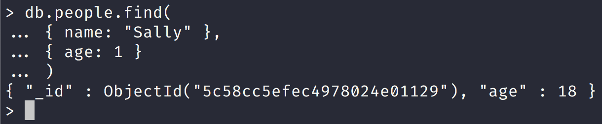

NoSQL Workshop - Mongo Crud Operations

## Sections:

* [Insert Documents](#insert_documents)
* [Query Documents](#query_documents)
* [Update Documents](#update_documents)
* [Delete Documents](#delete_documents)
* [Bulk Write Operations](#bulk_write_operations)
* [Retryable Writes](#retryable_writes)
* [SQL to MongoDB Mapping Chart](#sql_to_mongodb_mapping_chart)
* [Text Search](#text_search)
* [Geospatial Queries](#geospatial_queries)
* [Read Isolation (Read Concern)](#read_isolation_(read_concern))
* [Write Acknowledgement (Write Concern)](#write_acknowledgement_(write_concern))
* [Bread Crumb Navigation](#bread-crumb-navigation)

*All of this information is gathered from the official mongodb docs in https://docs.mongodb.com/manual/crud/*

### CRUD operations create, read, update, and delete documents.

Create or insert operations add new documents to a collection. 

If the collection does not currently exist, insert operations will create the collection.

MongoDB provides the following methods to insert documents into a collection:

* [db.collection.insertOne()](https://docs.mongodb.com/manual/reference/method/db.collection.insertOne/#db.collection.insertOne)

* [db.collection.insertMany()](https://docs.mongodb.com/manual/reference/method/db.collection.insertMany/#db.collection.insertMany)

In MongoDB, insert operations target a single collection. 

*All write operations in MongoDB are atomic on the level of a single document.*

```bash
db.people.insertOne( // collection
    {                        // document
        name: "John Rambo",  // field: value
        age: 34,             // field: value
        status: "MIA"        // field: value
    }
)
```

#### Read Operations

Read operations retrieves documents from a collection; i.e. queries a collection for documents. 

MongoDB provides the following methods to read documents from a collection:

* [db.collection.find()](https://docs.mongodb.com/manual/reference/method/db.collection.find/#db.collection.find)

Let us look at an example in the mongo shell:



*Notice that in the example above we use projection and only age is returned back while the _id is always returned in MongoDB.*

#### Update Operations

Update operations modify existing documents in a collection. MongoDB provides the following methods to update documents of a collection:

* [db.collection.updateOne()](https://docs.mongodb.com/manual/reference/method/db.collection.updateOne/#db.collection.updateOne)

* [db.collection.updateMany()](https://docs.mongodb.com/manual/reference/method/db.collection.updateMany/#db.collection.updateMany)

* [db.collection.replaceOne()](https://docs.mongodb.com/manual/reference/method/db.collection.replaceOne/#db.collection.replaceOne)

Let us look at an example in the mongo shell:


#### Delete Operations

Delete operations remove documents from a collection. MongoDB provides the following methods to delete documents of a collection:

* [db.collection.deleteOne()](https://docs.mongodb.com/manual/reference/method/db.collection.deleteOne/#db.collection.deleteOne)

* [db.collection.deleteMany()](https://docs.mongodb.com/manual/reference/method/db.collection.deleteMany/#db.collection.deleteMany)

In MongoDB, delete operations target a single collection. All write operations in MongoDB are atomic on the level of a single document.

You can specify criteria, or filters, that identify the documents to remove. These filters use the same syntax as read operations.

Let us look at some examples in the mongo shell:


*Notice that deleteMany deleted more than one document.*

#### Bulk Write

*MongoDB provides the ability to perform write operations in bulk.*

###### Insert Documents

Content

###### Query Documents

Content

###### Update Documents

Content

###### Delete Documents

Content

###### Bulk Write Operations

Content

###### Retryable Writes

Content

###### SQL to MongoDB Mapping Chart

Content

###### Text Search

Content

###### Geospatial Queries

Content

###### Read Isolation (Read Concern)

Content

###### Write Acknowledgement (Write Concern)

Content

#### Bread Crumb Navigation
_________________________

Previous | Next
:------- | ---:
← [Mongo Shell](./mongo-shell.md) | [MongoDB Aggregation](./mongodb-aggregation.md) →
