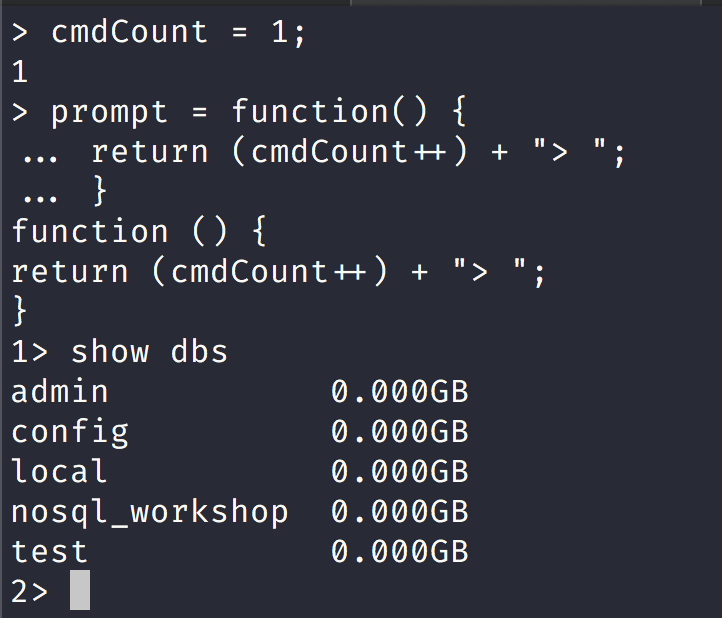
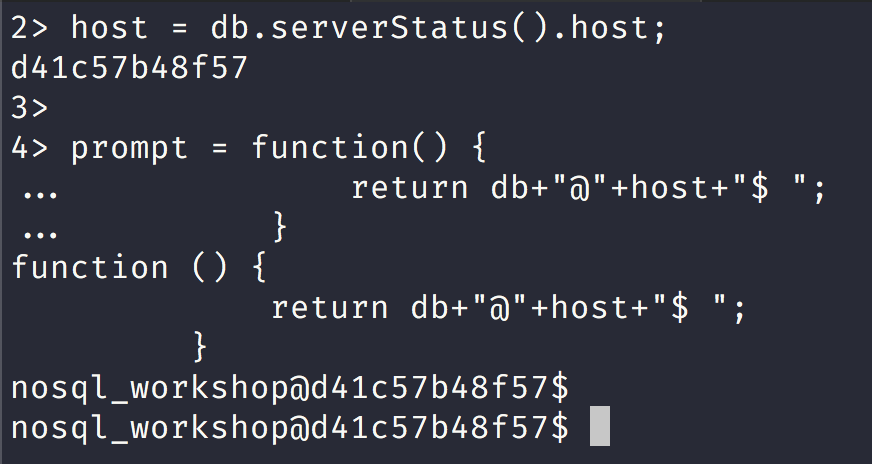
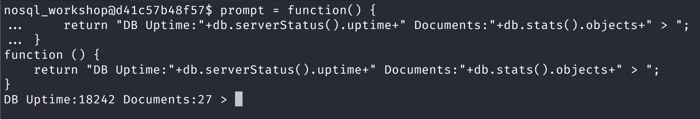
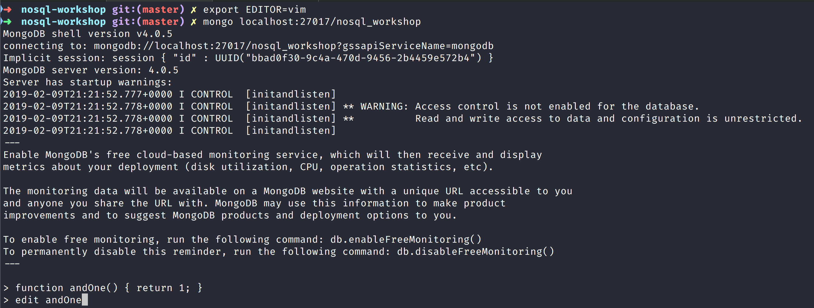
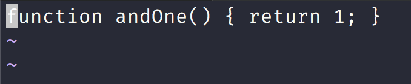
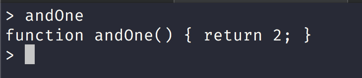
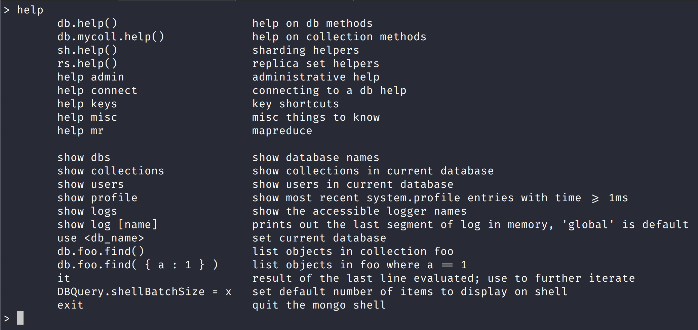
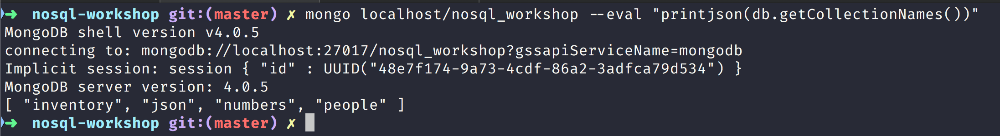
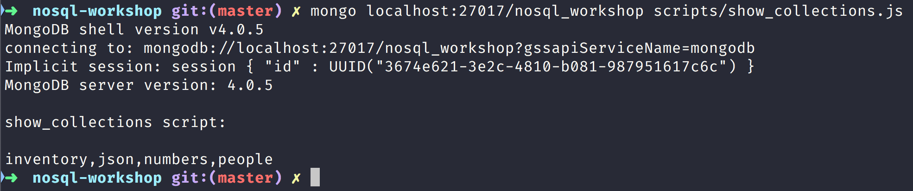
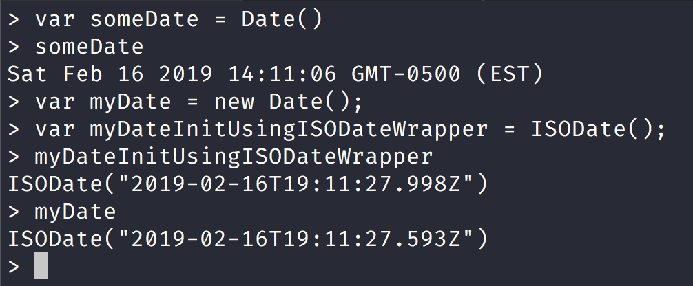

NoSQL Workshop - Mongo Shell

## Sections:

* [Configure the mongo Shell](#configure_the_mongo_shell)
* [Access the mongo Shell Help](access_the_mongo_shell_help)
* [Write Scripts for the mongo Shell](write_scripts_for_the_mongo_shell)
* [Data Types in the mongo Shell](data_types_in_the_mongo_shell)
* [mongo Shell Quick Reference](mongo_shell_quick_reference)
* [Bread Crumb Navigation](#bread-crumb-navigation)

**These information is all gleaned from the official [mongodb docs](https://docs.mongodb.com/manual/tutorial/access-mongo-shell-help/)**

#### Configure the mongo Shell

###### Customize the prompt 

We can easily customize the mongo shell:



We can also customize the mongo prompt to show more information with something like this:

```js
host = db.serverStatus().host;

prompt = function() {
    return db+"@"+host+"$ ";
}
```



Let us try another mongo prompt example:

```js
prompt = function() {
    return "DB Uptime:"+db.serverStatus().uptime+" Documents:"+db.stats().objects+" > ";
}
```



###### External Editor in Mongo shell

*We can configure an external editor like vim to the mongo shell.*



Here is a vim session with the *andOne* function we just defined:



We made some changes to the andOne function as you can tell when we print out the contents:



###### Changing the mongo shell batch size

We can directly change the default batch size by doing the following in the mongo shell:

```js
DBQuery.shellBatchSize = 15;
```

#### Access the mongo Shell Help

###### Command Line Help

You can see the full list of options and help items by invoking this command in your shell:

```bash
mongo --help
MongoDB shell version v4.0.5
usage: mongo [options] [db address] [file names (ending in .js)]
db address can be:
  foo                   foo database on local machine
  192.168.0.5/foo       foo database on 192.168.0.5 machine
  192.168.0.5:9999/foo  foo database on 192.168.0.5 machine on port 9999
Options:
  --shell                             run the shell after executing files
  --nodb                              don't connect to mongod on startup - no
                                      'db address' arg expected
  --norc                              will not run the ".mongorc.js" file on
                                      start up
  --quiet                             be less chatty
  --port arg                          port to connect to
  --host arg                          server to connect to
  --eval arg                          evaluate javascript
...................................................................
```

###### Shell Help

You can see all of the mongo shell *help* by typing *help* in mongo shell.

You can get to mongo shell in a couple of ways:

1. Run mongo daemon locally preferably with docker.

I have a mongo image with vim installed in it:

Pull my docker image with:

`docker pull jbelmont/mongo-vim:4.0.5`

Or you can pull the official mongo image in docker hub with:

`docker pull mongo:4.0.5`

Now you will need to run docker image once it is in your local machine.

I would suggest to create the following directory:

```bash
sudo mkdir -p /data/db

sudo chown -R jean-marcelbelmont:staff /data
```

The 2nd command should be your username and this is for a Mac OS X specifically.

The */data/db* directory is for [WiredTiger Storage Engine](https://docs.mongodb.com/manual/core/wiredtiger/) which is the default storage engine anyways.

Here is a script that will run my personal image:

```bash
#! /bin/bash

docker run --name jbelmont-mongo-image-4 \
  --rm \
  -v ~/mongod_data.4.0.5:/data/db \
  -p 27017:27017 \
  -v /var/run/docker.sock:/var/run/docker.sock \
  -d jbelmont/mongo-vim:4.0.5
```

Here is a command to run the official image:

```bash
docker run --name mongo-4 \
  --rm \
  -v ~/mongod_data.4.0.5:/data/db \
  -p 27017:27017 \
  -v /var/run/docker.sock:/var/run/docker.sock \
  -d jbelmont/mongo-vim:4.0.5
```

Now you can get an interactive mongo shell session a couple of ways:

1. You can directly enter running docker container with *docker exec* command
    1. If you run my personal docker image using the script above you can run the following command:
        1. `docker exec -it $(docker ps -a | awk '/mongo\-vim/ { print $1 }') /bin/bash`
    2. Else if you run the official docker image and execute the command I gave above
        1. `docker exec -it $(docker ps -a | awk '/mongo/ { print $1 }') /bin/bash`
    3. Else none of these commands work and you might have multiple mongo sessions running or something else.
        1. `docker ps -a | grep mongo` so find the right docker container id and copy it to system clipboard and run the exec command
        2. `docker exec -it SYSTEM-COPIED-process /bin/bash`

2. You can also run mongo directly like this:
    1. `mongo localhost:27017`
    2. This will connect to localhost and to port 27017 which is the default port.

*Once inside the mongo interactive shell run the following command:*



###### Database Help

###### To see the list of database on the mongodb server run the following command:

```bash
> show databases
admin           0.000GB
config          0.000GB
local           0.000GB
nosql_workshop  0.000GB
test            0.000GB
```

*Notice here that might have something different.*

You can run the alias form of:

`show dbs`

###### To see the list of help for methods you can use on the db object, call the db.help() method:

```bash
> db.help()
DB methods:
	db.adminCommand(nameOrDocument) - switches to 'admin' db, and runs command [just calls db.runCommand(...)]
	db.aggregate([pipeline], {options}) - performs a collectionless aggregation on this database; returns a cursor
	db.auth(username, password)
	db.cloneDatabase(fromhost) - deprecated
	db.commandHelp(name) returns the help for the command
	db.copyDatabase(fromdb, todb, fromhost) - deprecated
	db.createCollection(name, {size: ..., capped: ..., max: ...})
	db.createView(name, viewOn, [{$operator: {...}}, ...], {viewOptions})
	db.createUser(userDocument)
	db.currentOp() displays currently executing operations in the db
	db.dropDatabase()
	db.eval() - deprecated
	db.fsyncLock() flush data to disk and lock server for backups
	db.fsyncUnlock() unlocks server following a db.fsyncLock()
	db.getCollection(cname) same as db['cname'] or db.cname
	db.getCollectionInfos([filter]) - returns a list that contains the names and options of the db's collections
	db.getCollectionNames()
	db.getLastError() - just returns the err msg string
	db.getLastErrorObj() - return full status object
..........................................................................................
```

###### To see the implementation of a method in the shell, type the `db.<method name>` without the parenthesis `()`:

The following example will return the implementation of the method `db.dropDatabase()`:

```bash
> db.dropDatabase
function () {
    if (arguments.length)
        throw Error("dropDatabase doesn't take arguments");
    return this._dbCommand({dropDatabase: 1});
}
```

###### Collection Help

###### To see the list of collections in the current database, use the show collections command:

```bash
> use nosql_workshop
switched to db nosql_workshop
>
> show collections
inventory
json
numbers
people
```

Here we switch to nosql_workshop database and then run *show collections* command.

###### To see the help for methods available on the collection objects (e.g. db.<collection>), use the db.<collection>.help() method:

```bash
> db.numbers.help()
DBCollection help
	db.numbers.find().help() - show DBCursor help
	db.numbers.bulkWrite( operations, <optional params> ) - bulk execute write operations, optional parameters are: w, wtimeout, j
	db.numbers.count( query = {}, <optional params> ) - count the number of documents that matches the query, optional parameters are: limit, skip, hint, maxTimeMS
	db.numbers.countDocuments( query = {}, <optional params> ) - count the number of documents that matches the query, optional parameters are: limit, skip, hint, maxTimeMS
	db.numbers.estimatedDocumentCount( <optional params> ) - estimate the document count using collection metadata, optional parameters are: maxTimeMS
	db.numbers.copyTo(newColl) - duplicates collection by copying all documents to newColl; no indexes are copied.
	db.numbers.convertToCapped(maxBytes) - calls {convertToCapped:'numbers', size:maxBytes}} command
	db.numbers.createIndex(keypattern[,options])
	db.numbers.createIndexes([keypatterns], <options>)
	db.numbers.dataSize()
	db.numbers.deleteOne( filter, <optional params> ) - delete first matching document, optional parameters are: w, wtimeout, j
	db.numbers.deleteMany( filter, <optional params> ) - delete all matching documents, optional parameters are: w, wtimeout, j
	db.numbers.distinct( key, query, <optional params> ) - e.g. db.numbers.distinct( 'x' ), optional parameters are: maxTimeMS
	db.numbers.drop() drop the collection
	db.numbers.dropIndex(index) - e.g. db.numbers.dropIndex( "indexName" ) or db.numbers.dropIndex( { "indexKey" : 1 } )
	db.numbers.dropIndexes()
	db.numbers.ensureIndex(keypattern[,options]) - DEPRECATED, use createIndex() instead
	db.numbers.explain().help() - show explain help
	db.numbers.reIndex()
	db.numbers.find([query],[fields]) - query is an optional query filter. fields is optional set of fields to return.
	                                              e.g. db.numbers.find( {x:77} , {name:1, x:1} )
	db.numbers.find(...).count()
	db.numbers.find(...).limit(n)
...........................................................................................
```

> `<collection>` can be the name of a collection that exists, although you may specify a collection that doesn’t exist.

> To see the collection method implementation, type the `db.<collection>.<method>` name without the parenthesis `()`, as in the following example which will return the implementation of the find() method:

```bash
> db.numbers.find
function (query, fields, limit, skip, batchSize, options) {
    var cursor = new DBQuery(this._mongo,
                             this._db,
                             this,
                             this._fullName,
                             this._massageObject(query),
                             fields,
                             limit,
                             skip,
                             batchSize,
                             options || this.getQueryOptions());

    {
        const session = this.getDB().getSession();

        const readPreference = session._serverSession.client.getReadPreference(session);
        if (readPreference !== null) {
            cursor.readPref(readPreference.mode, readPreference.tags);
        }

        const readConcern = session._serverSession.client.getReadConcern(session);
        if (readConcern !== null) {
            cursor.readConcern(readConcern.level);
        }
    }

    return cursor;
}
```

###### Cursor Help

> When you perform read operations with the find() method in the mongo shell, you can use various cursor methods to modify the find() behavior and various JavaScript methods to handle the cursor returned from the find() method.

###### To list the available modifier and cursor handling methods, use the db.collection.find().help() command:

```bash
> db.numbers.find().help()
find(<predicate>, <projection>) modifiers
	.sort({...})
	.limit(<n>)
	.skip(<n>)
	.batchSize(<n>) - sets the number of docs to return per getMore
	.collation({...})
	.hint({...})
	.readConcern(<level>)
	.readPref(<mode>, <tagset>)
	.count(<applySkipLimit>) - total # of objects matching query. by default ignores skip,limit
	.size() - total # of objects cursor would return, honors skip,limit
	.explain(<verbosity>) - accepted verbosities are {'queryPlanner', 'executionStats', 'allPlansExecution'}
	.min({...})
	.max({...})
	.maxScan(<n>)
	.maxTimeMS(<n>)
	.comment(<comment>)
	.tailable(<isAwaitData>)
	.noCursorTimeout()
	.allowPartialResults()
	.returnKey()
	.showRecordId() - adds a $recordId field to each returned object

Cursor methods
	.toArray() - iterates through docs and returns an array of the results
	.forEach(<func>)
	.map(<func>)
	.hasNext()
	.next()
	.close()
	.objsLeftInBatch() - returns count of docs left in current batch (when exhausted, a new getMore will be issued)
	.itcount() - iterates through documents and counts them
	.pretty() - pretty print each document, possibly over multiple lines
>
```

> `<collection>` can be the name of a collection that exists, although you may specify a collection that doesn’t exist.

###### To see the implementation of the cursor method, type the db.<collection>.find().<method> name without the parenthesis (), as in the following example which will return the implementation of the toArray() method:

```bash
> db.collection.find().toArray
function () {
    if (this._arr)
        return this._arr;

    var a = [];
    while (this.hasNext())
        a.push(this.next());
    this._arr = a;
    return a;
}
```

*Some useful methods for handling cursors are:*

1. [`hasNext()`](https://docs.mongodb.com/manual/reference/method/cursor.hasNext/#cursor.hasNext)   
	
	1. hasNext checks whether the cursor has more documents to return.

2. [`next()`](https://docs.mongodb.com/manual/reference/method/cursor.next/#cursor.next)
    	
	1. next returns the next document and advances the cursor position forward by one.

3. [`forEach(<function>)`](https://docs.mongodb.com/manual/reference/method/cursor.forEach/#cursor.forEach) 
    	
	1. forEach iterates the whole cursor and applies the `<function>` to each document returned by the cursor. 
	2. The `<function>` expects a single argument which corresponds to the document from each iteration.

###### Wrapper Object Help

###### To get a list of the wrapper classes available in the mongo shell, such as ObjectId(), type help misc in the mongo shell:

```bash
> help misc
	b = new BinData(subtype,base64str)  create a BSON BinData value
	b.subtype()                         the BinData subtype (0..255)
	b.length()                          length of the BinData data in bytes
	b.hex()                             the data as a hex encoded string
	b.base64()                          the data as a base 64 encoded string
	b.toString()

	b = HexData(subtype,hexstr)         create a BSON BinData value from a hex string
	b = UUID(hexstr)                    create a BSON BinData value of UUID subtype
	b = MD5(hexstr)                     create a BSON BinData value of MD5 subtype
	"hexstr"                            string, sequence of hex characters (no 0x prefix)

	o = new ObjectId()                  create a new ObjectId
	o.getTimestamp()                    return timestamp derived from first 32 bits of the OID
	o.isObjectId
	o.toString()
	o.equals(otherid)

	d = ISODate()                       like Date() but behaves more intuitively when used
	d = ISODate('YYYY-MM-DD hh:mm:ss')    without an explicit "new " prefix on construction
> objectId = new ObjectId()
ObjectId("5c603570e97a475d5b92d7ac")
>
```

#### Write Scripts for the mongo Shell

#### Opening New Connections

From the mongo shell or from a JavaScript file, you can instantiate database connections using the `Mongo()` constructor:

```bash
db = new Mongo("localhost:27017").getDB("test")
test
```

Here we create a new local database connection to the test database.

> If connecting to a MongoDB instance that enforces access control, you can use the db.auth() method to authenticate.

> Additionally, you can use the connect() method to connect to the MongoDB instance.

```bash
db = connect("localhost:27017/test")
connecting to: mongodb://localhost:27017/test
Implicit session: session { "id" : UUID("11921e8f-706d-4b7e-9f09-fd70578846e6") }
MongoDB server version: 4.0.5
test
```

*The following example connects to the MongoDB instance to the test database that is running on localhost and sets the global db variable.*

#### Differences Between Interactive and Scripted mongo

[Differences Between Interactive and Script Mongo](https://docs.mongodb.com/manual/tutorial/write-scripts-for-the-mongo-shell/#differences-between-interactive-and-scripted-mongo)

> When writing scripts for the mongo shell, consider the following:

> To set the db global variable, use the getDB() method or the connect() method. You can assign the database reference to a variable other than db.

> Write operations in the mongo shell use a write concern of { w: 1 } by default. If performing bulk operations, use the Bulk() methods. See Write Method Acknowledgements for more information.

> You cannot use any shell helper (e.g. use `<dbname>`, show dbs, etc.) inside the JavaScript file because they are not valid JavaScript.

The following table maps the most common mongo shell helpers to their JavaScript equivalents.

| Shell Helpers | JavaScript Equivalents |
| --- | --- |
| show dbs, show databases | db.adminCommand('listDatabases') |
| use &lt;db&gt; | db = db.getSiblingDB('&lt;db&gt;') |
| show collections | db.getCollectionNames() |
| show users | db.getUsers() |
| show roles | db.getRoles({showBuiltinRoles: true}) |
| show log &lt;logname&gt; | db.adminCommand({ 'getLog' : '&lt;logname&gt;' }) |
| show logs | db.adminCommand({ 'getLog' : '*' }) |
| it | cursor = db.collection.find() if ( cursor.hasNext() ){cursor.next(); } | 

> In interactive mode, mongo prints the results of operations including the content of all cursors. In scripts, either use the JavaScript `print()` function or the mongo specific `printjson()` function which returns formatted JSON.

> To print all items in a result cursor in mongo shell scripts, use the following idiom:

```js
cursor = db.numbers.find();
while ( cursor.hasNext() ) {
   printjson( cursor.next() );
}
```

#### Scripting

From the system prompt, use mongo to evaluate JavaScript.



Notice that the screenshot show the collections that exist on the localhost/nosql_workshop connection on port 27017.

###### Executing a Javascript file on the mongo shell

You can specify a .js file to the mongo shell, and mongo will execute the JavaScript directly. Consider the following example:



> Alternately, you can specify the mongodb connection parameters inside of the javascript file using the `Mongo()` constructor.

*You can execute a .js file from within the mongo shell, using the load() function.*

```bash
load("scripts/show_collections.js")

show_collections script:

inventory,json,numbers,people
true
```

Here is the contents of the show_collections.js script:

```js
"use strict";

// equivalent for "use <db>" command in mongo shell
var db = db.getSiblingDB('nosql_workshop');
 
// print the collections present in nosql_workshop db
print("\nshow_collections script:\n")
print(db.getCollectionNames());
```

> The `load()` method accepts relative and absolute paths.

> There is no search path for the load() function. If the desired script is not in the current working directory or the full specified path, mongo will not be able to access the file.

#### Data Types in the mongo Shell

> MongoDB BSON provides support for additional data types than JSON. Drivers provide native support for these data types in host languages and the mongo shell also provides several helper classes to support the use of these data types in the mongo JavaScript shell. 

The mongo shell provides various methods to return the date, either as a string or as a Date object:

* [Date()]()
	* method which returns the current date as a string.
	* new Date() constructor which returns a Date object using the ISODate() wrapper.

* [ISODate()]() 
	* constructor which returns a Date object using the ISODate() wrapper.

###### Types

###### Dates

> Internally, Date objects are stored as a signed 64-bit integer representing the number of milliseconds since the Unix epoch (Jan 1, 1970).

Here is a shell session using Date and ISODate:



###### ObjectIds

The mongo shell provides the ObjectId() wrapper class around the ObjectId data type. To generate a new ObjectId, use the following operation in the mongo shell.

Returns a new ObjectId value. The 12-byte ObjectId value consists of:

a 4-byte value representing the seconds since the Unix epoch,
a 5-byte random value, and
a 3-byte counter, starting with a random value.

```bash
> new ObjectId()
ObjectId("5c68614d90753389f07190a9")
```

###### NumberLong

The mongo shell treats all numbers as floating-point values by default. The mongo shell provides the NumberLong() wrapper to handle 64-bit integers.

The NumberLong() wrapper accepts the long as a string:

```bash
> NumberLong("2090845886855")
NumberLong("2090845886855")
```

Here is an example session with NumberLong:

```bash
> db.numbers.insertOne( { _id: 6, calc: NumberLong("2090845886852") } )
{ "acknowledged" : true, "insertedId" : 6 }
> db.numbers.updateOne( { _id: 6 },
...                       { $set:  { calc: NumberLong("2555555000000") } } )
{ "acknowledged" : true, "matchedCount" : 1, "modifiedCount" : 1 }
> db.numbers.updateOne( { _id: 6 },
...                       { $inc: { calc: NumberLong(5) } } )
{ "acknowledged" : true, "matchedCount" : 1, "modifiedCount" : 1 }
> db.numbers.find({
... "_id": 6
... }).pretty()
{ "_id" : 6, "calc" : NumberLong("2555555000005") }
```

###### NumberInt

The mongo shell treats all numbers as floating-point values by default. The mongo shell provides the NumberInt() constructor to explicitly specify 32-bit integers.

Here is an example session:

```bash
> NumberInt(100)
NumberInt(100)
> NumberInt(1.5)
NumberInt(1)
```

Notice how `NumberInt(1.5)` got casted into 32-bit integer.

###### NumberDecimal

New in version 3.4.

The mongo shell treats all numbers as 64-bit floating-point double values by default. The mongo shell provides the NumberDecimal() constructor to explicitly specify 128-bit decimal-based floating-point values capable of emulating decimal rounding with exact precision. This functionality is intended for applications that handle monetary data, such as financial, tax, and scientific computations.

The decimal BSON type uses the IEEE 754 decimal128 floating-point numbering format which supports 34 decimal digits (i.e. significant digits) and an exponent range of −6143 to +6144.

The NumberDecimal() constructor accepts the decimal value as a string:

> The NumberDecimal() constructor also accepts double values from the mongo shell (i.e. without quotes), although this is not recommended due to the risk of losing precision. The constructor creates a binary-based double precision representation of the decimal-based parameter (potentially losing precision), then converts that value to a decimal value with a precision of 15 digits. The following example passes the value implicitly as a double and shows how it is created with a precision of 15 digits:

Here is an example session:

```bash
> NumberDecimal(1000.55)
NumberDecimal("1000.55000000000")
```

Notice the loss in precision here.

###### Equality and Sort Order

Here is an example session showing equality and sort order:

```bash
> db.numbers2.insertMany([
... { "_id" : 1, "val" : NumberDecimal( "9.99" ), "description" : "Decimal" },
... { "_id" : 2, "val" : 9.99, "description" : "Double" },
... { "_id" : 3, "val" : 10, "description" : "Double" },
... { "_id" : 4, "val" : NumberLong(10), "description" : "Long" },
... { "_id" : 5, "val" : NumberDecimal( "10.0" ), "description" : "Decimal" }
... ])
{ "acknowledged" : true, "insertedIds" : [ 1, 2, 3, 4, 5 ] }
> db.numbers2.find({})
{ "_id" : 1, "val" : NumberDecimal("9.99"), "description" : "Decimal" }
{ "_id" : 2, "val" : 9.99, "description" : "Double" }
{ "_id" : 3, "val" : 10, "description" : "Double" }
{ "_id" : 4, "val" : NumberLong(10), "description" : "Long" }
{ "_id" : 5, "val" : NumberDecimal("10.0"), "description" : "Decimal" }
> db.numbers2.find({
... val: 9.99
... })
{ "_id" : 2, "val" : 9.99, "description" : "Double" }
```

> The first query, { "val": 9.99 }, implicitly searches for the double representation of 9.99 which is not equal to the decimal representation of the value.

###### Checking for decimal type

To test for decimal type, use the $type operator with the string alias "decimal" or 19, the numeric code for the decimal type.

```bash
> db.inventory.insertOne({
...     "_id": new ObjectId(),
...     "item" : "postcard",
...     "qty" : 60,
...     "status" : "A",
...     "size" : {
...         "h" : 10,
...         "w" : NumberDecimal("15.25"),
...         "uom" : "cm" },
...         "tags" : [     "blue" ]
...     }
... )
{
	"acknowledged" : true,
	"insertedId" : ObjectId("5c6865d8035949476a06ce05")
}
> db.inventory.find({
... "size.w": {
... "$type": "decimal"
... }})
{
	"_id" : ObjectId("5c68656090753389f07190aa"),
	"item" : "postcard",
	"qty" : 59,
	"status" : "A",
	"size" : {
		"h" : 10,
		"w" : NumberDecimal("15.25"),
		"uom" : "cm"
	},
	"tags" : [
		"blue"
	]
}
{
	"_id" : ObjectId("5c6865d8035949476a06ce05"),
	"item" : "postcard",
	"qty" : 60,
	"status" : "A",
	"size" : {
		"h" : 10,
		"w" : NumberDecimal("15.25"),
		"uom" : "cm"
	},
	"tags" : [
		"blue"
	]
}
```

###### Check Types in the mongo Shell

To determine the type of fields, the mongo shell provides the instanceof and typeof operators.

*instanceof*

instanceof returns a boolean to test if a value is an instance of some type.

Let us look at an example in the mongo shell:

```bash
> db.inventory.find({ "size.w": {  "$type": "decimal" }})[0]._id instanceof ObjectId
true
```

*typeof*

typeof returns the type of a field.

Let us look at the type of the _id field in the shell:

```bash
> typeof db.inventory.find({ "size.w": {  "$type": "decimal" }})[0]._id
object
```

In this case typeof will return the more generic object type rather than ObjectId type.

###### Mongo Shell Quick Reference

###### mongo Shell Command History

> You can retrieve previous commands issued in the mongo shell with the up and down arrow keys. Command history is stored in ~/.dbshell file.

###### Command Line Options

The mongo shell can be started with numerous options.

The following table displays some common options for mongo:

| Command Line Option | Command Line Description |
| --- | --- |
| --help | Show command line options |
| --nodb | Start mongo shell without connecting to a database. To connect later, see Opening New Connections. |
| --shell | Used in conjunction with a JavaScript file (i.e. &lt;script.js&gt;) to continue in the mongo shell after running the JavaScript file. |

## Basic Commands

| Action | Run Command | Example |
| --- | --- | --- |
| Connect to local host on default port 27017 | mongo | mongo |
| Connect to remote host on specified port | mongo --host &lt;hostname or ip address&gt; --port &lt;port no&gt; | mongo --host 192.168.65.23 --port 27020 |
| Connect to a database | mongo &lt;host&gt;/&lt;database&gt; | mongo 192.168.65.23/api |
| Show current database | db | db |
| Select or switch database | use &lt;database name&gt; | use api |
| Execute a JavaScript file | load(&lt;filename&gt;) | load (program.js) |
| Display help | help | help |
| Display help on DB methods | db.help() | db.help() |
| Display help on Collection | db.mycol.help() | db.mycol.help() |

## Show Commands

| Action | Run Command | Example |
| --- | --- | --- |
| Show all databases | show dbs | show dbs |
| Show all collections in current database | show collections | show collections |
| Show all users on current database | show users | show users |
| Show all roles on current database | show roles | show roles |

## CRUD Operations

| Action | Run Command | Example |
| --- | --- | --- |
| If running in secure mode, authenticate the user. | db.auth() | db.auth() |
| Insert a new document in a collection | db.collection.insert( &lt;document&gt; ) | db.heroes.insert({"name": "Batman", "powers": ["Super Rich","Tech Gadgets","Batmobile","Martial Artists","Super Style","Alfred"], "gender": "male" }) |
| Insert multiple documents into a collection | db.collection.insertMany([ &lt;document1&gt;, &lt;document2&gt;, ... ]) or db.collection.insert([&lt;document1&gt;, &lt;document2&gt;, ... ])` | db.heroes.insertMany( [{"name": "Batman", "powers": ["Super Rich","Tech Gadgets","Batmobile","Martial Artists","Super Style","Alfred"], "gender": "male" }, {"name": "Aquaman", "powers", ["Superhuman Strength", "Telepathic Abilities"], "gender": "male"}]) |
| Show all documents in the collection | db.collection.find() | db.heroes.find() |
| Filter documents by field value condition | db.collection.find(&lt;query&gt;) | db.heroes.find({"_id": ObjectId("507f1f77bcf86cd799439011")}) |
| Show only some fields of matching documents | db.collection.find(&lt;query&gt;, &lt;projection&gt;) | db.heroes.find({"_id": "507f1f77bcf86cd799439011"}, {name: true}) |
| Show the first document that matches the query condition | db.collection.findOne(&lt;query&gt;, &lt;projection&gt;) | db.heroes.findOne({}, {_id:false}) |
| Update specific fields of a single document that match the query condition | db.collection.update(&lt;query&gt;, &lt;update&gt; ) | db.heores.update({name: "Aquaman"}, {$set : {name :"Aquaman Crisis"}}) |
| Remove certain fields of a single document the query condition | db.collection.update(&lt;query&gt;, &lt;update&gt;) | db.heroes.update({name: "Aquaman"}, {$unset : {gender:""}}) |
| Remove certain fields of all documents that match the query condition | db.collection.update(&lt;query&gt;, &lt;update&gt;, {multi:true} ) | db.heroes.update({gender : "male"}, {$unset : {name:""}}, {multi:true}) |
| Delete a single document that match the query condition | db.collection.remove(&lt;query&gt;, {justOne:true}) | db.heroes.remove({gender : "male"}, {justOne:true}) |
| Delete all documents matching a query condition | db.collection.remove(&lt;query&gt;) | db.heroes.remove({gender : "male"}) |
| Delete all documents in a collection | db.collection.remove({}) | db.heroes.remove({}) |

## Index Methods

| Action | Run Command | Example |
| --- | --- | --- |
| Create an index | db.collection.createIndex( {indexField:type} ) "type" can be 1 for ascending and -1 for descending | db.heroes.createIndex({organization:1}) |
| Create a unique index | db.collection.createIndex( {indexField:type}, {unique:true} ) | db.heroes.createIndex( {crisisMode:1},{unique:true} ) |
| Create a index on multiple fields (compound index) | db.collection.createIndex({indexField1:type1, indexField2:type2, ...}) | db.heroes.createIndex({name:1, gender:-1}) |
| Show all indexes in a collection | db.collection.getIndexes() | db.heroes.getIndexes() |
| Drop an index | db.collection.dropIndex( {indexField:type} ) | db.heroes.dropIndex({author:-1}) |
| Show index statistics | db.collection.stats() | db.heroes.stats() |

## Cursor Methods

| Action | Run Command | Example |
| --- | --- | --- |
| Show number of documents in the collection | cursor.count() | db.heroes.find().count() |
| Limit the number of documents to return | cursor.limit(&lt;n&gt;) | db.heroes.find().limit(2) |
| Return the result set after skipping the first n number of documents | cursor.skip(&lt;n&gt;) | db.heroes.find().skip(2) |
| Sort the documents in a result set in ascending or descending order of field values | cursor.sort( &lt;{field : value}&gt; ) where value = 1 for ascending and -1 for descending | db.heroes.find().sort( {name : 1} ) |
| Display formatted (more readable) result | cursor.pretty() | db.heroes.find({}).pretty() |

## Comparison Operators

| Action | Run Command | Example |
| --- | --- | --- |
| equals to | {&lt;field&gt;: { $eq: &lt;value&gt; }} | db.heroes.find({name: {$eq: "Aquaman"}}) |
| less than | {&lt;field&gt;: { $lt: &lt;value&gt; }} | db.heroes.find({year: {$lt: 1981}}) |
| less than or equal to | {&lt;field&gt;: { $lte: &lt;value&gt; }} | db.heroes.find({year: | {$lte: 1985}}) |
| greater than | {&lt;field&gt;: { $gt: &lt;value&gt; }} | db.heroes.find({year: {$gt: 1985}}) |
| greater than or equal to | {&lt;field&gt;: { $gte: &lt;value&gt; }} | db.heroes.find({year: {$gte: 2008}}) |
| not equal to | {&lt;field&gt;: { $ne: &lt;value&gt; }} | db.heroes.find({year: {$ne: 2008}}) |
| value in | {&lt;field&gt;: { $in: [ &lt;value1&gt;, &lt;value2&gt;, ... }} | db.heroes.find({year: {$in: [1985, 1991]}}) |
| value not in | {&lt;field&gt;: { $nin: [ &lt;value1&gt;, &lt;value2&gt;, ... }} | db.heroes.find({year: {$nin: [1981, 1992]}}) |

## Logical Operators

| Action | Run Command | Example |
| --- | --- | --- |
| OR | { $or: [&lt;expression1&gt;, &lt;expression2&gt;,...]} | db.heroes.find( { $or: [{year: {$lte: 1981}}, {year: {$eq: 1991}}]} ) |
| AND | { $and: [&lt;expression1&gt;, &lt;expression2&gt;,...]} | db.heroes.find( { $and: [{year: {$eq: 1981}}, {gender: {$eq: "male"}}]} ) |
| NOT | { $not: {&lt;expression&gt;}} | db.heroes.find( {$not: {year: {$eq: 1981} }}) |
| NOR | { $nor: [&lt;expression1&gt;, &lt;expression2&gt;,...]} | db.heroes.find( { $nor: [{year: {$lte: 1981}}, {year: {$eq: 1993}}]} ) |

## Element Operators

| Action | Run Command | Example |
| --- | --- | --- |
| Match documents that contains that specified field | {&lt;field&gt;: {$exists:true}} | db.heroes.find({ powers: {$exists: true }}) |
| Match documents whose field value is of the specified BSON data type | {&lt;field&gt;: {$type:value}} | db.heroes.find({name: {$type: 2 }}) |

## MongoDB Server Status
| Action | Run Command | Example |
| --- | --- | --- |
| Returns the number of mongo connections | db.serverStatus() | db.serverStatus().connections

###### Keyboard Shortcuts

| Keystroke | Function |
| --- | --- |
| Up-arrow | previous-history |
| Down-arrow | next-history |
| Home | beginning-of-line |
| End | end-of-line |
| Tab | autocomplete |
| Left-arrow | b |
| Right-arrow | forward-char |
| Ctrl-left-arrow | b |
| Ctrl-right-arrow | forward-word |
| Meta-left-arrow | b |
| Meta-right-arrow | forward-word |
| Ctrl-A | beginning-of-line |
| Ctrl-B | b |
| Up-arrow | previous-history |
| Down-arrow | next-history |
| Home | beginning-of-line |
| End | end-of-line |
| Tab | autocomplete |
| Left-arrow | backward-character |
| Right-arrow | forward-character |
| Ctrl-left-arrow | backward-word |
| Ctrl-right-arrow | forward-word |
| Meta-left-arrow | backward-word |
| Meta-right-arrow | forward-word |
| Ctrl-A | beginning-of-line |
| Ctrl-B | backward-char |
| Ctrl-C | exit-shell |
| Ctrl-D | delete-char (or | exit | shell) |
| Ctrl-E | end-of-line |
| Ctrl-F | forward-char |
| Ctrl-G | abort |
| Ctrl-J | accept-line |
| Ctrl-K | kill-line |
| Ctrl-L | clear-screen |
| Ctrl-M | accept-line |
| Ctrl-N | next-history |
| Ctrl-P | previous-history |
| Ctrl-R | reverse-search-history |
| Ctrl-S | forward-search-history |
| Ctrl-T | transpose-chars |
| Ctrl-U | unix-line-discard |
| Ctrl-W | unix-word-rubout |
| Ctrl-Y | yank |
| Ctrl-Z | Suspend (job control works in linux) |
| Ctrl-H (i.e. Backspace) | backward-delete-char |
| Ctrl-I (i.e. Tab) | complete |
| Meta-B | backward-word |
| Meta-C | capitalize-word |
| Meta-D | kill-word |
| Meta-F | forward-word |
| Meta-L | downcase-word |
| Meta-U | upcase-word |
| Meta-Y | yank-pop |
| Meta-&#91;Backspace&#93; | backward-kill-word |
| Meta-< | beginning-of-history |
| Meta-> | end-of-history |

###### Error Checking Methods

> The mongo shell write methods now integrates the Write Concern directly into the method execution rather than with a separate `db.getLastError()` method. As such, the write methods now return a WriteResult() object that contains the results of the operation, including any write errors and write concern errors.

Previous versions used `db.getLastError()` and `db.getLastErrorObj()` methods to return error information.

###### Administrative Command Helpers

| JavaScript Database Administration Methods | Description |
| --- | --- |
| db.cloneDatabase(&lt;host&gt;) | Clone the current database from the &lt;host&gt; specified. The &lt;host&gt; database instance must be in noauth mode.|
| db.copyDatabase(&lt;from&gt;, &lt;to&gt;, &lt;host&gt;) | Copy the &lt;from&gt; database from the &lt;host&gt; to the &lt;to&gt; database on the current server. The &lt;host&gt; database instance must be in noauth mode. |
| db.fromColl.renameCollection(&lt;toColl&gt;) | Rename collection from fromColl to &lt;toColl&gt;. |
| db.getCollectionNames() | Get the list of all collections in the current database. |
| db.dropDatabase() | Drops the current database. |

###### Opening Additional Connections

> You can create new connections within the mongo shell.

The following table displays the methods to create the connections:

| JavaScript Connection Create Methods | Description |
| --- | --- |
| db = connect("&lt;host&gt;&lt;:port&gt;/&lt;dbname&gt;") | Open a new database connection. |
| conn = new Mongo() &#59; db = conn.getDB("dbname") | Open a connection to a new server using new Mongo(). Use getDB() method of the connection to select a database. |

#### Bread Crumb Navigation
_________________________

Previous | Next
:------- | ---:
← [BSON Data Types](./bson-data-types.md) | [Mongo CRUD Operations](./mongo-crud-operations.md) →
