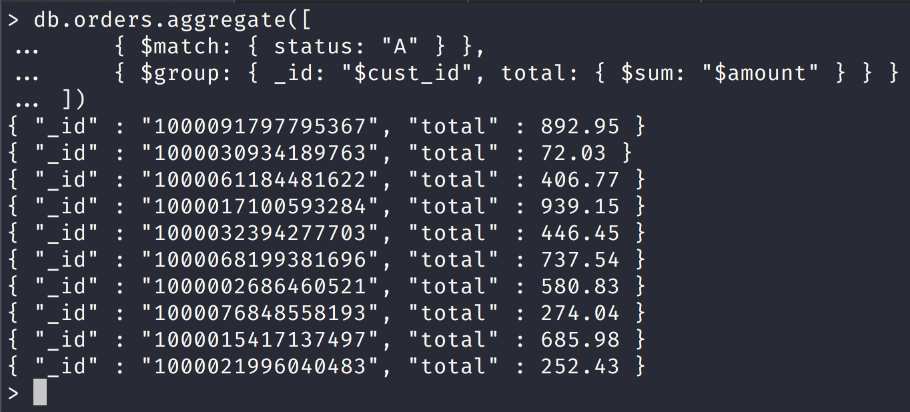
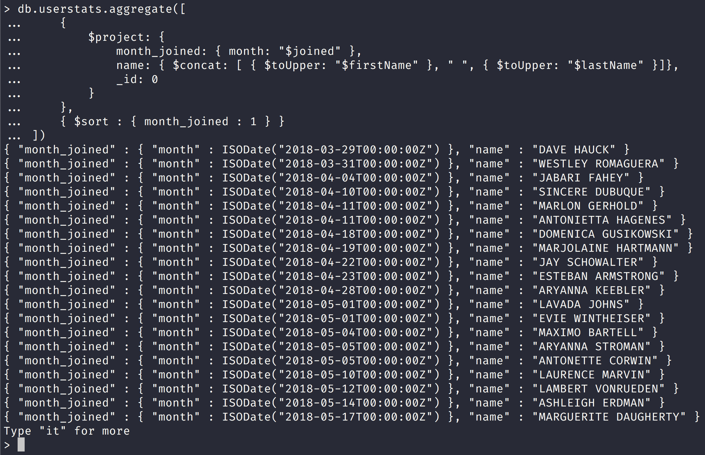
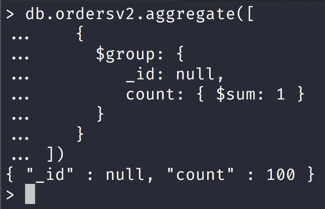
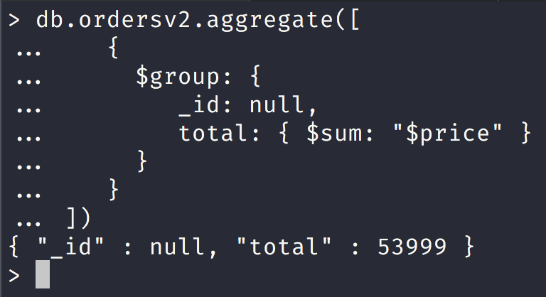
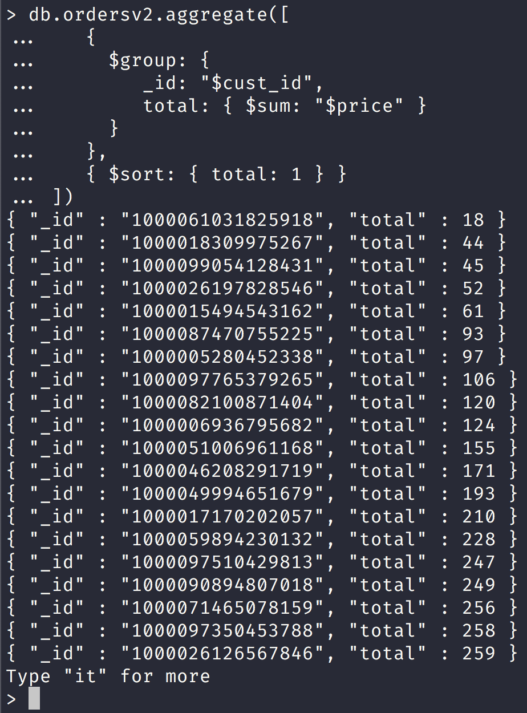
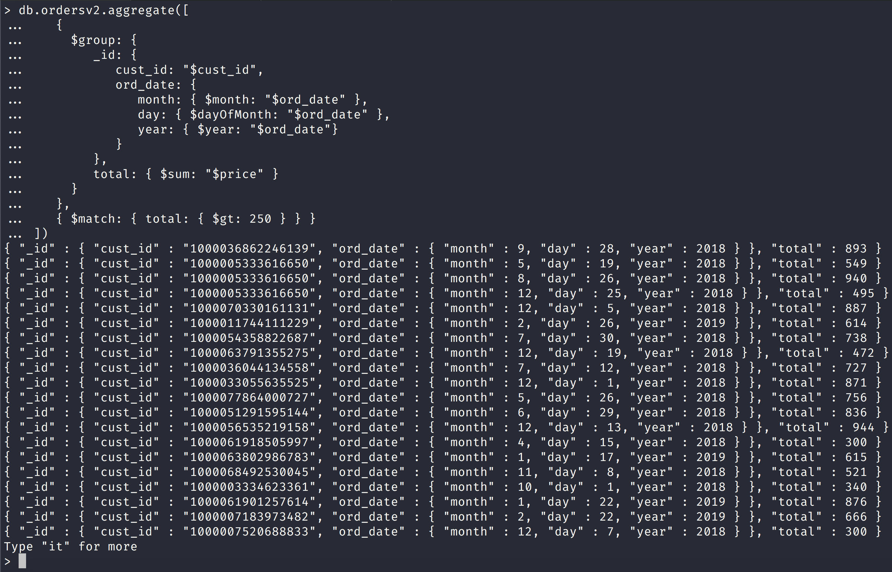
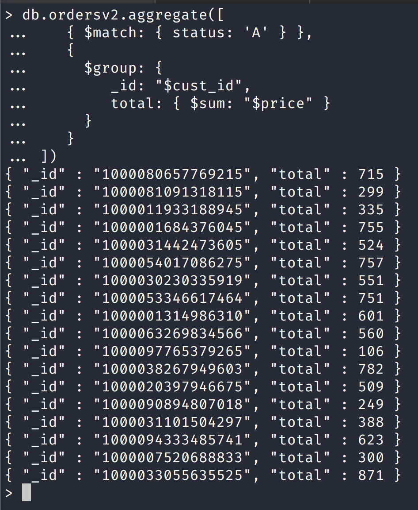
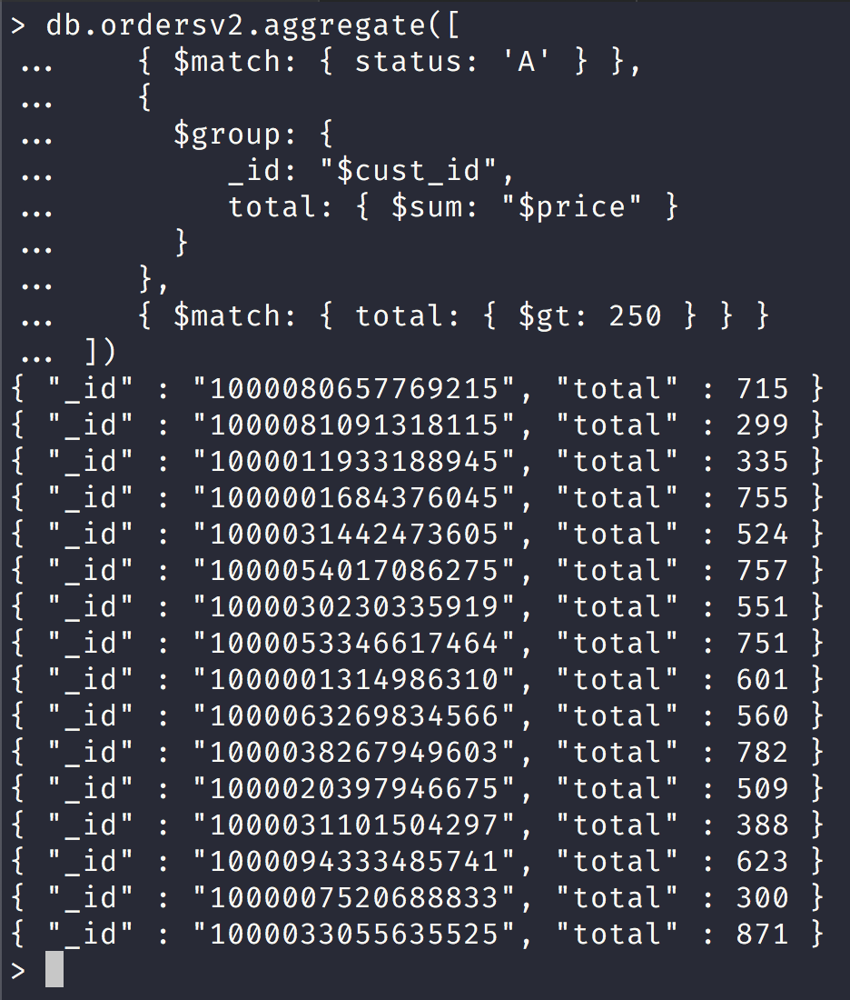

NoSQL Workshop - Mongo Aggregations

## Sections:

* [Aggregation Pipeline](#aggregation-pipeline)
* [Map-Reduce](#map-reduce)
* [Aggregation Reference](#aggregation-reference)
* [SQL to Aggregation Mapping Chart](#sql_to_aggregation_mapping_chart)
* [Bread Crumb Navigation](#bread-crumb-navigation)

*All of this information is gathered from the official mongodb docs in https://docs.mongodb.com/manual/aggregation/*

> Aggregation operations process data records and return computed results. Aggregation operations group values from multiple documents together, and can perform a variety of operations on the grouped data to return a single result. MongoDB provides three ways to perform aggregation: the aggregation pipeline, the map-reduce function, and single purpose aggregation methods.

## Aggregation Pipeline

[Aggregation Pipeline](https://docs.mongodb.com/manual/aggregation/#aggregation-pipeline)

> MongoDB’s aggregation framework is modeled on the concept of data processing pipelines. Documents enter a multi-stage pipeline that transforms the documents into an aggregated result.

> The most basic pipeline stages provide filters that operate like queries and document transformations that modify the form of the output document.

> Other pipeline operations provide tools for grouping and sorting documents by specific field or fields as well as tools for aggregating the contents of arrays, including arrays of documents. In addition, pipeline stages can use operators for tasks such as calculating the average or concatenating a string.

> The pipeline provides efficient data aggregation using native operations within MongoDB, and is the preferred method for data aggregation in MongoDB.

> The aggregation pipeline is a framework for data aggregation modeled on the concept of data processing pipelines. Documents enter a multi-stage pipeline that transforms the documents into aggregated results.



Notice that here we just received all of the matching 10 documents since cust_id is unique in each record.

Let us create a couple of documents with same id now and try again:

```js
db.orders.aggregate([
...     { $match: { status: "A" } },
...     { $group: { _id: "$cust_id", total: { $sum: "$amount" } } }
... ])
{ "_id" : "1000091797795367", "total" : 892.95 }
{ "_id" : "1000030934189763", "total" : 72.03 }
{ "_id" : "1000061184481622", "total" : 406.77 }
{ "_id" : "1000017100593284", "total" : 939.15 }
{ "_id" : "1000032394277703", "total" : 446.45 }
{ "_id" : "1000068199381696", "total" : 737.54 }
{ "_id" : "1000002686460521", "total" : 580.83 }
{ "_id" : "1000076848558193", "total" : 274.04 }
{ "_id" : "1000015417137497", "total" : 685.98 }
{ "_id" : "1000021996040483", "total" : 252.43 }
> db.orders.insertMany([
... { _id: new ObjectId(), cust_id: "1000015417137497", amount: 50.25, status: "A" },
... { _id: new ObjectId(), cust_id: "1000015417137497", amount: 25.75, status: "A" },
... { _id: new ObjectId(), cust_id: "1000015417137497", amount: 75.25, status: "A" }
... ])
{
	"acknowledged" : true,
	"insertedIds" : [
		ObjectId("5c9bafc5f65647b492473840"),
		ObjectId("5c9bafc5f65647b492473841"),
		ObjectId("5c9bafc5f65647b492473842")
	]
}
> db.orders.aggregate([
... { $match: { status: "A" } },
... { $group: { _id: "$cust_id", total: { $sum: "$amount" } } }
... ])
{ "_id" : "1000091797795367", "total" : 892.95 }
{ "_id" : "1000030934189763", "total" : 72.03 }
{ "_id" : "1000061184481622", "total" : 406.77 }
{ "_id" : "1000017100593284", "total" : 939.15 }
{ "_id" : "1000032394277703", "total" : 446.45 }
{ "_id" : "1000068199381696", "total" : 737.54 }
{ "_id" : "1000002686460521", "total" : 580.83 }
{ "_id" : "1000076848558193", "total" : 274.04 }
{ "_id" : "1000015417137497", "total" : 837.23 }
{ "_id" : "1000021996040483", "total" : 252.43 }
>
```

We added 2 more documents for the $cust_id of "1000015417137497" and now we should get a different total for the 4 documents in total.

Notice that now we have an aggregation for the $cust_id of "1000015417137497" and a different total and we can compute this total manually to verify as:

```
685.98 + 50.25 + 25.75 + 75.25 = 837.23
```

#### MongoDB Aggregation with Zipcode dataset

[Zipcode Dataset MongoDB](http://media.mongodb.org/zips.json)

Please run the following mongoimport command to import the zipcode dataset:

```bash
mongoimport datasets/zips.json -c zipcodes -d nosql_workshop
```


###### Return States with Populations above 10 Million

[Return States with Populations above 10 Million](https://docs.mongodb.com/manual/tutorial/aggregation-zip-code-data-set/#return-states-with-populations-above-10-million)

Let us run an aggregation query that returns state that have populations > 10 million:


*Here is a breakdown according to MongoDB docs!*

> The $group stage groups the documents of the zipcode collection by the state field, calculates the totalPop field for each state, and outputs a document for each unique state.

> The new per-state documents have two fields: the _id field and the totalPop field. The _id field contains the value of the state; i.e. the group by field. The totalPop field is a calculated field that contains the total population of each state. To calculate the value, $group uses the $sum operator to add the population field (pop) for each state.

> The $match stage filters these grouped documents to output only those documents whose totalPop value is greater than or equal to 10 million. The $match stage does not alter the matching documents but outputs the matching documents unmodified.

Here is an equivalent SQL statement according to the docs:

```sql
SELECT state, SUM(pop) AS totalPop
FROM zipcodes
GROUP BY state
HAVING totalPop >= (10*1000*1000)
```

###### Return Average City Population by State

[Return Average City Population by State](https://docs.mongodb.com/manual/tutorial/aggregation-zip-code-data-set/#return-average-city-population-by-state)

>The following aggregation operation returns the average populations for cities in each state:


> In this example, the aggregation pipeline consists of the $group stage followed by another $group stage:

* The first $group stage groups the documents by the combination of city and state, uses the $sum expression to calculate the population for each combination, and outputs a document for each city and state combination.

* A second $group stage groups the documents in the pipeline by the _id.state field (i.e. the state field inside the _id document), uses the $avg expression to calculate the average city population (avgCityPop) for each state, and outputs a document for each state.

###### Return Largest and Smallest Cities by State

[Return Largest and Smallest Cities by State](https://docs.mongodb.com/manual/tutorial/aggregation-zip-code-data-set/#return-largest-and-smallest-cities-by-state)

The following aggregation operation returns the smallest and largest cities by population for each state:

```js
db.zipcodes.aggregate([
   { $group:
      {
        _id: { state: "$state", city: "$city" },
        pop: { $sum: "$pop" }
      }
   },
   { $sort: { pop: 1 } },
   { $group:
      {
        _id : "$_id.state",
        biggestCity:  { $last: "$_id.city" },
        biggestPop:   { $last: "$pop" },
        smallestCity: { $first: "$_id.city" },
        smallestPop:  { $first: "$pop" }
      }
   },

  // the following $project is optional, and
  // modifies the output format.

  { $project:
    { _id: 0,
      state: "$_id",
      biggestCity:  { name: "$biggestCity",  pop: "$biggestPop" },
      smallestCity: { name: "$smallestCity", pop: "$smallestPop" }
    }
  }
])
```

Here is a screenshot with the results from the aggregate query:


> In this example, the aggregation pipeline consists of a $group stage, a $sort stage, another $group stage, and a $project stage:

* The first $group stage groups the documents by the combination of the city and state, calculates the sum of the pop values for each combination, and outputs a document for each city and state combination.

* The $sort stage orders the documents in the pipeline by the pop field value, from smallest to largest; i.e. by increasing order. This operation does not alter the documents.

* The next $group stage groups the now-sorted documents by the _id.state field (i.e. the state field inside the _id document) and outputs a document for each state. The stage also calculates the following four fields for each state. Using the $last expression, the $group operator creates the biggestCity and biggestPop fields that store the city with the largest population and that population. Using the $first expression, the $group operator creates the smallestCity and smallestPop fields that store the city with the smallest population and that population.

* The final $project stage renames the _id field to state and moves the biggestCity, biggestPop, smallestCity, and smallestPop into biggestCity and smallestCity embedded documents.

###### User Preference Data

*All of this comes from official docs at [Aggregation with user preference data](https://docs.mongodb.com/manual/tutorial/aggregation-with-user-preference-data/#aggregation-with-user-preference-data)*

Let us create a user preference collection using the following script in the workshop:

```bash
mongo scripts/create-userprefs-collection.js
```

*Now we can run the following aggregate query in MongoDB:*

```js
db.userstats.aggregate([     
    { $project: { name: { $concat: [ { $toUpper: "$firstName" }, " ", { $toUpper: "$lastName" }]}} },       
	{ $sort : { name : 1 } } 
])
```

Here is the aggregation query request which concatenates the firstName and lastName fields and transforms them into uppercase onto a new field called name and sort by the name field


All documents from the users collection pass through the pipeline, which consists of the following operations:

* The $project operator:
  * creates a new field called name.
  * converts the value of the _id to upper case, with the $toUpper operator. Then the $project creates a new field, named name to hold this value.
  * suppresses the id field. $project will pass the _id field by default, unless explicitly suppressed.

* The $sort operator orders the results by the name field.

###### Return Usernames Ordered by Join Month

[Return Usernames Ordered by Join Month](https://docs.mongodb.com/manual/tutorial/aggregation-with-user-preference-data/#return-usernames-ordered-by-join-month)

> The following aggregation operation returns user names sorted by the month they joined. This kind of aggregation could help generate membership renewal notices.



Notice here that we added a field called month_joined using $project

The pipeline passes all documents in the users collection through the following operations:

* The $project operator:
  * Creates two new fields: month_joined and name.
  * Suppresses the id from the results. The aggregate() method includes the _id, unless explicitly suppressed.

* The $month operator converts the values of the joined field to integer representations of the month. 
  * Then the $project operator assigns those values to the month_joined field.

* The $sort operator sorts the results by the month_joined field.

###### Return Total Number of Joins per Month

[Return Total Number of Joins per Month](https://docs.mongodb.com/manual/tutorial/aggregation-with-user-preference-data/#return-total-number-of-joins-per-month)

> The following operation shows how many people joined each month of the year. You might use this aggregated data for recruiting and marketing strategies.


The pipeline passes all documents in the users collection through the following operations:

* The $project operator creates a new field called month_joined.

* The $month operator converts the values of the joined field to integer representations of the month. Then the $project operator assigns the values to the month_joined field.

* The $group operator collects all documents with a given month_joined value and counts how many documents there are for that value. Specifically, for each unique value, $group creates a new “per-month” document with two fields:
  * _id, which contains a nested document with the month_joined field and its value.
  * number, which is a generated field. The $sum operator increments this field by 1 for every document containing the given month_joined value.

* The $sort operator sorts the documents created by $group according to the contents of the month_joined field.

###### Return the Five Most Common "Likes"

> The following aggregation collects top five most "liked" activities in the data set. This type of analysis could help inform planning and future development.


The pipeline begins with all documents in the users collection, and passes these documents through the following operations:

* The $unwind operator separates each value in the likes array, and creates a new version of the source document for every element in the array.

* The $group operator collects all documents with the same value for the likes field and counts each grouping. With this information, $group creates a new document with two fields:
  * _id, which contains the likes value.
  * number, which is a generated field. The $sum operator increments this field by 1 for every document containing the given likes value.

* The $sort operator sorts these documents by the number field in reverse order.

* The $limit operator only includes the first 5 result documents.

#### Single Purpose Aggregation Operations

> MongoDB also provides db.collection.estimatedDocumentCount(), db.collection.count() and db.collection.distinct().

> All of these operations aggregate documents from a single collection. While these operations provide simple access to common aggregation processes, they lack the flexibility and capabilities of the aggregation pipeline and map-reduce.

#### Pipeline

[Pipeline](https://docs.mongodb.com/manual/core/aggregation-pipeline/#pipeline)

> The MongoDB aggregation pipeline consists of stages. Each stage transforms the documents as they pass through the pipeline. Pipeline stages do not need to produce one output document for every input document; e.g., some stages may generate new documents or filter out documents. Pipeline stages can appear multiple times in the pipeline.

#### Pipeline Expressions

[Pipeline Expressions](https://docs.mongodb.com/manual/core/aggregation-pipeline/#pipeline-expressions)

> Some pipeline stages take a pipeline expression as the operand. Pipeline expressions specify the transformation to apply to the input documents. Expressions have a document structure and can contain other expression.

> Pipeline expressions can only operate on the current document in the pipeline and cannot refer to data from other documents: expression operations provide in-memory transformation of documents.

> Generally, expressions are stateless and are only evaluated when seen by the aggregation process with one exception: accumulator expressions.


## Map-Reduce

*All of the examples stem from the official docs at [Map Reduce Examples](https://docs.mongodb.com/manual/tutorial/map-reduce-examples/#map-reduce-examples)

[Map-Reduce](https://docs.mongodb.com/manual/aggregation/#map-reduce)

> MongoDB also provides map-reduce operations to perform aggregation. In general, map-reduce operations have two phases: a map stage that processes each document and emits one or more objects for each input document, and reduce phase that combines the output of the map operation. Optionally, map-reduce can have a finalize stage to make final modifications to the result. Like other aggregation operations, map-reduce can specify a query condition to select the input documents as well as sort and limit the results.

> Map-reduce uses custom JavaScript functions to perform the map and reduce operations, as well as the optional finalize operation. While the custom JavaScript provide great flexibility compared to the aggregation pipeline, in general, map-reduce is less efficient and more complex than the aggregation pipeline.

> Map-reduce can operate on a sharded collection. Map-reduce operations can also output to a sharded collection. See Aggregation Pipeline and Sharded Collections and Map-Reduce and Sharded Collections for details.

> Map-reduce is a data processing paradigm for condensing large volumes of data into useful aggregated results. For map-reduce operations, MongoDB provides the mapReduce database command.

Let us create a collection called ordersv2 with the following mongo script:

```bash
mongo scripts/create-ordersv2-collection.js
```

###### Return the Total Price Per Customer

[Return the Total Price Per Customer](https://docs.mongodb.com/manual/tutorial/map-reduce-examples/#return-the-total-price-per-customer)

Let us run the following query to return the total price per customer:

```js
"use strict";

let db = connect("localhost:27017/nosql_workshop");

let mapFunc = function() {
    emit(this.cust_id, this.price);
};

let reduceFunc = function(keyCustId, valuesPrices) {
    return Array.sum(valuesPrices);
};

db.ordersv2.mapReduce(
    mapFunc,
    reduceFunc,
    { out: "map_reduce_example" }
);
```

We can run this query and create a new collection called "map_reduce_example" with the following command:

```bash
mongo scripts/map-reduce-total-price-per-customer.js
```

###### Calculate Order and Total Quantity with Average Quantity Per Item

[Calculate Order and Total Quantity with Average Quantity Per Item](https://docs.mongodb.com/manual/tutorial/map-reduce-examples/#calculate-order-and-total-quantity-with-average-quantity-per-item)

Here is the corresponding example mongo script:

```js
"use strict";

let db = connect("localhost:27017/nosql_workshop");

let mapFunc = function() {
    this.items.forEach(function(item) {
        var value = {
            count: 1,
            qty: item.qty
        };
        emit(item.sku, value);
    });
};

let reduceFunc = function(keyCustId, countObjVals) {
    let reducedVal = {
        count: 0,
        qty: 0
    };

    for (let index = 0; index < countObjVals.length; index++) {
        reducedVal.count += countObjVals[index].count;
        reducedVal.qty += countObjVals[index].qty;
    }

    return reducedVal;
};

let finalizeFunc = function(key, reducedVal) {
    reducedVal.avg = reducedVal.qty / reducedVal.count;
    
    return reducedVal;
}

const query = {
    out: {
        merge: "map_reduce_example"
    },
    query: {
        ord_date: {
            $gt: new Date('01/01/2012')
        },
        finalize: finalizeFunc
    }
};

db.ordersv2.mapReduce(
    mapFunc,
    reduceFunc,
    query
);
```

You can run this example with:

```bash
mongo scripts/calculate_order_and_total_quantity_with_average_quantity_per_item.js
```

#### Perform incremental map reduce example

Let us create a new collection based on the example on [Perform Incremental Map Reduce in MongoDB docs](https://docs.mongodb.com/manual/tutorial/perform-incremental-map-reduce/)

Please run the following script to create the sessions collection:

```bash
mongo scripts/create-sessions-collection.js
```

Let us look at the following example that computes map reduce with sessions collection:

```js
"use strict";

let db = connect("localhost:27017/nosql_workshop");

let mapFunc = function() {
    let key = this.userid;
    let value = {
        user_id: this.user_id,
        total_time: this.length,
        count: 1,
        avg_time: 0
    };
    emit(key, value);
};

let reduceFunc = function(key, values) {
    let reducedObject = {
        user_id: key,
        total_time: 0,
        count: 0,
        avg_time: 0
    };

    for (let i = 0; i < values.length; i++) {
        reducedObject.total_time += values[i].total_time;
        reducedObject.count += values[i].count;
    }

    return reducedObject;
};

let finalizeFunc = function(key, reducedVal) {
    if (reducedVal.count > 0) {
        reducedVal.avg_time = reducedVal.total_time / reducedVal.count;
    }

    return reducedVal;
}

let query = {
    out: "session_stat",
    finalize: finalizeFunc
};

db.sessions.mapReduce(
    mapFunc,
    reduceFunc,
    query
);
```

Let us say at the end of the day the following entries are added to the sessions collection:

```js
db.sessions.insertMany([
    { user_id: "9cc42fe7-832b-492c-812b-08663f559ad9", ts: ISODate("2018-11-18T19:59:40.130Z"), length: 47 },
    { user_id: "868e6fd4-e962-48ae-b286-7e358a7f765d", ts: ISODate("2018-09-26T11:00:19.750Z"), length: 84 },
    { user_id: "e52559ad-773e-4c45-84d5-d712e6a86c71", ts: ISODate("2019-01-11T14:04:14.295Z"), length: 48 },
    { user_id: "b3b75da6-68ce-4b14-8841-363ac286ac8e", ts: ISODate("2019-03-08T16:24:18.058Z"), length: 32 },
    { user_id: "fb540a5a-ac56-4557-804e-e8226db05dba", ts: ISODate("2018-12-04T17:02:30.487Z"), length: 31 },
    { user_id: "2084d803-ae55-4b59-b7ef-9ad1b2339a2a", ts: ISODate("2019-01-09T06:54:58.016Z"), length: 61 }
])
```

> At the end of the day, perform incremental map-reduce on the sessions collection, but use the query field to select only the new documents. Output the results to the collection session_stat, but reduce the contents with the results of the incremental map-reduce:

Now our query would look like this for the end of day computation:

```js
let query = {
    out: {
        reduce: "session_stat"
    },
    query: {
        ts: {
            $gt: ISODate('2011-11-05 00:00:00')
        }
    },
    finalize: finalizeFunc
};

```

Look at *scripts/incremental_map_reducev2.js* for more details.

###### Troubleshoot the Map Function

[Troubleshoot the Map Function](https://docs.mongodb.com/manual/tutorial/troubleshoot-map-function/)

> The map function is a JavaScript function that associates or "maps" a value with a key and emits the key and value pair during a map-reduce operation.

Look at us look the following example to troubleshoot map function:

```js
"use strict";

let db = connect("localhost:27017/nosql_workshop");

let map = function() {
    emit(this.cust_id, this.price);
};

let emit = function(key, value) {
    print("emit");
    print(`key: ${key} value: ${tojson(value)}`);

};

let myDoc = db.ordersv2.findOne({ price: { $gt: 300 } });
map.apply(myDoc);

// Now invoke map with multiple documents
let myCursor = db.ordersv2.find({ price: { $gt: 300 } });

while (myCursor.hasNext()) {
    let doc = myCursor.next();
    print(`document _id = ${tojson(doc._id)}`);
    map.apply(doc);
    print();
}
```

###### Troubleshoot the Reduce Function

> The reduce function is a JavaScript function that "reduces" to a single object all the values associated with a particular key during a map-reduce operation. The reduce function must meet various requirements. This tutorial helps verify that the reduce function meets the following criteria:

Look at the following script that uses the examples from [Troubleshoot reduce function](https://docs.mongodb.com/manual/tutorial/troubleshoot-reduce-function/).

## Aggregation Reference

* [Aggregation Quick Reference](https://docs.mongodb.com/manual/meta/aggregation-quick-reference/)

* [Aggregation Commands](https://docs.mongodb.com/manual/reference/operator/aggregation/interface/)

* [Aggregation Commands Comparison](https://docs.mongodb.com/manual/reference/aggregation-commands-comparison/)

* [Aggregation Variables](https://docs.mongodb.com/manual/reference/aggregation-variables/)

* [SQL to Aggregation Mapping Chart](https://docs.mongodb.com/manual/reference/sql-aggregation-comparison/)

#### Aggregation Quick Reference

*All information here is directly from official MongoDB docs at [Aggregation Pipeline Quick Reference](https://docs.mongodb.com/manual/meta/aggregation-quick-reference/#stages-db-collection-aggregate)*

###### Aggregation Stages Table Reference for db.collection.aggregate

[](https://docs.mongodb.com/manual/meta/aggregation-quick-reference/#stages-db-collection-aggregate)

| Aggregation Stage | Description | 
| --- | --- |
| $addFields | Adds new fields to documents. Similar to $project, $addFields reshapes each document in the stream; specifically, by adding new fields to output documents that contain both the existing fields from the input documents and the newly added fields. | 
| $bucket | Categorizes incoming documents into groups, called buckets, based on a specified expression and bucket boundaries. | 
| $bucketAuto | Categorizes incoming documents into a specific number of groups, called buckets, based on a specified expression. Bucket boundaries are automatically determined in an attempt to evenly distribute the documents into the specified number of buckets. | 
| $collStats | Returns statistics regarding a collection or view. | 
| $count | Returns a count of the number of documents at this stage of the aggregation pipeline. | 
| $facet | Processes multiple aggregation pipelines within a single stage on the same set of input documents. Enables the creation of multi-faceted aggregations capable of characterizing data across multiple dimensions, or facets, in a single stage. | 
| $geoNear | Returns an ordered stream of documents based on the proximity to a geospatial point. Incorporates the functionality of $match, $sort, and $limit for geospatial data. The output documents include an additional distance field and can include a location identifier field. | 
| $graphLookup | Performs a recursive search on a collection. To each output document, adds a new array field that contains the traversal results of the recursive search for that document. | 
| $group | Groups input documents by a specified identifier expression and applies the accumulator expression(s), if specified, to each group. Consumes all input documents and outputs one document per each distinct group. The output documents only contain the identifier field and, if specified, accumulated fields. | 
| $indexStats | Returns statistics regarding the use of each index for the collection. | 
| $limit | Passes the first n documents unmodified to the pipeline where n is the specified limit. For each input document, outputs either one document (for the first n documents) or zero documents (after the first n documents). | 
| $listSessions | Lists all sessions that have been active long enough to propagate to the system.sessions collection. | 
| $lookup | Performs a left outer join to another collection in the same database to filter in documents from the “joined” collection for processing. | 
| $match | Filters the document stream to allow only matching documents to pass unmodified into the next pipeline stage. $match uses standard MongoDB queries. For each input document, outputs either one document (a match) or zero documents (no match). | 
| $out | Writes the resulting documents of the aggregation pipeline to a collection. To use the $out stage, it must be the last stage in the pipeline. | 
| $project | Reshapes each document in the stream, such as by adding new fields or removing existing fields. For each input document, outputs one document. | 
| $redact | Reshapes each document in the stream by restricting the content for each document based on information stored in the documents themselves. Incorporates the functionality of $project and $match. Can be used to implement field level redaction. For each input document, outputs either one or zero documents. | 
| $replaceRoot | Replaces a document with the specified embedded document. The operation replaces all existing fields in the input document, including the _id field. Specify a document embedded in the input document to promote the embedded document to the top level. |
| $sample | Randomly selects the specified number of documents from its input. | 
| $skip | Skips the first n documents where n is the specified skip number and passes the remaining documents unmodified to the pipeline. For each input document, outputs either zero documents (for the first n documents) or one document (if after the first n documents). | 
| $sort | Reorders the document stream by a specified sort key. Only the order changes; the documents remain unmodified. For each input document, outputs one document. | 
| $sortByCount | Groups incoming documents based on the value of a specified expression, then computes the count of documents in each distinct group. | 
| $unwind | Deconstructs an array field from the input documents to output a document for each element. Each output document replaces the array with an element value. For each input document, outputs n documents where n is the number of array elements and can be zero for an empty array. | 

###### Aggregation Stages Table Reference only for db.aggregate

`db.aggregate( [ { <stage> }, ... ] )`

| Stage | Description | 
| --- | --- |
| $currentOp | Returns information on active and/or dormant operations for the MongoDB deployment. | 
| $listLocalSessions | Lists all active sessions recently in use on the currently connected mongos or mongod instance. These sessions may have not yet propagated to the system.sessions collection. | 

###### Arithmetic Expression Operators

[Arithmetic Expression Operators](https://docs.mongodb.com/manual/meta/aggregation-quick-reference/#arithmetic-expression-operators)

| Arithmetic Expression Name | Description | 
| --- | --- |
| $abs | Returns the absolute value of a number. | 
| $add | Adds numbers to return the sum, or adds numbers and a date to return a new date. If adding numbers and a date, treats the numbers as milliseconds. Accepts any number of argument expressions, but at most, one expression can resolve to a date. | 
| $ceil | Returns the smallest integer greater than or equal to the specified number. | 
| $divide | Returns the result of dividing the first number by the second. Accepts two argument expressions. | 
| $exp | Raises e to the specified exponent. | 
| $floor | Returns the largest integer less than or equal to the specified number. | 
| $ln | Calculates the natural log of a number. | 
| $log | Calculates the log of a number in the specified base. | 
| $log10 | Calculates the log base 10 of a number. | 
| $mod | Returns the remainder of the first number divided by the second. Accepts two argument expressions. | 
| $multiply | Multiplies numbers to return the product. Accepts any number of argument expressions. | 
| $pow | Raises a number to the specified exponent. | 
| $sqrt | Calculates the square root. | 
| $subtract | Returns the result of subtracting the second value from the first. If the two values are numbers, return the difference. If the two values are dates, return the difference in milliseconds. If the two values are a date and a number in milliseconds, return the resulting date. Accepts two argument expressions. If the two values are a date and a number, specify the date argument first as it is not meaningful to subtract a date from a number. | 
| $trunc | Truncates a number to its integer. | 

###### Array Expression Operators

[Array Expression Operators](https://docs.mongodb.com/manual/meta/aggregation-quick-reference/#array-expression-operators)

| Array Expression Name | Description |
| --- | --- |
| $arrayElemAt | Returns the element at the specified array index. | 
| $arrayToObject | Converts an array of key value pairs to a document. | 
| $concatArrays | Concatenates arrays to return the concatenated array. | 
| $filter | Selects a subset of the array to return an array with only the elements that match the filter condition. | 
| $in | Returns a boolean indicating whether a specified value is in an array. | 
| $indexOfArray | Searches an array for an occurence of a specified value and returns the array index of the first occurence. If the substring is not found, returns -1. | 
| $isArray | Determines if the operand is an array. Returns a boolean. | 
| $map | Applies a subexpression to each element of an array and returns the array of resulting values in order. Accepts named parameters. | 
| $objectToArray | Converts a document to an array of documents representing key-value pairs. | 
| $range | Outputs an array containing a sequence of integers according to user-defined inputs. | 
| $reduce | Applies an expression to each element in an array and combines them into a single value. | 
| $reverseArray | Returns an array with the elements in reverse order. | 
| $size | Returns the number of elements in the array. Accepts a single expression as argument. | 
| $slice | Returns a subset of an array. | 
| $zip | Merge two arrays together. | 

###### Boolean Expression Operators

> Boolean expressions evaluate their argument expressions as booleans and return a boolean as the result.

> In addition to the false boolean value, Boolean expression evaluates as false the following: null, 0, and undefined values. The Boolean expression evaluates all other values as true, including non-zero numeric values and arrays.

| Boolean Expression Name | Description | 
| --- | --- |
| $and | Returns true only when all its expressions evaluate to true. Accepts any number of argument expressions. | 
| $not | Returns the boolean value that is the opposite of its argument expression. Accepts a single argument expression. | 
| $or | Returns true when any of its expressions evaluates to true. Accepts any number of argument expressions. | 

###### Comparison Expression Operators

[Comparison Expression Operators](https://docs.mongodb.com/manual/meta/aggregation-quick-reference/#comparison-expression-operators)

> Comparison expressions return a boolean except for $cmp which returns a number.

> The comparison expressions take two argument expressions and compare both value and type, using the specified BSON comparison order for values of different types.

| Comparison Expression Name | Description | 
| --- | --- |
| $cmp | Returns 0 if the two values are equivalent, 1 if the first value is greater than the second, and -1 if the first value is less than the second. | 
| $eq | Returns true if the values are equivalent. | 
| $gt | Returns true if the first value is greater than the second. | 
| $gte | Returns true if the first value is greater than or equal to the second. | 
| $lt | Returns true if the first value is less than the second. | 
| $lte | Returns true if the first value is less than or equal to the second. | 
| $ne | Returns true if the values are not equivalent. | 

###### Conditional Expression Operators

[Conditional Expression Operators](https://docs.mongodb.com/manual/meta/aggregation-quick-reference/#conditional-expression-operators)

| Conditional Expression Name | Description | 
| --- | --- |
| $cond | A ternary operator that evaluates one expression, and depending on the result, returns the value of one of the other two expressions. Accepts either three expressions in an ordered list or three named parameters. | 
| $ifNull | Returns either the non-null result of the first expression or the result of the second expression if the first expression results in a null result. Null result encompasses instances of undefined values or missing fields. Accepts two expressions as arguments. The result of the second expression can be null. | 
| $switch | Evaluates a series of case expressions. When it finds an expression which evaluates to true, $switch executes a specified expression and breaks out of the control flow. | 

###### Date Expression Operators

[Date Expression Operators](https://docs.mongodb.com/manual/meta/aggregation-quick-reference/#date-expression-operators)

| Name | Description | 
| --- | --- |
| $dateFromParts | Constructs a BSON Date object given the date’s constituent parts. | 
| $dateFromString | Converts a date/time string to a date object. | 
| $dateToParts | Returns a document containing the constituent parts of a date. | 
| $dateToString | Returns the date as a formatted string. | 
| $dayOfMonth | Returns the day of the month for a date as a number between 1 and 31. | 
| $dayOfWeek | Returns the day of the week for a date as a number between 1 (Sunday) and 7 (Saturday). | 
| $dayOfYear | Returns the day of the year for a date as a number between 1 and 366 (leap year). | 
| $hour | Returns the hour for a date as a number between 0 and 23. | 
| $isoDayOfWeek | Returns the weekday number in ISO 8601 format, ranging from 1 (for Monday) to 7 (for Sunday). | 
| $isoWeek | Returns the week number in ISO 8601 format, ranging from 1 to 53. Week numbers start at 1 with the week (Monday through Sunday) that contains the year’s first Thursday. | 
| $isoWeekYear | Returns the year number in ISO 8601 format. The year starts with the Monday of week 1 (ISO 8601) and ends with the Sunday of the last week (ISO 8601). | 
| $millisecond | Returns the milliseconds of a date as a number between 0 and 999. | 
| $minute | Returns the minute for a date as a number between 0 and 59. | 
| $month | Returns the month for a date as a number between 1 (January) and 12 (December). |
| $second | Returns the seconds for a date as a number between 0 and 60 (leap seconds). | 
| $toDate	 | Converts value to a Date. New in version 4.0. | 
| $week | Returns the week number for a date as a number between 0 (the partial week that precedes the first Sunday of the year) and 53 (leap year). | 
| $year | Returns the year for a date as a number (e.g. 2014). |
| $add	| Adds numbers and a date to return a new date. If adding numbers and a date, treats the numbers as milliseconds. Accepts any number of argument expressions, but at most, one expression can resolve to a date. |
| $subtract	| Returns the result of subtracting the second value from the first. If the two values are dates, return the difference in milliseconds. If the two values are a date and a number in milliseconds, return the resulting date. Accepts two argument expressions. If the two values are a date and a number, specify the date argument first as it is not meaningful to subtract a date from a number.

###### Literal Expresion Operator

[Literal Expresion Operator](https://docs.mongodb.com/manual/meta/aggregation-quick-reference/#literal-expresion-operator)

| Literal Expresion Name | Description | 
| --- | --- |
| $literal | Return a value without parsing. Use for values that the aggregation pipeline may interpret as an expression. For example, use a $literal expression to a string that starts with a $ to avoid parsing as a field path. | 


###### Object Expression Operators

[Object Expression Operators](https://docs.mongodb.com/manual/meta/aggregation-quick-reference/#object-expression-operators)

| Name | Description | 
| --- | --- |
| $mergeObjects	| Combines multiple documents into a single document. New in version 3.6. | 
| $objectToArray | Converts a document to an array of documents representing key-value pairs. New in version 3.6. | 

###### Set Expression Operators

[Set Expression Operators](https://docs.mongodb.com/manual/meta/aggregation-quick-reference/#set-expression-operators)

> Set expressions performs set operation on arrays, treating arrays as sets. Set expressions ignores the duplicate entries in each input array and the order of the elements.

> If the set operation returns a set, the operation filters out duplicates in the result to output an array that contains only unique entries. The order of the elements in the output array is unspecified.

> If a set contains a nested array element, the set expression does not descend into the nested array but evaluates the array at top-level.

| Name | Description | 
| --- | --- |
| $allElementsTrue | Returns true if no element of a set evaluates to false, otherwise, returns false. Accepts a single argument expression. | 
| $anyElementTrue | Returns true if any elements of a set evaluate to true; otherwise, returns false. Accepts a single argument expression. | 
| $setDifference | Returns a set with elements that appear in the first set but not in the second set; i.e. performs a relative complement of the second set relative to the first. Accepts exactly two argument expressions. | 
| $setEquals | Returns true if the input sets have the same distinct elements. Accepts two or more argument expressions. | 
| $setIntersection | Returns a set with elements that appear in all of the input sets. Accepts any number of argument expressions. | 
| $setIsSubset | Returns true if all elements of the first set appear in the second set, including when the first set equals the second set; i.e. not a strict subset. Accepts exactly two argument expressions. | 
| $setUnion | Returns a set with elements that appear in any of the input sets. | 

###### String Expression Operators

[String Expression Operators](https://docs.mongodb.com/manual/meta/aggregation-quick-reference/#string-expression-operators)

> String expressions, with the exception of $concat, only have a well-defined behavior for strings of ASCII characters.

> $concat behavior is well-defined regardless of the characters used.

| Name | Description | 
| --- | --- |
| $concat | Concatenates any number of strings. | 
| $dateFromString | Converts a date/time string to a date object. | 
| $dateToString | Returns the date as a formatted string. | 
| $indexOfBytes | Searches a string for an occurence of a substring and returns the UTF-8 byte index of the first occurence. If the substring is not found, returns -1. | 
| $indexOfCP | Searches a string for an occurence of a substring and returns the UTF-8 code point index of the first occurence. If the substring is not found, returns -1 | 
| $ltrim | Removes whitespace or the specified characters from the beginning of a string. New in version 4.0. |  
| $rtrim | Removes whitespace or the specified characters from the end of a string. New in version 4.0. | 
| $split | Splits a string into substrings based on a delimiter. Returns an array of substrings. If the delimiter is not found within the string, returns an array containing the original string. | 
| $strLenBytes | Returns the number of UTF-8 encoded bytes in a string. | 
| $strLenCP | Returns the number of UTF-8 code points in a string. | 
| $strcasecmp | Performs case-insensitive string comparison and returns: 0 if two strings are equivalent, 1 if the first string is greater than the second, and -1 if the first string is less than the second. | 
| $substr | Deprecated. Use $substrBytes or $substrCP. | 
| $substrBytes | Returns the substring of a string. Starts with the character at the specified UTF-8 byte index (zero-based) in the string and continues for the specified number of bytes. | 
| $substrCP | Returns the substring of a string. Starts with the character at the specified UTF-8 code point (CP) index (zero-based) in the string and continues for the number of code points specified. | 
| $toLower | Converts a string to lowercase. Accepts a single argument expression. | 
| $toString	 | Converts value to a string. New in version 4.0. | 
| $trim	| Removes whitespace or the specified characters from the beginning and end of a string. New in version 4.0. | 
| $toUpper | Converts a string to uppercase. Accepts a single argument expression. | 

###### Text Expression Operator

[Text Expression Operator](https://docs.mongodb.com/manual/meta/aggregation-quick-reference/#text-expression-operator)

| Text Expression Name | Description | 
| --- | --- |
| $meta | Access text search metadata. | 

###### Type Expression Operators

[Type Expression Operators](https://docs.mongodb.com/manual/meta/aggregation-quick-reference/#type-expression-operators)

| Name | Description | 
| --- | --- |
| $convert | Converts a value to a specified type. New in version 4.0. | 
| $toBool	 | Converts value to a boolean. New in version 4.0. | 
| $toDate	 | Converts value to a Date. New in version 4.0. | 
| $toDecimal | Converts value to a Decimal128. New in version 4.0. | 
| $toDouble	| Converts value to a double. New in version 4.0. | 
| $toInt | Converts value to an integer. New in version 4.0. | 
| $toLong	| Converts | value to a long. New in version 4.0. | 
| $toObjectId	| Converts value to an ObjectId. New in version 4.0. | 
| $toString	| Converts value to a string. New in version 4.0. | 
| $type | Return the BSON data type of the field. | 

###### Accumulators ($group)

[Accumulators](https://docs.mongodb.com/manual/meta/aggregation-quick-reference/#accumulators-group)

> Available for use in the $group stage, accumulators are operators that maintain their state (e.g. totals, maximums, minimums, and related data) as documents progress through the pipeline.

> When used as accumulators in the $group stage, these operators take as input a single expression, evaluating the expression once for each input document, and maintain their stage for the group of documents that share the same group key.

| Accumulators Name | Description | 
| --- | --- |
| $addToSet | Returns an array of unique expression values for each group. Order of the array elements is undefined. | 
| $avg | Returns an average of numerical values. Ignores non-numeric values. | 
| $first | Returns a value from the first document for each group. Order is only defined if the documents are in a defined order. | 
| $last | Returns a value from the last document for each group. Order is only defined if the documents are in a defined order. | 
| $max | Returns the highest expression value for each group. | 
| $mergeObjects | Returns a document created by combining the input documents for each group. | 
| $min | Returns the lowest expression value for each group. | 
| $push | Returns an array of expression values for each group. | 
| $stdDevPop | Returns the population standard deviation of the input values. | 
| $stdDevSamp | Returns the sample standard deviation of the input values. | 
| $sum | Returns a sum of numerical values. Ignores non-numeric values. | 

###### Accumulators ($project and $addFields)

[Accumulators ($project and $addFields)](https://docs.mongodb.com/manual/meta/aggregation-quick-reference/#variable-expression-operators)

> Some operators that are available as accumulators for the $group stage are also available for use in the $project and $addFields stages but not as accumulators. When used in the $project and $addFields stages, these operators do not maintain their state and can take as input either a single argument or multiple arguments.

| Accumulators Name | Description | 
| --- | --- |
| $avg | Returns an average of the specified expression or list of expressions for each document. Ignores non-numeric values. | 
| $max | Returns the maximum of the specified expression or list of expressions for each document | 
| $min | Returns the minimum of the specified expression or list of expressions for each document | 
| $stdDevPop | Returns the population standard deviation of the input values. | 
| $stdDevSamp | Returns the sample standard deviation of the input values. | 
| $sum | Returns a sum of numerical values. Ignores non-numeric values. | 

###### Variable Expression Operators

[Variable Expression Operators](https://docs.mongodb.com/manual/meta/aggregation-quick-reference/#variable-expression-operators)

| Name | Description | 
| --- | --- |
| $let | Defines variables for use within the scope of a subexpression and returns the result of the subexpression. Accepts named parameters. Accepts any number of argument expressions. | 

## SQL to Aggregation Mapping Chart

[SQL to Aggregation Mapping Chart](https://docs.mongodb.com/manual/reference/sql-aggregation-comparison/)

> The aggregation pipeline allows MongoDB to provide native aggregation capabilities that corresponds to many common data aggregation operations in SQL.

| SQL | Terms, Functions, and Concepts	MongoDB Aggregation Operators | 
| --- | --- |
| WHERE |	$match | 
| GROUP BY | $group | 
| HAVING | $match | 
| SELECT | $project | 
| ORDER BY | $sort | 
| LIMIT |	$limit | 
| SUM()	| $sum | 
| COUNT()	 | 	$sum, $sortByCount
| join | $lookup |

> The following table presents a quick reference of SQL aggregation statements and the corresponding MongoDB statements. The examples in the table assume the following conditions:

> The SQL examples assume two tables, orders and order_lineitem that join by the order_lineitem.order_id and the orders.id columns.

#### Count all records from ordersv2 collection

Here is MongoDB Query that counts all records from ordersv2 collection:

```js
db.ordersv2.aggregate([
   {
     $group: {
        _id: null,
        count: { $sum: 1 }
     }
   }
])
```

This query is the equivalent to the following SQL command: 

```sql
SELECT COUNT(*) AS count
FROM orders
```



*Notice that we got a count of 100 since there is 100 documents in the ordersv2 collection.*

#### Sum the price field from ordersv2 collection

Here is MongoDB Query that sums the price field from ordersv2 collection

```js
db.ordersv2.aggregate([
   {
     $group: {
        _id: null,
        total: { $sum: "$price" }
     }
   }
])
```

This query is the equivalent to the following SQL command: 

```sql
SELECT SUM(price) AS total
FROM orders
```



*Notice that we computed the summation of all the prices in each document.*

#### For each unique cust_id, sum the price field on ordersv2 collection

Here is a mongodb query that for each unique cust_id, sum the price field.

```js
db.ordersv2.aggregate([
   {
     $group: {
        _id: "$cust_id",
        total: { $sum: "$price" }
     }
   }
])
```

This query is the equivalent to the following SQL command: 

```sql
SELECT cust_id,
       SUM(price) AS total
FROM orders
GROUP BY cust_id
```


#### For each unique cust_id, sum the price field, results sorted by sum in ordersv2 collection

Here is a mongodb query that for each unique cust_id, sum the price field, results sorted by sum.

```js
db.ordersv2.aggregate([
   {
     $group: {
        _id: "$cust_id",
        total: { $sum: "$price" }
     }
   },
   { $sort: { total: 1 } }
])
```

This query is the equivalent to the following SQL command: 

```sql
SELECT cust_id,
       SUM(price) AS total
FROM orders
GROUP BY cust_id
ORDER BY total
```



*Notice here that the results are sorted in ascending order by total.*

#### For each unique cust_id, ord_date grouping, sum the price field. Excludes the time portion of the date.

```js
db.ordersv2.aggregate([
   {
     $group: {
        _id: {
           cust_id: "$cust_id",
           ord_date: {
               month: { $month: "$ord_date" },
               day: { $dayOfMonth: "$ord_date" },
               year: { $year: "$ord_date"}
           }
        },
        total: { $sum: "$price" }
     }
   }
])
```

This query is the equivalent to the following SQL command: 

```sql
SELECT cust_id,
       ord_date,
       SUM(price) AS total
FROM orders
GROUP BY cust_id,
         ord_date
```


*Notice how we used the mongodb date expression operators for the ord_date to return month,day and year*

#### For cust_id with multiple records, return the cust_id and the corresponding record count.

```js
db.ordersv2.aggregate([
   {
     $group: {
        _id: "$cust_id",
        count: { $sum: 1 }
     }
   },
   { $match: { count: { $gt: 1 } } }
])
```

This query is the equivalent to the following SQL command: 

```sql
SELECT cust_id,
       count(*)
FROM orders
GROUP BY cust_id
HAVING count(*) > 1
```


#### For each unique cust_id, ord_date grouping, sum the price field and return only where the sum is greater than 250. Excludes the time portion of the date.

```js
db.ordersv2.aggregate([
   {
     $group: {
        _id: {
           cust_id: "$cust_id",
           ord_date: {
              month: { $month: "$ord_date" },
              day: { $dayOfMonth: "$ord_date" },
              year: { $year: "$ord_date"}
           }
        },
        total: { $sum: "$price" }
     }
   },
   { $match: { total: { $gt: 250 } } }
])
```

This query is the equivalent to the following SQL command: 

```sql
SELECT cust_id,
       ord_date,
       SUM(price) AS total
FROM orders
GROUP BY cust_id,
         ord_date
HAVING total > 250
```



#### For each unique cust_id with status A, sum the price field

```js
db.ordersv2.aggregate([
   { $match: { status: 'A' } },
   {
     $group: {
        _id: "$cust_id",
        total: { $sum: "$price" }
     }
   }
])
```

This query is the equivalent to the following SQL command: 

```sql
SELECT cust_id,
       SUM(price) as total
FROM orders
WHERE status = 'A'
GROUP BY cust_id
```



#### For each unique cust_id with status A, sum the price field and return only where the sum is greater than 250.

```js
db.ordersv2.aggregate([
   { $match: { status: 'A' } },
   {
     $group: {
        _id: "$cust_id",
        total: { $sum: "$price" }
     }
   },
   { $match: { total: { $gt: 250 } } }
])
```

This query is the equivalent to the following SQL command: 

```sql
SELECT cust_id,
       SUM(price) as total
FROM orders
WHERE status = 'A'
GROUP BY cust_id
HAVING total > 250
```



*Notice that we only return documents that have total greater than 250.*

#### For each unique cust_id, sum the corresponding line item qty fields associated with the orders.

```js
db.ordersv2.aggregate([
   { $unwind: "$items" },
   {
     $group: {
        _id: "$cust_id",
        qty: { $sum: "$items.qty" }
     }
   }
])
```

This query is the equivalent to the following SQL command: 

```sql
SELECT cust_id,
       SUM(li.qty) as qty
FROM orders o,
     order_lineitem li
WHERE li.order_id = o.id
GROUP BY cust_id
```


#### Count the number of distinct cust_id, ord_date groupings. Excludes the time portion of the date.

```js
db.ordersv2.aggregate([
   {
     $group: {
        _id: {
           cust_id: "$cust_id",
           ord_date: {
              month: { $month: "$ord_date" },
              day: { $dayOfMonth: "$ord_date" },
              year: { $year: "$ord_date"}
           }
        }
     }
   },
   {
     $group: {
        _id: null,
        count: { $sum: 1 }
     }
   }
])
```

This query is the equivalent to the following SQL command: 

```sql
SELECT COUNT(*)
FROM (SELECT cust_id,
             ord_date
      FROM orders
      GROUP BY cust_id,
               ord_date)
      as DerivedTable
```


## Bread Crumb Navigation
_________________________

Previous | Next
:------- | ---:
← [Mongo CRUD Concepts](./mongo-crud-concepts.md) | [MongoDB Data Models](./mongodb_data_models.md) →
