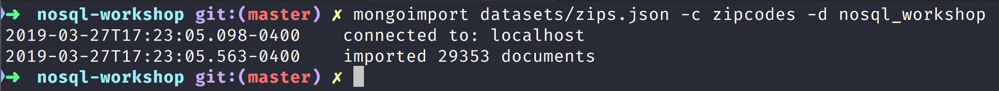
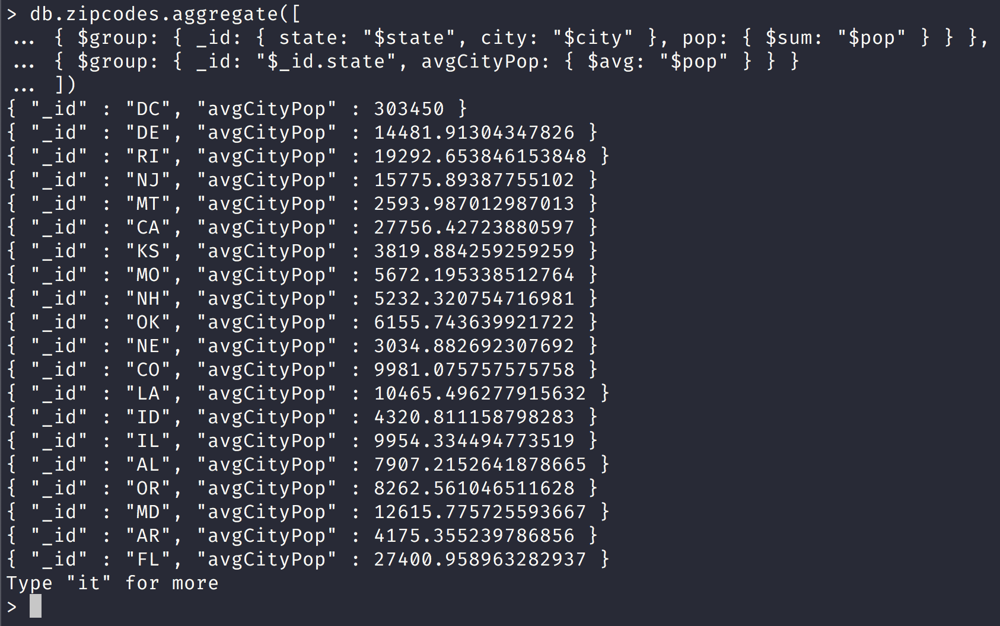
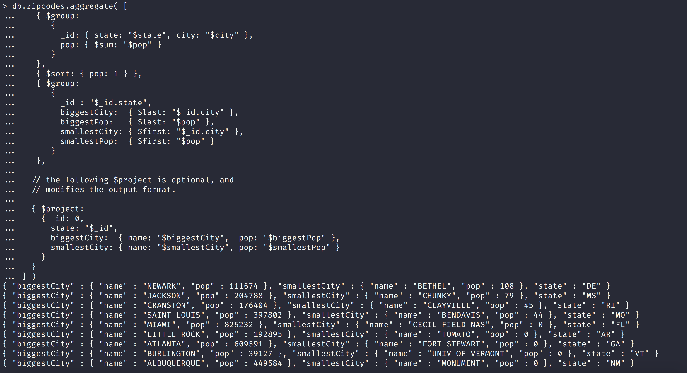
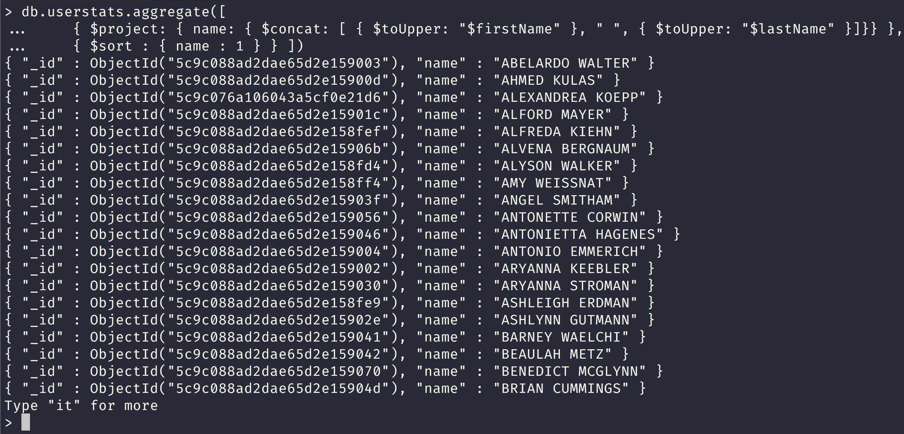
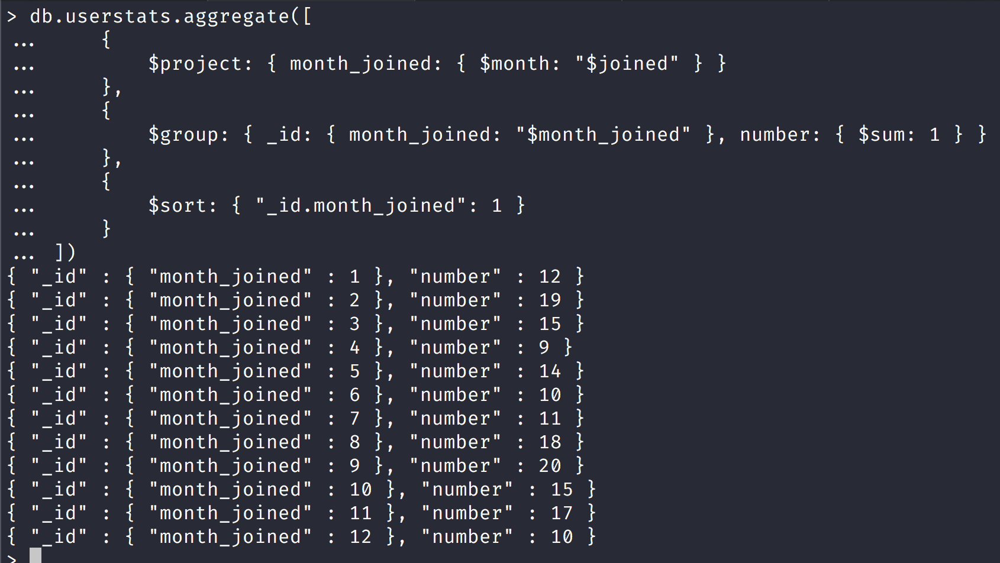
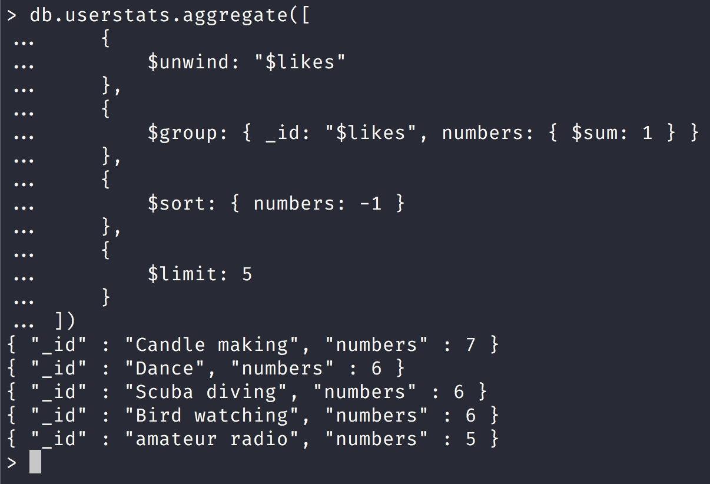

NoSQL Workshop - Mongo Aggregations

## Sections:

* [Aggregation Pipeline](#aggregation-pipeline)
* [Map-Reduce](#map-reduce)
* [Single Purpose Aggregation Operations](#single_purpose_aggregation_operations)
* [Aggregation Reference](#aggregation-reference)
* [Bread Crumb Navigation](#bread-crumb-navigation)

*All of this information is gathered from the official mongodb docs in https://docs.mongodb.com/manual/aggregation/*

> Aggregation operations process data records and return computed results. Aggregation operations group values from multiple documents together, and can perform a variety of operations on the grouped data to return a single result. MongoDB provides three ways to perform aggregation: the aggregation pipeline, the map-reduce function, and single purpose aggregation methods.

## Aggregation Pipeline

[Aggregation Pipeline](https://docs.mongodb.com/manual/aggregation/#aggregation-pipeline)

> MongoDB’s aggregation framework is modeled on the concept of data processing pipelines. Documents enter a multi-stage pipeline that transforms the documents into an aggregated result.

> The most basic pipeline stages provide filters that operate like queries and document transformations that modify the form of the output document.

> Other pipeline operations provide tools for grouping and sorting documents by specific field or fields as well as tools for aggregating the contents of arrays, including arrays of documents. In addition, pipeline stages can use operators for tasks such as calculating the average or concatenating a string.

> The pipeline provides efficient data aggregation using native operations within MongoDB, and is the preferred method for data aggregation in MongoDB.

> The aggregation pipeline is a framework for data aggregation modeled on the concept of data processing pipelines. Documents enter a multi-stage pipeline that transforms the documents into aggregated results.


Notice that here we just received all of the matching 10 documents since cust_id is unique in each record.

Let us create a couple of documents with same id now and try again:

```js
db.orders.aggregate([
...     { $match: { status: "A" } },
...     { $group: { _id: "$cust_id", total: { $sum: "$amount" } } }
... ])
{ "_id" : "1000091797795367", "total" : 892.95 }
{ "_id" : "1000030934189763", "total" : 72.03 }
{ "_id" : "1000061184481622", "total" : 406.77 }
{ "_id" : "1000017100593284", "total" : 939.15 }
{ "_id" : "1000032394277703", "total" : 446.45 }
{ "_id" : "1000068199381696", "total" : 737.54 }
{ "_id" : "1000002686460521", "total" : 580.83 }
{ "_id" : "1000076848558193", "total" : 274.04 }
{ "_id" : "1000015417137497", "total" : 685.98 }
{ "_id" : "1000021996040483", "total" : 252.43 }
> db.orders.insertMany([
... { _id: new ObjectId(), cust_id: "1000015417137497", amount: 50.25, status: "A" },
... { _id: new ObjectId(), cust_id: "1000015417137497", amount: 25.75, status: "A" },
... { _id: new ObjectId(), cust_id: "1000015417137497", amount: 75.25, status: "A" }
... ])
{
	"acknowledged" : true,
	"insertedIds" : [
		ObjectId("5c9bafc5f65647b492473840"),
		ObjectId("5c9bafc5f65647b492473841"),
		ObjectId("5c9bafc5f65647b492473842")
	]
}
> db.orders.aggregate([
... { $match: { status: "A" } },
... { $group: { _id: "$cust_id", total: { $sum: "$amount" } } }
... ])
{ "_id" : "1000091797795367", "total" : 892.95 }
{ "_id" : "1000030934189763", "total" : 72.03 }
{ "_id" : "1000061184481622", "total" : 406.77 }
{ "_id" : "1000017100593284", "total" : 939.15 }
{ "_id" : "1000032394277703", "total" : 446.45 }
{ "_id" : "1000068199381696", "total" : 737.54 }
{ "_id" : "1000002686460521", "total" : 580.83 }
{ "_id" : "1000076848558193", "total" : 274.04 }
{ "_id" : "1000015417137497", "total" : 837.23 }
{ "_id" : "1000021996040483", "total" : 252.43 }
>
```

We added 2 more documents for the $cust_id of "1000015417137497" and now we should get a different total for the 4 documents in total.

Notice that now we have an aggregation for the $cust_id of "1000015417137497" and a different total and we can compute this total manually to verify as:

```
685.98 + 50.25 + 25.75 + 75.25 = 837.23
```

#### MongoDB Aggregation with Zipcode dataset

[Zipcode Dataset MongoDB](http://media.mongodb.org/zips.json)

Please run the following mongoimport command to import the zipcode dataset:

```bash
mongoimport datasets/zips.json -c zipcodes -d nosql_workshop
```



###### Return States with Populations above 10 Million

[Return States with Populations above 10 Million](https://docs.mongodb.com/manual/tutorial/aggregation-zip-code-data-set/#return-states-with-populations-above-10-million)

Let us run an aggregation query that returns state that have populations > 10 million:


*Here is a breakdown according to MongoDB docs!*

> The $group stage groups the documents of the zipcode collection by the state field, calculates the totalPop field for each state, and outputs a document for each unique state.

> The new per-state documents have two fields: the _id field and the totalPop field. The _id field contains the value of the state; i.e. the group by field. The totalPop field is a calculated field that contains the total population of each state. To calculate the value, $group uses the $sum operator to add the population field (pop) for each state.

> The $match stage filters these grouped documents to output only those documents whose totalPop value is greater than or equal to 10 million. The $match stage does not alter the matching documents but outputs the matching documents unmodified.

Here is an equivalent SQL statement according to the docs:

```sql
SELECT state, SUM(pop) AS totalPop
FROM zipcodes
GROUP BY state
HAVING totalPop >= (10*1000*1000)
```

###### Return Average City Population by State

[Return Average City Population by State](https://docs.mongodb.com/manual/tutorial/aggregation-zip-code-data-set/#return-average-city-population-by-state)

>The following aggregation operation returns the average populations for cities in each state:



> In this example, the aggregation pipeline consists of the $group stage followed by another $group stage:

* The first $group stage groups the documents by the combination of city and state, uses the $sum expression to calculate the population for each combination, and outputs a document for each city and state combination.

* A second $group stage groups the documents in the pipeline by the _id.state field (i.e. the state field inside the _id document), uses the $avg expression to calculate the average city population (avgCityPop) for each state, and outputs a document for each state.

###### Return Largest and Smallest Cities by State

[Return Largest and Smallest Cities by State](https://docs.mongodb.com/manual/tutorial/aggregation-zip-code-data-set/#return-largest-and-smallest-cities-by-state)

The following aggregation operation returns the smallest and largest cities by population for each state:

```js
db.zipcodes.aggregate([
   { $group:
      {
        _id: { state: "$state", city: "$city" },
        pop: { $sum: "$pop" }
      }
   },
   { $sort: { pop: 1 } },
   { $group:
      {
        _id : "$_id.state",
        biggestCity:  { $last: "$_id.city" },
        biggestPop:   { $last: "$pop" },
        smallestCity: { $first: "$_id.city" },
        smallestPop:  { $first: "$pop" }
      }
   },

  // the following $project is optional, and
  // modifies the output format.

  { $project:
    { _id: 0,
      state: "$_id",
      biggestCity:  { name: "$biggestCity",  pop: "$biggestPop" },
      smallestCity: { name: "$smallestCity", pop: "$smallestPop" }
    }
  }
])
```

Here is a screenshot with the results from the aggregate query:



> In this example, the aggregation pipeline consists of a $group stage, a $sort stage, another $group stage, and a $project stage:

* The first $group stage groups the documents by the combination of the city and state, calculates the sum of the pop values for each combination, and outputs a document for each city and state combination.

* The $sort stage orders the documents in the pipeline by the pop field value, from smallest to largest; i.e. by increasing order. This operation does not alter the documents.

* The next $group stage groups the now-sorted documents by the _id.state field (i.e. the state field inside the _id document) and outputs a document for each state. The stage also calculates the following four fields for each state. Using the $last expression, the $group operator creates the biggestCity and biggestPop fields that store the city with the largest population and that population. Using the $first expression, the $group operator creates the smallestCity and smallestPop fields that store the city with the smallest population and that population.

* The final $project stage renames the _id field to state and moves the biggestCity, biggestPop, smallestCity, and smallestPop into biggestCity and smallestCity embedded documents.

###### User Preference Data

*All of this comes from official docs at [Aggregation with user preference data](https://docs.mongodb.com/manual/tutorial/aggregation-with-user-preference-data/#aggregation-with-user-preference-data)*

Let us create a user preference collection using the following script in the workshop:

```bash
mongo scripts/create-userprefs-collection.js
```

*Now we can run the following aggregate query in MongoDB:*

```js
db.userstats.aggregate([     
    { $project: { name: { $concat: [ { $toUpper: "$firstName" }, " ", { $toUpper: "$lastName" }]}} },       
	{ $sort : { name : 1 } } 
])
```

Here is the aggregation query request which concatenates the firstName and lastName fields and transforms them into uppercase onto a new field called name and sort by the name field



All documents from the users collection pass through the pipeline, which consists of the following operations:

* The $project operator:
  * creates a new field called name.
  * converts the value of the _id to upper case, with the $toUpper operator. Then the $project creates a new field, named name to hold this value.
  * suppresses the id field. $project will pass the _id field by default, unless explicitly suppressed.

* The $sort operator orders the results by the name field.

###### Return Usernames Ordered by Join Month

[Return Usernames Ordered by Join Month](https://docs.mongodb.com/manual/tutorial/aggregation-with-user-preference-data/#return-usernames-ordered-by-join-month)

> The following aggregation operation returns user names sorted by the month they joined. This kind of aggregation could help generate membership renewal notices.


Notice here that we added a field called month_joined using $project

The pipeline passes all documents in the users collection through the following operations:

* The $project operator:
  * Creates two new fields: month_joined and name.
  * Suppresses the id from the results. The aggregate() method includes the _id, unless explicitly suppressed.

* The $month operator converts the values of the joined field to integer representations of the month. 
  * Then the $project operator assigns those values to the month_joined field.

* The $sort operator sorts the results by the month_joined field.

###### Return Total Number of Joins per Month

[Return Total Number of Joins per Month](https://docs.mongodb.com/manual/tutorial/aggregation-with-user-preference-data/#return-total-number-of-joins-per-month)

> The following operation shows how many people joined each month of the year. You might use this aggregated data for recruiting and marketing strategies.



The pipeline passes all documents in the users collection through the following operations:

* The $project operator creates a new field called month_joined.

* The $month operator converts the values of the joined field to integer representations of the month. Then the $project operator assigns the values to the month_joined field.

* The $group operator collects all documents with a given month_joined value and counts how many documents there are for that value. Specifically, for each unique value, $group creates a new “per-month” document with two fields:
  * _id, which contains a nested document with the month_joined field and its value.
  * number, which is a generated field. The $sum operator increments this field by 1 for every document containing the given month_joined value.

* The $sort operator sorts the documents created by $group according to the contents of the month_joined field.

###### Return the Five Most Common "Likes"

> The following aggregation collects top five most "liked" activities in the data set. This type of analysis could help inform planning and future development.



The pipeline begins with all documents in the users collection, and passes these documents through the following operations:

* The $unwind operator separates each value in the likes array, and creates a new version of the source document for every element in the array.

* The $group operator collects all documents with the same value for the likes field and counts each grouping. With this information, $group creates a new document with two fields:
  * _id, which contains the likes value.
  * number, which is a generated field. The $sum operator increments this field by 1 for every document containing the given likes value.

* The $sort operator sorts these documents by the number field in reverse order.

* The $limit operator only includes the first 5 result documents.


#### Pipeline

[Pipeline](https://docs.mongodb.com/manual/core/aggregation-pipeline/#pipeline)

> The MongoDB aggregation pipeline consists of stages. Each stage transforms the documents as they pass through the pipeline. Pipeline stages do not need to produce one output document for every input document; e.g., some stages may generate new documents or filter out documents. Pipeline stages can appear multiple times in the pipeline.

#### Pipeline Expressions

[Pipeline Expressions](https://docs.mongodb.com/manual/core/aggregation-pipeline/#pipeline-expressions)

> Some pipeline stages take a pipeline expression as the operand. Pipeline expressions specify the transformation to apply to the input documents. Expressions have a document structure and can contain other expression.

> Pipeline expressions can only operate on the current document in the pipeline and cannot refer to data from other documents: expression operations provide in-memory transformation of documents.

> Generally, expressions are stateless and are only evaluated when seen by the aggregation process with one exception: accumulator expressions.


## Map-Reduce

*All of the examples stem from the official docs at [Map Reduce Examples](https://docs.mongodb.com/manual/tutorial/map-reduce-examples/#map-reduce-examples)

[Map-Reduce](https://docs.mongodb.com/manual/aggregation/#map-reduce)

> MongoDB also provides map-reduce operations to perform aggregation. In general, map-reduce operations have two phases: a map stage that processes each document and emits one or more objects for each input document, and reduce phase that combines the output of the map operation. Optionally, map-reduce can have a finalize stage to make final modifications to the result. Like other aggregation operations, map-reduce can specify a query condition to select the input documents as well as sort and limit the results.

> Map-reduce uses custom JavaScript functions to perform the map and reduce operations, as well as the optional finalize operation. While the custom JavaScript provide great flexibility compared to the aggregation pipeline, in general, map-reduce is less efficient and more complex than the aggregation pipeline.

> Map-reduce can operate on a sharded collection. Map-reduce operations can also output to a sharded collection. See Aggregation Pipeline and Sharded Collections and Map-Reduce and Sharded Collections for details.

> Map-reduce is a data processing paradigm for condensing large volumes of data into useful aggregated results. For map-reduce operations, MongoDB provides the mapReduce database command.

Let us create a collection called ordersv2 with the following mongo script:

```bash
mongo scripts/create-ordersv2-collection.js
```

###### Return the Total Price Per Customer

[Return the Total Price Per Customer](https://docs.mongodb.com/manual/tutorial/map-reduce-examples/#return-the-total-price-per-customer)


#### Single Purpose Aggregation Operations

> MongoDB also provides db.collection.estimatedDocumentCount(), db.collection.count() and db.collection.distinct().

> All of these operations aggregate documents from a single collection. While these operations provide simple access to common aggregation processes, they lack the flexibility and capabilities of the aggregation pipeline and map-reduce.

## Aggregation Reference

Content

## Bread Crumb Navigation
_________________________

Previous | Next
:------- | ---:
← [Mongo CRUD Concepts](./mongo-crud-concepts.md) | [MongoDB Data Models](./mongodb_data_models.md) →
