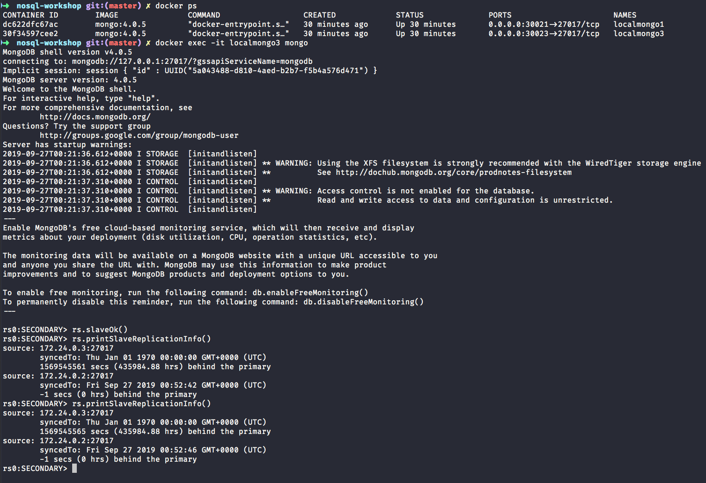
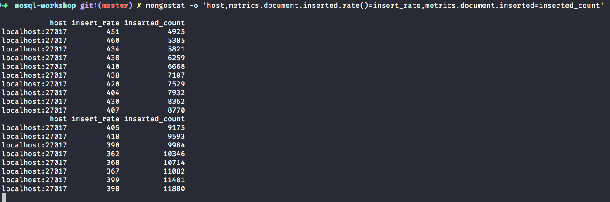
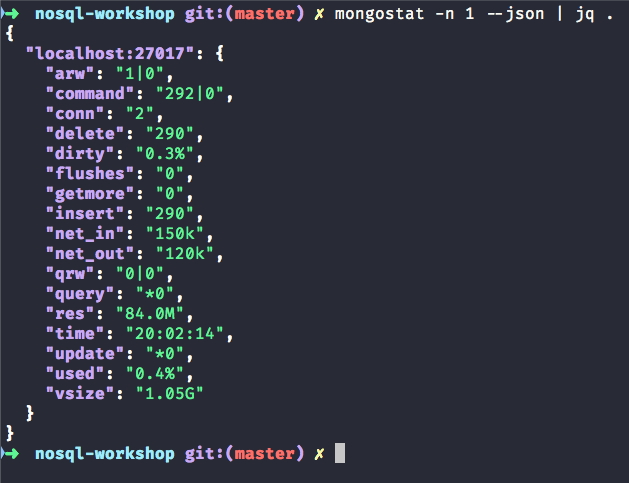
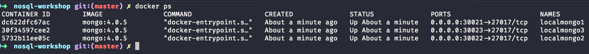
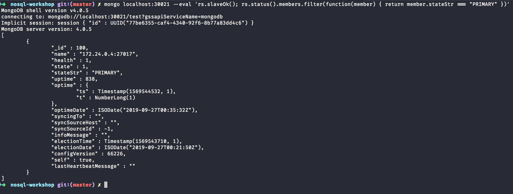
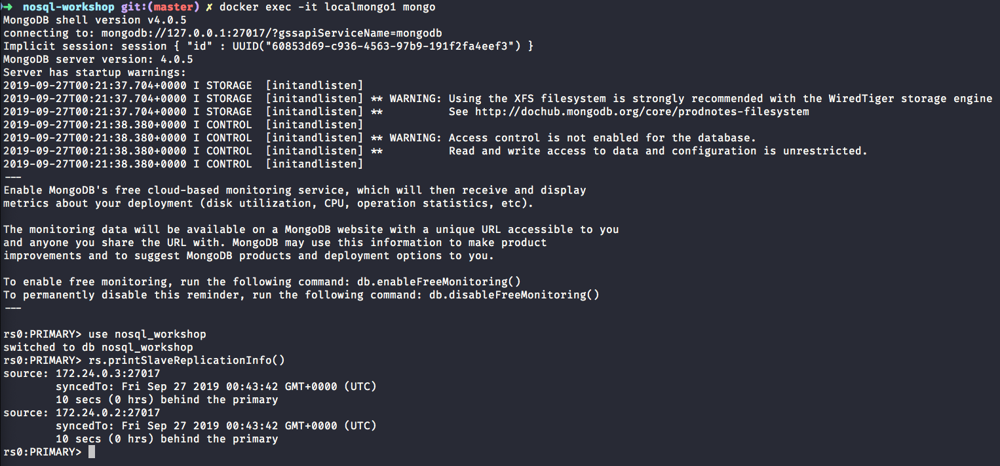

NoSQL Workshop - Mongo Administration

## Sections:

* [Production Notes](#production-notes)
* [Operations Checklist](#operations-checklist)
* [Development Checklist](#development-checklist)
* [Performance](#performance)
* [Configuration and Maintenance](#configuration-and-maintenance)
* [Data Center Awareness](#data-center-awareness)
* [MongoDB Backup Methods](#mongodb-backup-methods)
* [Monitoring for MongoDB](#monitoring-for-mongodb)
* [Personal Notes on MongoDB Administration](#personal-notes-on-mongodb-administration)
* [Bread Crumb Navigation](#bread-crumb-navigation)

###### Production Notes

Please read the official [Production Notes document](https://docs.mongodb.com/manual/administration/production-notes/)

###### Operations Checklist

Please read the official [Operations Checklist document](https://docs.mongodb.com/manual/administration/production-checklist-operations/)

###### Development Checklist

Please read the official [Development Checklist document](https://docs.mongodb.com/manual/administration/production-checklist-development/)

###### Performance

Please read the official [Performance document](https://docs.mongodb.com/manual/administration/analyzing-mongodb-performance/)

###### Configuration and Maintenance

Please read the official [Configuration and Maintenance document](https://docs.mongodb.com/manual/administration/configuration-and-maintenance/)

###### Data Center Awareness

Please read the official [Data Center Awareness document](https://docs.mongodb.com/manual/data-center-awareness/)

###### MongoDB Backup Methods

Please read the official [MongoDB Backup Methods document](https://docs.mongodb.com/manual/core/backups/)

###### Monitoring for MongoDB

Please read the official [Monitoring for MongoDB document](https://docs.mongodb.com/manual/administration/monitoring/)

###### Personal Notes on MongoDB Administration

###### Mongo Perf usage

Let us create json file to get performance metrics in mongodb

```bash
mongoperf --help
mongoperf

usage:

  mongoperf < myjsonconfigfile

  {
    nThreads:<n>,     // number of threads (default 1)
    fileSizeMB:<n>,   // test file size (default 1MB)
    sleepMicros:<n>,  // pause for sleepMicros/nThreads between each operation (default 0)
    mmf:<bool>,       // if true do i/o's via memory mapped files (default false)
    r:<bool>,         // do reads (default false)
    w:<bool>,         // do writes (default false)
    recSizeKB:<n>,    // size of each write (default 4KB)
    syncDelay:<n>     // secs between fsyncs, like --syncdelay in mongod. (default 0/never)
  }

mongoperf is a performance testing tool. the initial tests are of disk subsystem performance;
  tests of mongos and mongod will be added later.
most fields are optional.
non-mmf io is direct io (no caching). use a large file size to test making the heads
  move significantly and to avoid i/o coalescing
mmf io uses caching (the file system cache).
```

We are going to add the following json config file:

```json
{ recSizeKB: 8, nThreads: 12, fileSizeMB: 10000, r: true, mmf: false }
```

Let us run a mongo perf test:

```bash
mongoperf < perf.json
mongoperf
use -h for help
parsed options:
{ recSizeKB: 8, nThreads: 12, fileSizeMB: 10000, r: true, mmf: false }
creating test file size:10000MB ...
1GB...
2GB...
3GB...
4GB...
5GB...
6GB...
7GB...
8GB...
9GB...
testing...
optoins:{ recSizeKB: 8, nThreads: 12, fileSizeMB: 10000, r: true, mmf: false }
wthr 12
new thread, total running : 1
read:1 write:0
201 ops/sec 0 MB/sec
346 ops/sec 1 MB/sec
308 ops/sec 1 MB/sec
314 ops/sec 1 MB/sec
335 ops/sec 1 MB/sec
195 ops/sec 0 MB/sec
320 ops/sec 1 MB/sec
320 ops/sec 1 MB/sec
new thread, total running : 2
read:1 write:0
677 ops/sec 2 MB/sec
738 ops/sec 2 MB/sec
692 ops/sec 2 MB/sec
562 ops/sec 2 MB/sec
526 ops/sec 2 MB/sec
598 ops/sec 2 MB/sec
736 ops/sec 2 MB/sec
586 ops/sec 2 MB/sec
new thread, total running : 4
read:1 write:0
read:1 write:0
1252 ops/sec 4 MB/sec
1140 ops/sec 4 MB/sec
1151 ops/sec 4 MB/sec
1212 ops/sec 4 MB/sec
1051 ops/sec 4 MB/sec
1372 ops/sec 5 MB/sec
1382 ops/sec 5 MB/sec
1406 ops/sec 5 MB/sec
read:1 write:0
read:1 write:0
new thread, total running : 8
read:1 write:0
read:1 write:0
1777 ops/sec 6 MB/sec
1805 ops/sec 7 MB/sec
1859 ops/sec 7 MB/sec
1736 ops/sec 6 MB/sec
1782 ops/sec 6 MB/sec
1616 ops/sec 6 MB/sec
1658 ops/sec 6 MB/sec
2108 ops/sec 8 MB/sec
read:1 write:0
read:1 write:0
new thread, total running : 12
read:1 write:0
read:1 write:0
2181 ops/sec 8 MB/sec
2069 ops/sec 8 MB/sec
```

Now let us check the disk utilization using the `iostat` command:

```bash
iostat -mx 2
Linux 4.4.0-1088-aws (<environment>) 	09/25/2019 	_x86_64_	(4 CPU)

avg-cpu:  %user   %nice %system %iowait  %steal   %idle
           3.64    0.24    0.97    4.10    0.55   90.50

Device:         rrqm/s   wrqm/s     r/s     w/s    rMB/s    wMB/s avgrq-sz avgqu-sz   await r_await w_await  svctm  %util
loop0             0.00     0.00    1.68    0.00     0.00     0.00     2.18     0.00    2.11    2.11    0.00   0.17   0.03
loop1             0.00     0.00    5.18    0.00     0.01     0.00     2.20     0.01    2.27    2.27    0.00   0.13   0.07
loop2             0.00     0.00    5.77    0.00     0.01     0.00     2.17     0.00    0.04    0.04    0.00   0.00   0.00
loop3             0.00     0.00    1.69    0.00     0.00     0.00     2.18     0.00    0.11    0.11    0.00   0.01   0.00
xvda              0.05   104.02   11.32   84.92     0.28     7.90   174.03    10.34  107.45    7.86  120.73   1.44  13.83

avg-cpu:  %user   %nice %system %iowait  %steal   %idle
           0.25    0.00    0.00   27.02    0.00   72.73

Device:         rrqm/s   wrqm/s     r/s     w/s    rMB/s    wMB/s avgrq-sz avgqu-sz   await r_await w_await  svctm  %util
loop0             0.00     0.00    0.00    0.00     0.00     0.00     0.00     0.00    0.00    0.00    0.00   0.00   0.00
loop1             0.00     0.00    0.00    0.00     0.00     0.00     0.00     0.00    0.00    0.00    0.00   0.00   0.00
loop2             0.00     0.00    0.00    0.00     0.00     0.00     0.00     0.00    0.00    0.00    0.00   0.00   0.00
loop3             0.00     0.00    0.00    0.00     0.00     0.00     0.00     0.00    0.00    0.00    0.00   0.00   0.00
xvda              0.00     2.00 1154.00  146.00     9.02    15.77    39.05     8.12    6.20    3.40   28.32   0.77 100.00

avg-cpu:  %user   %nice %system %iowait  %steal   %idle
           0.25    0.00    0.00   36.28    0.00   63.46

Device:         rrqm/s   wrqm/s     r/s     w/s    rMB/s    wMB/s avgrq-sz avgqu-sz   await r_await w_await  svctm  %util
loop0             0.00     0.00    0.00    0.00     0.00     0.00     0.00     0.00    0.00    0.00    0.00   0.00   0.00
loop1             0.00     0.00    0.00    0.00     0.00     0.00     0.00     0.00    0.00    0.00    0.00   0.00   0.00
loop2             0.00     0.00    0.00    0.00     0.00     0.00     0.00     0.00    0.00    0.00    0.00   0.00   0.00
loop3             0.00     0.00    0.00    0.00     0.00     0.00     0.00     0.00    0.00    0.00    0.00   0.00   0.00
xvda              0.00     0.00 1160.00    0.50     9.06     0.01    16.01     3.99    3.42    3.43    0.00   0.86 100.00
.....................................................................................................................
```


Notice that the xvda device in the %util column from the iostat command reached 100% utilization quickly from 13% ~ disk utilization.

###### Mongo Monitoring with mongostat

Let us create a 100k documents in the nosql_workshop database like this:

```js
rs0:PRIMARY> use nosql_workshop
switched to db nosql_workshop
rs0:PRIMARY> for (var x = 0; x < 100000; x++) {
...     db.mongostat.insert({
...         age:(Math.round(Math.random()*100)%20)
...     });
...     db.mongostat.findAndModify({
...         query: { age: (Math.round(Math.random()*100)%20)},
...         update:{ $inc: {age: 2}}
...     });
...     db.mongostat.remove({
...         age:(Math.round(Math.random()*100)%20)
...     });
... }
```

Now let us monitor the secondary replica set member:



*While this long running insert find/update, and remove operation is working we will jump into another terminal session.*

Run the following command:

```bash
mongostat -o 'host,metrics.document.inserted.rate()=insert_rate,metrics.document.inserted=inserted_count'
```

Here is a screenshot of the output:



###### Mongostat metric Table

| Metric | Description |
| --- | --- |
| insert, query, update, and delete | The rate of the specific query type per second |
| getmore | The rate of the cursor batch fetches per second |
| command | The number of commands per second |
| flushes | For WiredTiger Engine, it represents the rate of checkpoints per polling interval |
| mapped | The size of total data mapped for the MMAPv1 storage engine |
| vsize &#124; res | The virtual and resident memory size of the mongod/mongos process |
| faults | MMAPv1 only, represents the number of page faults per second |
| qr &#124; qw | The queue length of active clients waiting for reads and writes respectively |
| ar &#124; aw | The current number of active clients performing read and write operations |

###### Mongostat json output

Pretty JSON output:



*In this output we used jq utility to pretty print our output.*

###### Monitoring the Replication lag of Replica Set nodes in a Replica Set

*Make sure to stop this other container before running the next series of commands*

`docker stop <container_id>`

You can run a command like this if there is only one container:

```bash
docker ps | awk '{ if(NR>1) { print $1 } }'
```

Let us start up our 3 node replica set member using the docker-compose yml script like this:

```bash
docker-compose up
```

We should see 3 docker containers like this screenshot depicts:



Now let us go into the primary replica set member 

We could do the following type command:



The key field to distinguish the primary replica set member is:

* `"stateStr" : "PRIMARY"`

In this case we don't get as helpful information but in our docker-compose.yml file we have mapped the following ports:

* 30021
* 30022
* 30023

We have also mapped the following container names:

* localmongo1
* localmongo2
* localmongo3

so you can easily connect in 2 ways:

* `mongo localhost:30021` if you have mongo client tools installed
* `docker exec -it localmongo1 mongo` using docker commands

Now let us reuse the long running insert, find/update, and remove command that we previously used.

Connect to the primary replica set member and run the following command and print replica set information:



Now we will shutdown one of the secondary nodes like this:

`docker stop localmongo2` and we should only have 2 containers now

Now let us make a long running operation in the primary replica set like this:


#### Bread Crumb Navigation
_________________________

Previous | Next
:------- | ---:
← [MongoDB Sharding](./mongodb_sharding.md) | [MongoDB Storage](./mongodb_storage.md) →
