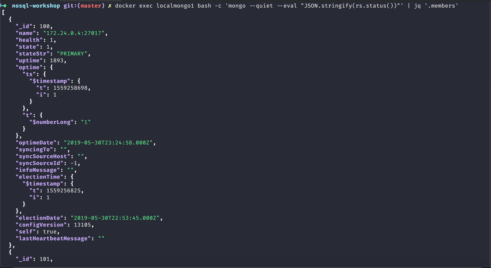
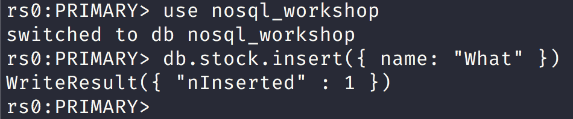

NoSQL Workshop - Mongo Change Streams

## Sections:

* [Definition of Change Streams](#definition-of-change-streams)
* [Change Streams Production Recommendations](#change-streams-production-recommendations)
* [Change Events](#change-events)
* [Bread Crumb Navigation](#bread-crumb-navigation)

## Definition of Change Streams

[MongoDB Change Streams](https://docs.mongodb.com/manual/changeStreams/)

> Change streams allow applications to access real-time data changes without the complexity and risk of tailing the oplog. Applications can use change streams to subscribe to all data changes on a single collection, a database, or an entire deployment, and immediately react to them. Because change streams use the aggregation framework, applications can also filter for specific changes or transform the notifications at will.

#### Watch Collection/Database/Deployment

[Watch collections](https://docs.mongodb.com/manual/changeStreams/#watch-collection-database-deployment)

#### Change Streams Production Recommendations

[Change Streams Production Recommendations](https://docs.mongodb.com/manual/administration/change-streams-production-recommendations/)

###### Change Events

[MongoDB Change Events](https://docs.mongodb.com/manual/reference/change-events/)

#### Creating 3 node replica set with docker run instructions

Create a network first: 

`docker network create my-mongo-cluster`

Now let us create 3 separate containers with the following commands:

```bash
> docker run --name mongo-node1 -d --net my-mongo-cluster mongo:4.0.5 --replSet "rs0"
> docker run --name mongo-node2 -d --net my-mongo-cluster mongo:4.0.5 --replSet "rs0"
> docker run --name mongo-node3 -d --net my-mongo-cluster mongo:4.0.5 --replSet "rs0"
```

Next let us get into the mongo-node1 container with the following command like this:

```bash
docker exec -it mongo-node1 mongo
```

Next let us initiate a replica set with the following configuration options:

```js
config = {
      "_id" : "rs0",
      "members" : [
          {
              "_id" : 0,
              "host" : "mongo-node1:27017"
          },
          {
              "_id" : 1,
              "host" : "mongo-node2:27017"
          },
          {
              "_id" : 2,
              "host" : "mongo-node3:27017"
          }
      ]
}
```

Then we can simply do: `rs.initiate(config)`

#### Creating 3 node replica set with docker-compose yml script

Run the following docker-compose command at the root:

```bash
docker-compose build
docker-compose up
```

Next assuming that 3 docker containers are created you can get into the primary like this:

```bash
docker exec -it localmongo1 mongo
```

You can monitor the secondary replica set like this:

```bash
docker exec -it localmongo2 mongo
```

#### Example using mongodb change stream blog post

The mongodb blog has a good introductory blog post on using change streams that you can find at [An Introduction to Change Streams](https://www.mongodb.com/blog/post/an-introduction-to-change-streams)

I also used and adapted the code in this github repository: [mongodb-node-changestreams-sample](https://github.com/rlondner/mongodb-node-changestreams-sample/tree/master/shell)

Make sure that you have a 3 node replicaset and primary running and as a sanity check you should see something like this:


You can check which node is the primary with this command:

```bash
docker exec localmongo1 bash -c 'mongo --eval "rs.status()"'
```

*You will see a bson blob like this:*

```json
{
	"set" : "rs0",
	"date" : ISODate("2019-05-30T23:18:01.179Z"),
	"myState" : 1,
	"term" : NumberLong(1),
	"syncingTo" : "",
	"syncSourceHost" : "",
	"syncSourceId" : -1,
	"heartbeatIntervalMillis" : NumberLong(2000),
	"optimes" : {
		"lastCommittedOpTime" : {
			"ts" : Timestamp(1559258277, 1),
			"t" : NumberLong(1)
		},
		"readConcernMajorityOpTime" : {
			"ts" : Timestamp(1559258277, 1),
			"t" : NumberLong(1)
		},
		"appliedOpTime" : {
			"ts" : Timestamp(1559258277, 1),
			"t" : NumberLong(1)
		},
		"durableOpTime" : {
			"ts" : Timestamp(1559258277, 1),
			"t" : NumberLong(1)
		}
	},
	"lastStableCheckpointTimestamp" : Timestamp(1559258267, 1),
	"members" : [
		{
			"_id" : 100,
			"name" : "172.24.0.4:27017",
			"health" : 1,
			"state" : 1,
			"stateStr" : "PRIMARY",
			"uptime" : 1467,
			"optime" : {
				"ts" : Timestamp(1559258277, 1),
				"t" : NumberLong(1)
			},
			"optimeDate" : ISODate("2019-05-30T23:17:57Z"),
			"syncingTo" : "",
			"syncSourceHost" : "",
			"syncSourceId" : -1,
			"infoMessage" : "",
			"electionTime" : Timestamp(1559256825, 1),
			"electionDate" : ISODate("2019-05-30T22:53:45Z"),
			"configVersion" : 13105,
			"self" : true,
			"lastHeartbeatMessage" : ""
		},
		{
			"_id" : 101,
			"name" : "172.24.0.3:27017",
			"health" : 1,
			"state" : 2,
			"stateStr" : "SECONDARY",
			"uptime" : 1465,
			"optime" : {
				"ts" : Timestamp(1559258277, 1),
				"t" : NumberLong(1)
			},
			"optimeDurable" : {
				"ts" : Timestamp(1559258277, 1),
				"t" : NumberLong(1)
			},
			"optimeDate" : ISODate("2019-05-30T23:17:57Z"),
			"optimeDurableDate" : ISODate("2019-05-30T23:17:57Z"),
			"lastHeartbeat" : ISODate("2019-05-30T23:17:59.456Z"),
			"lastHeartbeatRecv" : ISODate("2019-05-30T23:18:00.411Z"),
			"pingMs" : NumberLong(0),
			"lastHeartbeatMessage" : "",
			"syncingTo" : "172.24.0.4:27017",
			"syncSourceHost" : "172.24.0.4:27017",
			"syncSourceId" : 100,
			"infoMessage" : "",
			"configVersion" : 13105
		},
		{
			"_id" : 102,
			"name" : "172.24.0.2:27017",
			"health" : 1,
			"state" : 2,
			"stateStr" : "SECONDARY",
			"uptime" : 1465,
			"optime" : {
				"ts" : Timestamp(1559258277, 1),
				"t" : NumberLong(1)
			},
			"optimeDurable" : {
				"ts" : Timestamp(1559258277, 1),
				"t" : NumberLong(1)
			},
			"optimeDate" : ISODate("2019-05-30T23:17:57Z"),
			"optimeDurableDate" : ISODate("2019-05-30T23:17:57Z"),
			"lastHeartbeat" : ISODate("2019-05-30T23:17:59.457Z"),
			"lastHeartbeatRecv" : ISODate("2019-05-30T23:18:00.412Z"),
			"pingMs" : NumberLong(0),
			"lastHeartbeatMessage" : "",
			"syncingTo" : "172.24.0.4:27017",
			"syncSourceHost" : "172.24.0.4:27017",
			"syncSourceId" : 100,
			"infoMessage" : "",
			"configVersion" : 13105
		}
	],
	"ok" : 1,
	"operationTime" : Timestamp(1559258277, 1),
	"$clusterTime" : {
		"clusterTime" : Timestamp(1559258277, 1),
		"signature" : {
			"hash" : BinData(0,"AAAAAAAAAAAAAAAAAAAAAAAAAAA="),
			"keyId" : NumberLong(0)
		}
	}
}
```

We can use the jq json parser to just get the list of members like this:

`docker exec localmongo1 bash -c 'mongo --quiet --eval "JSON.stringify(rs.status())"' | jq '.members'`



We can get change stream working in the shell by doing the following:

`docker exec -it localmongo1 mongo` this command will get you into the primary and load mongo shell.

Next you need to switch to nosql_workshop in mongo shell:

`use nosql_workshop`

Then you need to load the following script:

```js
"use strict";

// Original Code for this is from:
// https://github.com/rlondner/mongodb-node-changestreams-sample/tree/master/shell
// This example is based out of mongodb blog post:
// https://www.mongodb.com/blog/post/an-introduction-to-change-streams

var CONNECTION_STRING = "mongodb://localhost:27017/nosql_workshop?replicaSet=rs0";

var db = connect(CONNECTION_STRING);
var collection = db.stock;

var changeStreamCursor = collection.watch();

pollStream(changeStreamCursor);

//this function polls a change stream and prints out each change as it comes in
function pollStream(cursor) {
  while (!cursor.isExhausted()) {
    if (cursor.hasNext()) {
      var change = cursor.next();
      print(JSON.stringify(change));
    }
  }
  pollStream(cursor);
}
```

You can load the change stream script in the primary replicaset node like this:

`load('/usr/src/configs/change-stream.js')`

Then inside another shell session get into the primary node like this again:

```bash
docker exec -it localmongo1 mongo
```



You will then see a message like this in the primary replica set:

```json
{
  "_id": {
    "_data": "825CF094FB0000000229295A10047BD0B4FEAA254B5E9C3ED88E9A0477E046645F696400645CF094FB9A7A0E082A335F540004"
  },
  "operationType": "insert",
  "clusterTime": {
    "$timestamp": {
      "t": 1559270651,
      "i": 2
    }
  },
  "fullDocument": {
    "_id": {
      "$oid": "5cf094fb9a7a0e082a335f54"
    },
    "name": "What"
  },
  "ns": {
    "db": "nosql_workshop",
    "coll": "stock"
  },
  "documentKey": {
    "_id": {
      "$oid": "5cf094fb9a7a0e082a335f54"
    }
  }
}
```

#### Bread Crumb Navigation
_________________________

Previous | Next
:------- | ---:
← [MongoDB Security](./mongodb_security.md) | [MongoDB Replication](./mongodb_replication.md) →
