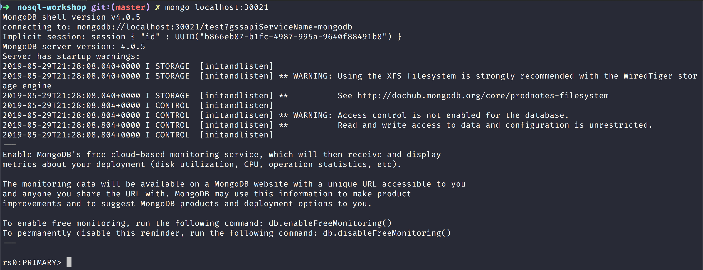

NoSQL Workshop - Mongo Change Streams

## Sections:

* [Definition of Change Streams](#definition-of-change-streams)
* [Change Streams Production Recommendations](#change-streams-production-recommendations)
* [Change Events](#change-events)
* [Bread Crumb Navigation](#bread-crumb-navigation)

## Definition of Change Streams

[MongoDB Change Streams](https://docs.mongodb.com/manual/changeStreams/)

> Change streams allow applications to access real-time data changes without the complexity and risk of tailing the oplog. Applications can use change streams to subscribe to all data changes on a single collection, a database, or an entire deployment, and immediately react to them. Because change streams use the aggregation framework, applications can also filter for specific changes or transform the notifications at will.

#### Watch Collection/Database/Deployment

[Watch collections](https://docs.mongodb.com/manual/changeStreams/#watch-collection-database-deployment)

#### Change Streams Production Recommendations

[Change Streams Production Recommendations](https://docs.mongodb.com/manual/administration/change-streams-production-recommendations/)

###### Change Events

[MongoDB Change Events](https://docs.mongodb.com/manual/reference/change-events/)

#### Creating 3 node replica set with docker run instructions

Create a network first: 

`docker network create my-mongo-cluster`

Now let us create 3 separate containers with the following commands:

```bash
> docker run --name mongo-node1 -d --net my-mongo-cluster mongo:4.0.5 --replSet "rs0"
> docker run --name mongo-node2 -d --net my-mongo-cluster mongo:4.0.5 --replSet "rs0"
> docker run --name mongo-node3 -d --net my-mongo-cluster mongo:4.0.5 --replSet "rs0"
```

Next let us get into the mongo-node1 container with the following command like this:

```bash
docker exec -it mongo-node1 mongo
```

Next let us initiate a replica set with the following configuration options:

```js
config = {
      "_id" : "rs0",
      "members" : [
          {
              "_id" : 0,
              "host" : "mongo-node1:27017"
          },
          {
              "_id" : 1,
              "host" : "mongo-node2:27017"
          },
          {
              "_id" : 2,
              "host" : "mongo-node3:27017"
          }
      ]
}
```

Then we can simply do: `rs.initiate(config)`

#### Creating 3 node replica set with docker-compose yml script

Run the following docker-compose command at the root:

```bash
docker-compose build
docker-compose up
```

Next assuming that 3 docker containers are created you can get into the primary like this:

```bash
docker exec -it localmongo1 mongo
```

You can monitor the secondary replica set like this:

```bash
docker exec -it localmongo2 mongo
```

#### Example using mongodb change stream blog post

The mongodb blog has a good introductory blog post on using change streams that you can find at [An Introduction to Change Streams](https://www.mongodb.com/blog/post/an-introduction-to-change-streams)

I also used and adapted the code in this github repository: [mongodb-node-changestreams-sample](https://github.com/rlondner/mongodb-node-changestreams-sample/tree/master/shell)

Make sure that you have a 3 node replicaset and primary running and as a sanity check you should see something like this:



You can 

#### Bread Crumb Navigation
_________________________

Previous | Next
:------- | ---:
← [MongoDB Security](./mongodb_security.md) | [MongoDB Replication](./mongodb_replication.md) →
