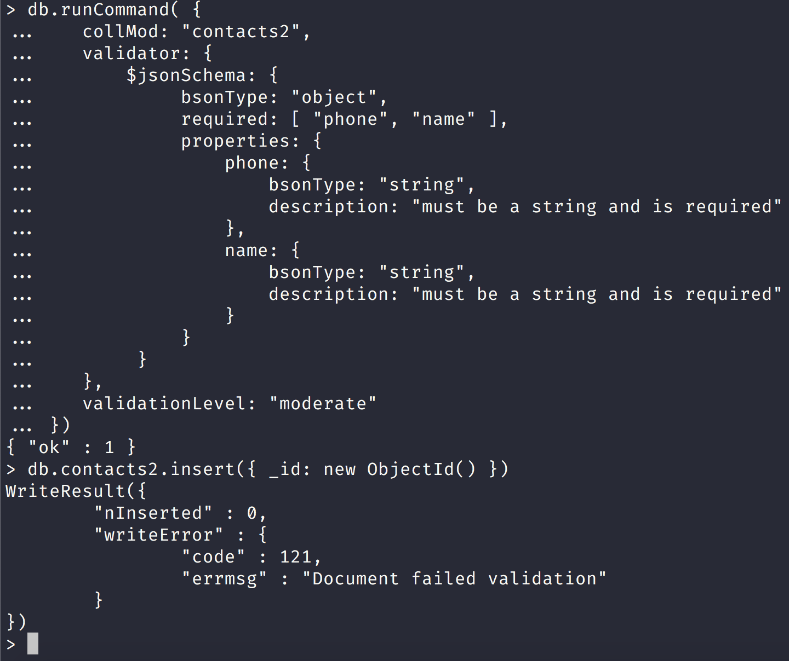
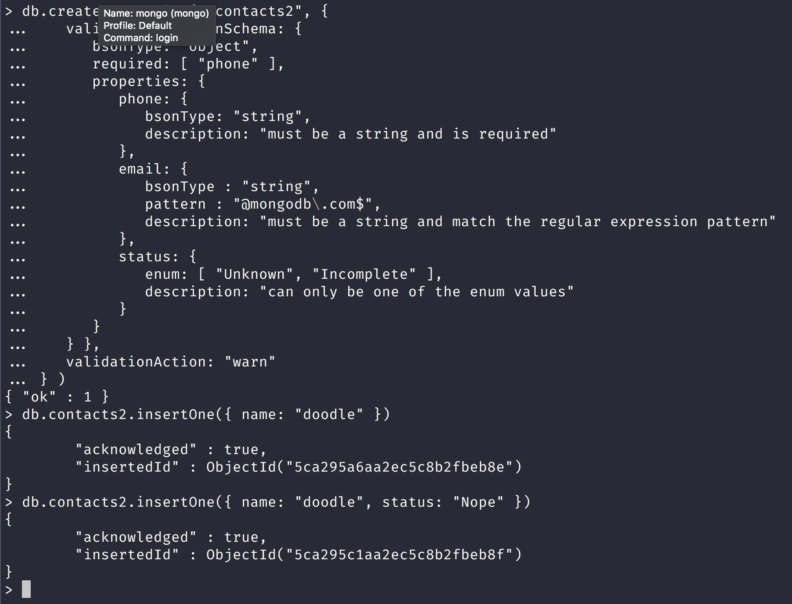

NoSQL Workshop - Mongo Data Models Part I

## Sections:

* [Data Modeling Introduction](#data-modeling-introduction)
* [Schema Validation](#schema-validation)
* [Bread Crumb Navigation](#bread-crumb-navigation)

## Data Modeling Introduction

*All of this information is from [Data Modeling Introduction MongoDB Docs](https://docs.mongodb.com/manual/core/data-modeling-introduction/)

> The key challenge in data modeling is balancing the needs of the application, the performance characteristics of the database engine, and the data retrieval patterns. When designing data models, always consider the application usage of the data (i.e. queries, updates, and processing of the data) as well as the inherent structure of the data itself.

#### Flexible Schema

> Unlike SQL databases, where you must determine and declare a table’s schema before inserting data, MongoDB’s collections, by default, does not require its documents to have the same schema. That is:

> The documents in a single collection do not need to have the same set of fields and the data type for a field can differ across documents within a collection.
To change the structure of the documents in a collection, such as add new fields, remove existing fields, or change the field values to a new type, update the documents to the new structure.

> This flexibility facilitates the mapping of documents to an entity or an object. Each document can match the data fields of the represented entity, even if the document has substantial variation from other documents in the collection.

> In practice, however, the documents in a collection share a similar structure, and you can enforce document validation rules for a collection during update and insert operations. See Schema Validation for details.

#### Document Structure

> The key decision in designing data models for MongoDB applications revolves around the structure of documents and how the application represents relationships between data. MongoDB allows related data to be embedded within a single document.

###### Embedded Data

> Embedded documents capture relationships between data by storing related data in a single document structure. MongoDB documents make it possible to embed document structures in a field or array within a document. These denormalized data models allow applications to retrieve and manipulate related data in a single database operation.

###### References

References store the relationships between data by including links or references from one document to another. Applications can resolve these references to access the related data. Broadly, these are normalized data models.

*user document:*

```js
{
    _id: ObjectId("12345"),
    username: "jbelmont"
}
```

*contact document:*

```js
{
    id: ObjectId("some1345"),
    user_id: ObjectId("12345"),
    phone: "910-923-4556",
    email: "somebody@hey.com"
}
```

*Notice here that user_id is a reference to the _id field in the user document.*

## Schema Validation

[Schema Validation](https://docs.mongodb.com/manual/core/schema-validation/)

> MongoDB provides the capability to perform schema validation during updates and insertions in version 3.2

#### Specify Validation Rules

Validation rules are on a per-collection basis.

To specify validation rules when creating a new collection, use db.createCollection() with the validator option.

To add document validation to an existing collection, use collMod command with the validator option.

MongoDB also provides the following related options:

* validationLevel option, which determines how strictly MongoDB applies validation rules to existing documents during an update, and

* validationAction option, which determines whether MongoDB should error and reject documents that violate the validation rules or warn about the violations in the log but allow invalid documents.

#### JSON Schema

> Starting in version 3.6, MongoDB supports JSON Schema validation. To specify JSON Schema validation, use the $jsonSchema operator in your validator expression.

**JSON Schema is the recommended means of performing schema validation.**

*Schema validation with json schema:*

```js
db.createCollection("students", {
   validator: {
      $jsonSchema: {
         bsonType: "object",
         required: [ "name", "year", "major", "gpa", "address.city", "address.street" ],
         properties: {
            name: {
               bsonType: "string",
               description: "must be a string and is required"
            },
            gender: {
               bsonType: "string",
               description: "must be a string and is not required"
            },
            year: {
               bsonType: "int",
               minimum: 2017,
               maximum: 3017,
               exclusiveMaximum: false,
               description: "must be an integer in [ 2017, 3017 ] and is required"
            },
            major: {
               enum: [ "Math", "English", "Computer Science", "History", null ],
               description: "can only be one of the enum values and is required"
            },
            gpa: {
               bsonType: [ "double" ],
               minimum: 0,
               description: "must be a double and is required"
            },
            "address.city" : {
               bsonType: "string",
               description: "must be a string and is required"
            },
            "address.street" : {
               bsonType: "string",
               description: "must be a string and is required"
            }
         }
      }
   }
})
```

*Notice here that we specify the bson type for each property and can specify required fields.*

#### Query Expressions

> In addition to JSON Schema validation, MongoDB supports validation with query filter expressions using the query operators, with the exception of $near, $nearSphere, $text, and $where.

```js
db.createCollection( "contacts", { 
    validator: { 
        $or: [
            { phone: { $type: "string" } },
            { email: { $regex: /@mongodb\.com$/ } },
            { status: { $in: [ "Unknown", "Incomplete" ] } }
        ]
    }
})
```

Let us try to add a new set of contacts with the validation rules that fail in the following example:

```js
db.contacts.insert([
   { "_id": 1, "name": "Anne", "phone": "+1 555 123 456", "city": "London", "status": "Complete" },
   { "_id": 2, "name": "Ivan", "city": "Vancouver" }
])
```


Let us fix the validation failures in the example:

```js
db.contacts.insert([
   { "_id": 1, "name": "Anne", "phone": "+1 555 123 456", "city": "London", "status": "Incomplete" },
   { "_id": 2, "name": "Ivan", "city": "Vancouver", "email": "somebody@mongodb.com" }
])
```


*Notice that it passed now because the $or validation passed for the status which is Incomplete in _id 1 and we passed a valid email to the _id of 2.*

#### Existing Documents

[Existing Documents](https://docs.mongodb.com/manual/core/schema-validation/#existing-documents)

The validationLevel option determines which operations MongoDB applies the validation rules:

* If the validationLevel is strict (the default), MongoDB applies validation rules to all inserts and updates.

* If the validationLevel is moderate, MongoDB applies validation rules to inserts and to updates to existing documents that already fulfill the validation criteria. With the moderate level, updates to existing documents that do not fulfill the validation criteria are not checked for validity.

Let us create a new collection called "contacts2" to test the existing documents validation.

```js
db.createCollection("contacts2")

db.contacts2.insert([
   { "_id": 1, "name": "Anne", "phone": "+1 555 123 456", "city": "London", "status": "Complete" },
   { "_id": 2, "name": "Ivan", "city": "Vancouver" }
])
```

Let us now add a validator to the contacts2 collection like this:

```js
db.runCommand( {
   collMod: "contacts2",
   validator: { 
       $jsonSchema: {
            bsonType: "object",
            required: [ "phone", "name" ],
            properties: {
                phone: {
                    bsonType: "string",
                    description: "must be a string and is required"
                },
                name: {
                    bsonType: "string",
                    description: "must be a string and is required"
                }
            }
        } 
   },
   validationLevel: "error"
})
```

Now when we try to update the existing contact2 collection we should get a validation failure with an insert like this:



###### Accept or Reject Invalid Documents

[Accept or Reject Invalid Documents](https://docs.mongodb.com/manual/core/schema-validation/#accept-or-reject-invalid-documents)

The validationAction option determines how MongoDB handles documents that violate the validation rules:

* If the validationAction is error (the default), MongoDB rejects any insert or update that violates the validation criteria.

* If the validationAction is warn, MongoDB logs any violations but allows the insertion or update to proceed.

```js
db.createCollection( "contacts2", {
   validator: { $jsonSchema: {
      bsonType: "object",
      required: [ "phone" ],
      properties: {
         phone: {
            bsonType: "string",
            description: "must be a string and is required"
         },
         email: {
            bsonType : "string",
            pattern : "@mongodb\.com$",
            description: "must be a string and match the regular expression pattern"
         },
         status: {
            enum: [ "Unknown", "Incomplete" ],
            description: "can only be one of the enum values"
         }
      }
   } },
   validationAction: "warn"
} )
```




Notice that the log showed the warning but the insert still occurred.

## Bread Crumb Navigation
_________________________

Previous | Next
:------- | ---:
← [MongoDB Aggregation](./mongodb-aggregation.md) | [MongoDB Data Models Part I](./mongodb_data_models_part_II.md) →
