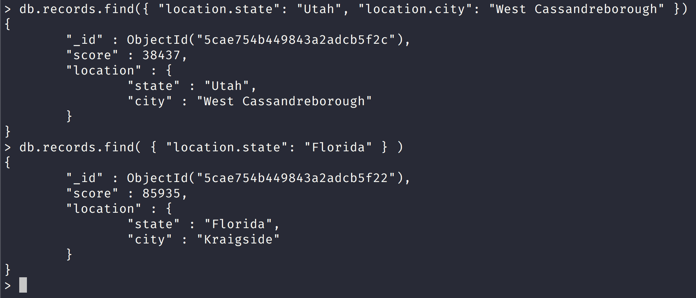

NoSQL Workshop - Mongo Indexes

## Sections:

* [Single Field Indexes](#single-field-indexes)
* [Compound Indexes](#compound-indexes)
* [Multikey Indexes](#multikey-indexes)
* [Text Indexes](#text-indexes)
* [2dsphere Indexes](#2dsphere-indexes)
* [2d Indexes](#2d-indexes)
* [geoHaystack Indexes](#geohaystack-indexes)
* [Hashed Indexes](#hashed-indexes)
* [Index Properties](#index-properties)
* [Index Build Operations on a Populated Collection](#index-build-operations-on-a-populated-collection)
* [Index Intersection](#index-intersection)
* [Manage Indexes](#manage-indexes)
* [Measure Index Use](#measure-index-use)
* [Indexing Strategies](#indexing-strategies)
* [Indexing Reference](#indexing-reference)
* [Bread Crumb Navigation](#bread-crumb-navigation)

## Single Field Indexes

Let us create the records collection with the following script:

```bash
mongo scripts/create-records-collection.js
```

in order to test out the indexes section.

[Single Field Indexes](https://docs.mongodb.com/manual/core/index-single/)

> MongoDB provides complete support for indexes on any field in a collection of documents. By default, all collections have an index on the _id field, and applications and users may add additional indexes to support important queries and operations.

> The following operation creates an ascending index on the score field of the records collection:

```js
db.records.createIndex( { score: 1 } )
```

> The value of the field in the index specification describes the kind of index for that field. For example, a value of 1 specifies an index that orders items in ascending order. A value of -1 specifies an index that orders items in descending order. For additional index types, see index types.

#### Create an Index on an Embedded Field

[Create an Index on an Embedded Field](https://docs.mongodb.com/manual/core/index-single/#create-an-index-on-an-embedded-field)

> You can create indexes on fields within embedded documents, just as you can index top-level fields in documents. Indexes on embedded fields differ from indexes on embedded documents, which include the full content up to the maximum index size of the embedded document in the index. Instead, indexes on embedded fields allow you to use a “dot notation,” to introspect into embedded documents.

```js
db.records.createIndex( { "location.state": 1 } )
```

> The created index will support queries that select on the field location.state, such as the following:



#### Create an Index on Embedded Document

[Create an Index on Embedded Document](https://docs.mongodb.com/manual/core/index-single/#create-an-index-on-embedded-document)

> You can also create indexes on embedded document as a whole.

> The location field is an embedded document, containing the embedded fields city and state. The following command creates an index on the location field as a whole:

```js
db.records.createIndex( { location: 1 } )
```

## Compound Indexes

Content

## Multikey Indexes

Content

## Text Indexes

Content

## 2dsphere Indexes

Content

## 2d Indexes

Content

## geoHaystack Indexes

Content

## Hashed Indexes

Content

## Index Properties

Content

## Index Build Operations on a Populated Collection

Content

## Index Intersection

Content

## Manage Indexes

Content

## Measure Index Use

Content

## Indexing Strategies

Content

## Indexing Reference

Content

## Bread Crumb Navigation
_________________________

Previous | Next
:------- | ---:
← [MongoDB Transactions](./mongodb_transactions.md) | [MongoDB Security](./mongodb_security.md) →
