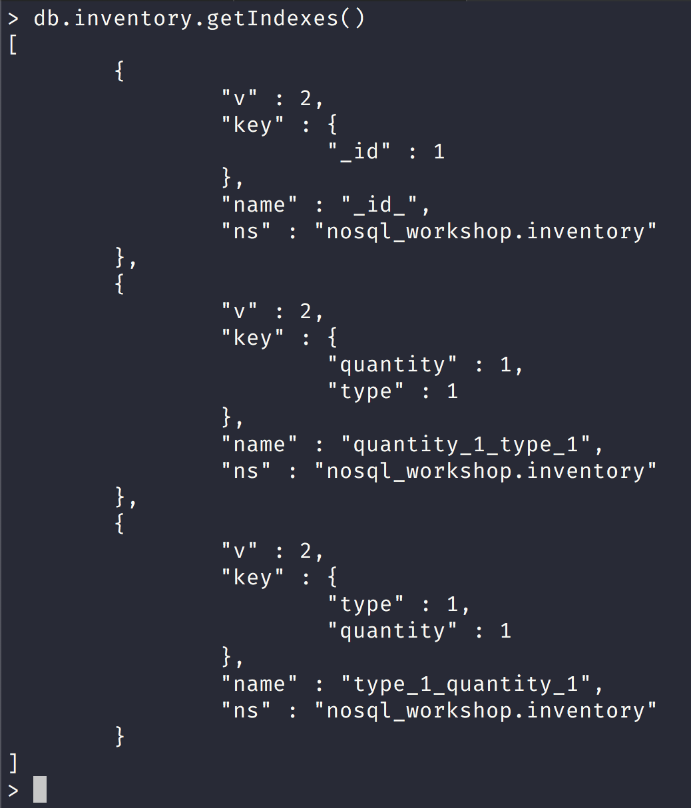
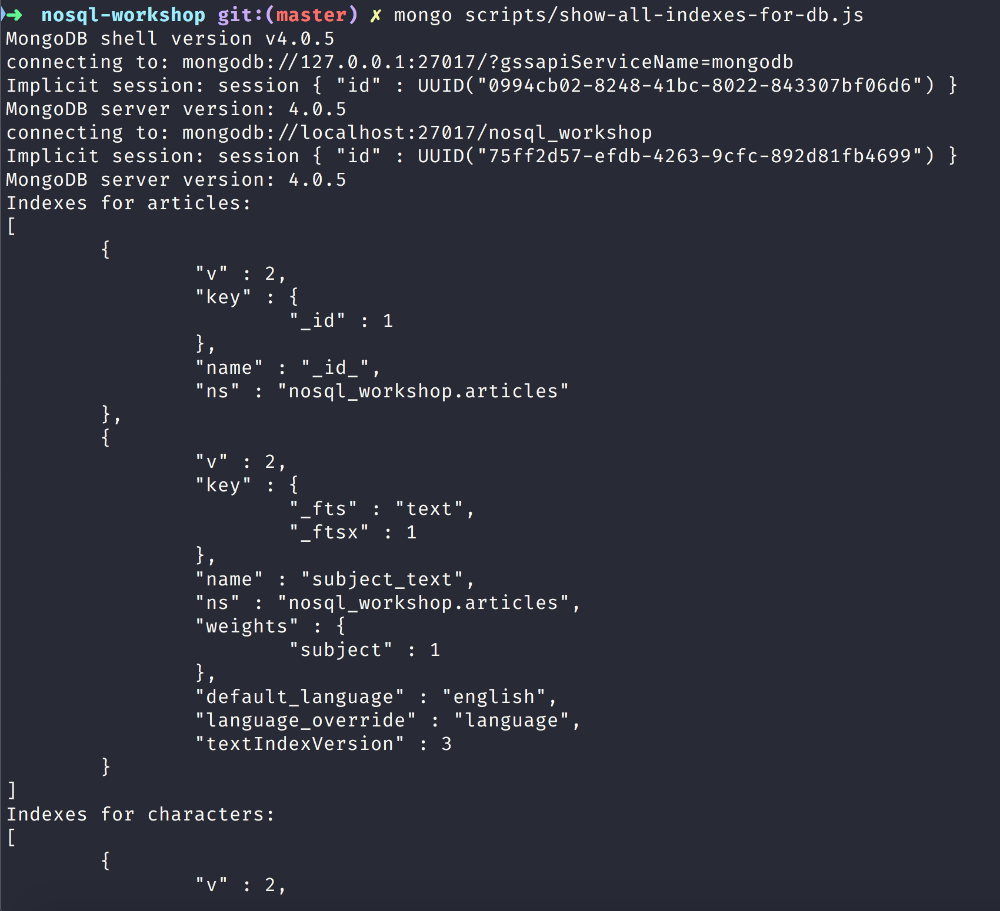
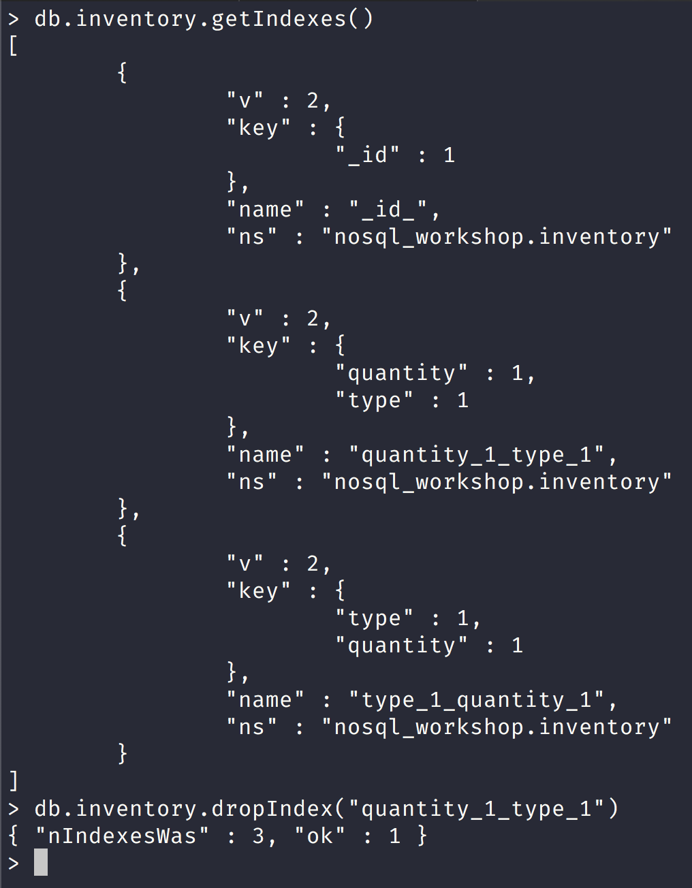
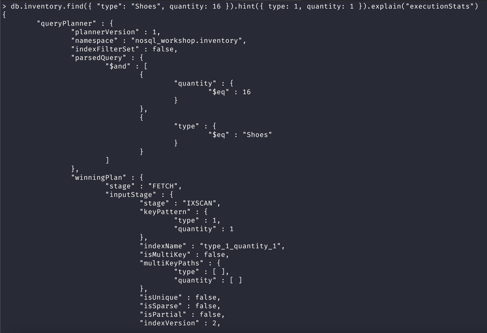

NoSQL Workshop - Mongo Indexes Part I

## Sections:

* [Single Field Indexes](#single-field-indexes)
* [Compound Indexes](#compound-indexes)
* [Multikey Indexes](#multikey-indexes)
* [Text Indexes](#text-indexes)
* [2dsphere Indexes](#2dsphere-indexes)
* [2d Indexes](#2d-indexes)
* [geoHaystack Indexes](#geohaystack-indexes)
* [Hashed Indexes](#hashed-indexes)
* [Index Properties](#index-properties)
* [Index Build Operations on a Populated Collection](#index-build-operations-on-a-populated-collection)
* [Index Intersection](#index-intersection)
* [Manage Indexes](#manage-indexes)
* [Measure Index Use](#measure-index-use)
* [Indexing Strategies](#indexing-strategies)
* [Load collection with large amount of data](#load-collection-with-large-amount-of-data)
* [Indexing Reference](#indexing-reference)
* [Bread Crumb Navigation](#bread-crumb-navigation)

The information below comes from [MongoDB Reference on Indexes](https://docs.mongodb.com/manual/indexes/)

## Single Field Indexes

Let us create the records collection with the following script:

```bash
mongo scripts/create-records-collection.js
```

in order to test out the indexes section.

[Single Field Indexes](https://docs.mongodb.com/manual/core/index-single/)

> MongoDB provides complete support for indexes on any field in a collection of documents. By default, all collections have an index on the _id field, and applications and users may add additional indexes to support important queries and operations.

> The following operation creates an ascending index on the score field of the records collection:

```js
db.records.createIndex( { score: 1 } )
```

> The value of the field in the index specification describes the kind of index for that field. For example, a value of 1 specifies an index that orders items in ascending order. A value of -1 specifies an index that orders items in descending order. For additional index types, see index types.

#### Create an Index on an Embedded Field

[Create an Index on an Embedded Field](https://docs.mongodb.com/manual/core/index-single/#create-an-index-on-an-embedded-field)

> You can create indexes on fields within embedded documents, just as you can index top-level fields in documents. Indexes on embedded fields differ from indexes on embedded documents, which include the full content up to the maximum index size of the embedded document in the index. Instead, indexes on embedded fields allow you to use a “dot notation,” to introspect into embedded documents.

```js
db.records.createIndex( { "location.state": 1 } )
```

> The created index will support queries that select on the field location.state, such as the following:


#### Create an Index on Embedded Document

[Create an Index on Embedded Document](https://docs.mongodb.com/manual/core/index-single/#create-an-index-on-embedded-document)

> You can also create indexes on embedded document as a whole.

> The location field is an embedded document, containing the embedded fields city and state. The following command creates an index on the location field as a whole:

```js
db.records.createIndex( { location: 1 } )
```

## Compound Indexes

> MongoDB supports compound indexes, where a single index structure holds references to multiple fields within a collection’s documents. The following diagram illustrates an example of a compound index on two fields:

> Compound indexes can support queries that match on multiple fields.

[Create a Compound Index](https://docs.mongodb.com/manual/core/index-compound/#create-a-compound-index)

```js
db.collection.createIndex( { <field1>: <type>, <field2>: <type2>, ... } )
```

> The value of the field in the index specification describes the kind of index for that field. For example, a value of 1 specifies an index that orders items in ascending order. A value of -1 specifies an index that orders items in descending order. For additional index types, see index types.

Let us insert many documents to the products collection:

```js
let products = [
  {"item":"Intelligent Granite Chair","category":["Shoes","Grocery","Grocery"],"location":"8551 Darrion Plaza","stock":57,"type":"Car"},{"item":"Rustic Steel Tuna","category":["Grocery","Electronics","Outdoors"],"location":"01833 Sydney Lights","stock":5,"type":"Gloves"},{"item":"Small Granite Chips","category":["Outdoors","Grocery","Baby"],"location":"2777 Esther Mountain","stock":7,"type":"Fish"},{"item":"Generic Frozen Chicken","category":["Home","Movies","Grocery"],"location":"2838 Rosella Parkway","stock":1,"type":"Pants"},{"item":"Sleek Concrete Cheese","category":["Industrial","Grocery","Tools"],"location":"80038 Lindsey Green","stock":51,"type":"Soap"},{"item":"Awesome Wooden Bike","category":["Baby","Home","Clothing"],"location":"671 Emard Camp","stock":4,"type":"Hat"},{"item":"Sleek Metal Towels","category":["Industrial","Sports","Electronics"],"location":"8685 Arnaldo Brook","stock":21,"type":"Bacon"},{"item":"Intelligent Granite Keyboard","category":["Industrial","Grocery","Tools"],"location":"3296 Friedrich Summit","stock":13,"type":"Hat"},{"item":"Incredible Plastic Sausages","category":["Beauty","Outdoors","Baby"],"location":"276 Bergnaum Plaza","stock":63,"type":"Gloves"},{"item":"Small Metal Chips","category":["Jewelery","Clothing","Industrial"],"location":"5299 Roob Drive","stock":23,"type":"Tuna"},{"item":"Handmade Granite Shoes","category":["Computers","Industrial","Home"],"location":"53272 Homenick Row","stock":38,"type":"Salad"},{"item":"Small Wooden Car","category":["Sports","Home","Toys"],"location":"28131 Gleichner Trace","stock":43,"type":"Sausages"},{"item":"Gorgeous Wooden Pizza","category":["Toys","Beauty","Home"],"location":"5073 Jarvis Dale","stock":54,"type":"Towels"},{"item":"Handmade Soft Pizza","category":["Music","Books","Grocery"],"location":"7509 Daniel Walks","stock":96,"type":"Shirt"},{"item":"Ergonomic Concrete Chair","category":["Books","Movies","Home"],"location":"54435 Yundt Roads","stock":13,"type":"Tuna"},{"item":"Ergonomic Steel Shirt","category":["Clothing","Automotive","Kids"],"location":"827 Mohr Parkways","stock":68,"type":"Bacon"},{"item":"Licensed Granite Mouse","category":["Grocery","Sports","Games"],"location":"1350 Champlin Ridges","stock":98,"type":"Shoes"},{"item":"Generic Soft Ball","category":["Garden","Music","Garden"],"location":"017 Jerald Manors","stock":26,"type":"Bacon"},{"item":"Tasty Plastic Pizza","category":["Books","Music","Electronics"],"location":"64802 Briana Valleys","stock":81,"type":"Computer"},{"item":"Refined Concrete Bacon","category":["Music","Electronics","Sports"],"location":"6687 Blick Route","stock":10,"type":"Shirt"},{"item":"Incredible Cotton Tuna","category":["Electronics","Industrial","Games"],"location":"614 Stephan Parkway","stock":63,"type":"Computer"},{"item":"Intelligent Rubber Chair","category":["Toys","Music","Baby"],"location":"100 Ziemann Canyon","stock":37,"type":"Mouse"},{"item":"Gorgeous Fresh Car","category":["Grocery","Outdoors","Outdoors"],"location":"76946 Douglas Mount","stock":93,"type":"Chicken"},{"item":"Generic Soft Keyboard","category":["Beauty","Health","Kids"],"location":"9064 Fahey Spring","stock":40,"type":"Sausages"},{"item":"Fantastic Wooden Ball","category":["Automotive","Jewelery","Home"],"location":"52448 Retta Mount","stock":91,"type":"Chicken"},{"item":"Gorgeous Fresh Mouse","category":["Electronics","Garden","Sports"],"location":"09186 Crona Isle","stock":30,"type":"Bike"},{"item":"Ergonomic Cotton Keyboard","category":["Movies","Health","Garden"],"location":"551 Pacocha Grove","stock":38,"type":"Car"},{"item":"Handmade Fresh Car","category":["Kids","Books","Health"],"location":"8392 Davion Rue","stock":20,"type":"Chicken"},{"item":"Small Steel Shoes","category":["Games","Books","Tools"],"location":"770 Hilpert Corners","stock":97,"type":"Gloves"},{"item":"Handmade Soft Shirt","category":["Health","Clothing","Toys"],"location":"24184 Predovic Locks","stock":85,"type":"Towels"},{"item":"Licensed Plastic Cheese","category":["Home","Sports","Baby"],"location":"061 Hackett Hill","stock":56,"type":"Cheese"},{"item":"Unbranded Wooden Cheese","category":["Toys","Toys","Games"],"location":"2274 Breitenberg Isle","stock":80,"type":"Bike"},{"item":"Intelligent Fresh Tuna","category":["Baby","Garden","Toys"],"location":"628 Mitchell Forges","stock":67,"type":"Chicken"},{"item":"Gorgeous Cotton Car","category":["Jewelery","Automotive","Grocery"],"location":"5363 Narciso Mall","stock":3,"type":"Sausages"},{"item":"Handcrafted Steel Shoes","category":["Jewelery","Baby","Tools"],"location":"80987 Schoen Ridges","stock":65,"type":"Towels"},{"item":"Ergonomic Steel Soap","category":["Shoes","Jewelery","Toys"],"location":"29058 Fahey Flats","stock":99,"type":"Computer"},{"item":"Small Cotton Pants","category":["Garden","Grocery","Beauty"],"location":"98194 Abbie Station","stock":19,"type":"Chicken"},{"item":"Intelligent Cotton Pants","category":["Health","Electronics","Beauty"],"location":"120 Hills Plaza","stock":55,"type":"Tuna"},{"item":"Ergonomic Rubber Bike","category":["Music","Movies","Garden"],"location":"9058 Christiansen Points","stock":61,"type":"Salad"},{"item":"Unbranded Steel Fish","category":["Computers","Beauty","Outdoors"],"location":"05465 Elissa Manors","stock":21,"type":"Chicken"},{"item":"Refined Granite Chips","category":["Sports","Games","Garden"],"location":"494 Hirthe Ports","stock":81,"type":"Shirt"},{"item":"Gorgeous Steel Computer","category":["Books","Industrial","Toys"],"location":"00908 Ahmed Unions","stock":11,"type":"Pants"},{"item":"Unbranded Concrete Car","category":["Baby","Computers","Baby"],"location":"802 Farrell Inlet","stock":59,"type":"Chicken"},{"item":"Refined Wooden Pizza","category":["Clothing","Games","Computers"],"location":"15858 Predovic Ferry","stock":34,"type":"Keyboard"},{"item":"Licensed Concrete Computer","category":["Computers","Toys","Health"],"location":"439 Stamm Extensions","stock":49,"type":"Computer"},{"item":"Generic Frozen Ball","category":["Tools","Beauty","Sports"],"location":"21821 Jermaine Brooks","stock":75,"type":"Bacon"},{"item":"Licensed Frozen Towels","category":["Games","Toys","Movies"],"location":"39745 Kuvalis Ridges","stock":20,"type":"Chair"},{"item":"Gorgeous Cotton Shirt","category":["Baby","Electronics","Grocery"],"location":"780 Ernser Lodge","stock":69,"type":"Bike"},{"item":"Tasty Cotton Table","category":["Industrial","Games","Baby"],"location":"486 Ondricka Dam","stock":97,"type":"Chicken"},{"item":"Ergonomic Soft Towels","category":["Shoes","Kids","Baby"],"location":"251 Anya Hill","stock":93,"type":"Shoes"}
];

db.products.insertMany(products);

db.products.createIndex({ "item": 1, "stock": 1 })
```

Here we create a compound index on item and stock

`db.events.find().sort( { username: 1, date: -1 } )`

> For a compound index, MongoDB can use the index to support queries on the index prefixes. As such, MongoDB can use the index for queries on the following fields:

* the item field,
* the item field and the location field,
* the item field and the location field and the stock field.

## Multikey Indexes

Please read the official docs on [Multikey Indexes](https://docs.mongodb.com/manual/core/index-multikey/)

## Text Indexes

Please read the official docs on [Multikey Indexes](https://docs.mongodb.com/manual/core/index-multikey/)

## 2dsphere Indexes

Please read the official docs on [2dsphere Indexes](https://docs.mongodb.com/manual/core/2dsphere/)

## 2d Indexes

Please read the official docs on [2d Indexes](https://docs.mongodb.com/manual/core/2d/)

## geoHaystack Indexes

Please read the official docs on [GeoHaystack Indexes](https://docs.mongodb.com/manual/core/geohaystack/)

## Hashed Indexes

Please read the official docs on [Hashed](https://docs.mongodb.com/manual/core/index-hashed/)

## Index Properties

Please read the official docs on [Index Properties](https://docs.mongodb.com/manual/core/index-properties/)

## Index Build Operations on a Populated Collection

Please read the official docs on [Index Build Operations on a Populated Collection](https://docs.mongodb.com/manual/core/index-creation/)

## Index Intersection

Please read the official docs on [Index Intersection](https://docs.mongodb.com/manual/core/index-intersection/)

## Manage Indexes

Please read the official docs on [Manage Indexes](https://docs.mongodb.com/manual/tutorial/manage-indexes/)

#### View Existing Indexes

###### List all Indexes on a Collection

> To return a list of all indexes on a collection, use the db.collection.getIndexes() method or a similar method for your driver.



> To list all indexes on all collections in a database, you can use the following operation in the mongo shell:

```js
db.getCollectionNames().forEach(function(collection) {
   indexes = db[collection].getIndexes();
   print("Indexes for " + collection + ":");
   printjson(indexes);
});
```

You can execute this with the mongo binary executable with the following script:

```bash
mongo scripts/show-all-indexes-for-db.js
```



#### Remove Indexes

MongoDB provides two methods for removing indexes from a collection:

* [db.collection.dropIndex()](https://docs.mongodb.com/manual/reference/method/db.collection.dropIndex/#db.collection.dropIndex)

* [db.collection.dropIndexes()](https://docs.mongodb.com/manual/reference/method/db.collection.dropIndexes/)

###### Removing the index with index name

To remove an index, you can use the db.collection.dropIndex() method and provide the name.

Here is a sample session removing an index by name:



###### Remove All Indexes

> You can also use the db.collection.dropIndexes() to remove all indexes except for the _id index from a collection.

```js
db.inventory.dropIndexes()
```

## Measure Index Use

[Measure Index Use](https://docs.mongodb.com/manual/tutorial/measure-index-use/)

> Use the $indexStats aggregation stage to get statistics regarding the use of each index for a collection. For example, the following aggregation operation returns statistics on the index use on the orders collection:

```js
db.orders.aggregate( [ { $indexStats: { } } ] )
```

I wrote a script that gets index information for all the collections in a database:

```js
"use strict";

let db = connect("localhost:27017/nosql_workshop");

function indexStats() {
    let adminDB = db.adminCommand({ listDatabases: 1 });

    if (!adminDB.databases) {
        print("There are no databases!");
    }

    adminDB.databases.filter(function(database) {
        return database.name !== "admin" && 
            database.name !== "local" && 
            database.name !== "config" &&
            database.name !== "test";
    }).forEach(function(database) {
        aggregateStatsInformation(db.getSiblingDB(database.name));
    });
}

function aggregateStatsInformation(db) {
    let collectionNames = db.getCollectionNames();

    collectionNames.filter(collection => {
        return db.getCollection(collection).getIndexes().length > 0;
    }).forEach(collection => {
        print(`${collection} collection:`);
        let cursor = db[collection].aggregate([{$indexStats:{}}]);
        let indexSize = db[collection].stats().indexSizes._id_;
        while(cursor.hasNext()) {
            let value = cursor.next();
            printIndexStats(value, indexSize);
        }
    });
}

function printIndexStats(stats, indexSize) {
    print("\nns\tsize\tops\tsince");
    print(
        `${stats.name}\t${indexSize}\t${stats.accesses.ops}\t${stats.accesses.since}`  
    );
}

indexStats();
```

You can run this script by executing: `mongo scripts/show-index-stats.js`

#### Return Query Plan with explain()

[Return Query Plan with explain()](https://docs.mongodb.com/manual/tutorial/measure-index-use/#return-query-plan-with-explain)

> Use the db.collection.explain() or the cursor.explain() method in executionStats mode to return statistics about the query process, including the index used, the number of documents scanned, and the time the query takes to process in milliseconds.

> Run db.collection.explain() or the cursor.explain() method in allPlansExecution mode to view partial execution statistics collected during plan selection.

> db.collection.explain() provides information on the execution of other operations, such as db.collection.update(). See db.collection.explain() for details.

#### Control Index Use with hint()

[Control Index Use with hint()](https://docs.mongodb.com/manual/tutorial/measure-index-use/#control-index-use-with-hint)

> To force MongoDB to use a particular index for a db.collection.find() operation, specify the index with the hint() method. Append the hint() method to the find() method. Consider the following example:

Here is a sample run session using hint and explain in a query:



## Indexing Strategies

Please read the official docs on [Indexing Strategies](https://docs.mongodb.com/manual/applications/indexes/)

## Indexing Reference

[Indexing Reference](https://docs.mongodb.com/manual/reference/indexes/)

| Indexing | Methods in the mongo Shell | 
| --- | --- |
| Name | Description | 
| db.collection.createIndex() | Builds an index on a collection. | 
| db.collection.dropIndex() | Removes a specified index on a collection. | 
| db.collection.dropIndexes() | Removes all indexes on a collection. | 
| db.collection.getIndexes() | Returns an array of documents that describe the existing indexes on a collection. | 
| db.collection.reIndex() | Rebuilds all existing indexes on a collection. | 
| db.collection.totalIndexSize() | Reports the total size used by the indexes on a collection. Provides a wrapper around the totalIndexSize field of the collStats output. | 
| cursor.explain() | Reports on the query execution plan for a cursor. | 
| cursor.hint() | Forces MongoDB to use a specific index for a query. | 
| cursor.max() | Specifies an exclusive upper index bound for a cursor. For use with cursor.hint() |
| cursor.min() | Specifies an inclusive lower index bound for a cursor. For use with cursor.hint() | 
| Indexing | Database Commands | 
| --- | --- |
| Name | Description | 
| createIndexes | Builds one or more indexes for a collection. | 
| dropIndexes | Removes indexes from a collection. | 
| compact | Defragments a collection and rebuilds the indexes. | 
| reIndex | Rebuilds all indexes on a collection. | 
| validate | Internal command that scans for a collection’s data and indexes for correctness. | 
| geoNear | Deprecated in MongoDB 4.0. Performs a geospatial query that returns the documents closest to a given point. | 
| geoSearch | Performs a geospatial query that uses MongoDB’s haystack index functionality. | 
| checkShardingIndex | Internal command that validates index on shard key. | 

| Geospatial | Query Selectors |
| --- | --- |
| Name | Description | 
| $geoWithin | Selects geometries within a bounding GeoJSON geometry. The 2dsphere and 2d indexes support $geoWithin. | 
| $geoIntersects | Selects geometries that intersect with a GeoJSON geometry. The 2dsphere index supports $geoIntersects. | 
| $near | Returns geospatial objects in proximity to a point. Requires a geospatial index. The 2dsphere and 2d indexes support $near. | 
| $nearSphere | Returns geospatial objects in proximity to a point on a sphere. Requires a geospatial index. The 2dsphere and 2d indexes support $nearSphere. | 
| Indexing | Query Modifiers | 
| Name | Description | 
| $explain | Forces MongoDB to report on query execution plans. See explain(). | 
| $hint | Forces MongoDB to use a specific index. See hint() | 
| $max | Specifies an exclusive upper limit for the index to use in a query. See max(). | 
| $min | Specifies an inclusive lower limit for the index to use in a query. See min(). | 
| $returnKey | Forces the cursor to only return fields included in the index. | 


## Bread Crumb Navigation
_________________________

Previous | Next
:------- | ---:
← [MongoDB Transactions](./mongodb_transactions.md) | [MongoDB Indexes Part II](./mongodb_indexes_partII.md) →
