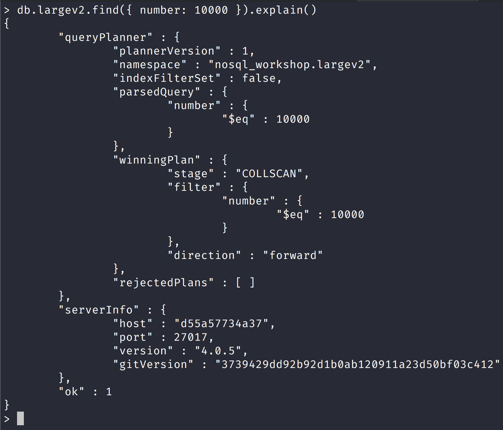
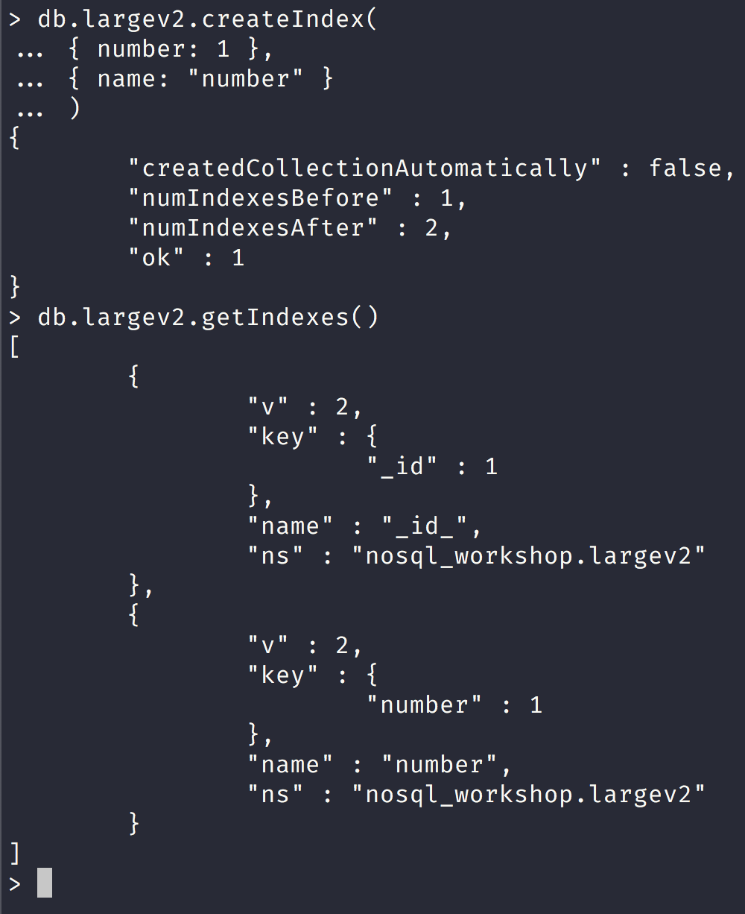

NoSQL Workshop - Mongo Indexes Part II

## Sections:

* [Load collection with large amount of data](#load-collection-with-large-amount-of-data)
* [Reading Query Plan in Mongo Shell](#reading-query-plan-in-mongo-shell)
* [MongoDB Indexes Exercises](#mongodb-indexes-exercises)
* [Bread Crumb Navigation](#bread-crumb-navigation)

The information below comes from [MongoDB Reference on Indexes](https://docs.mongodb.com/manual/indexes/)

## Load collection with large amount of data

We will load a collection named 'large' with large amount of data into the nosql_workshop database.

The following script will load however many documents into a collection that you prescribe into the nosql_workshop database.

```js
"use strict";

var db = connect("localhost:27017");

class Large {
    constructor(numberOfDocuments, targetDB, collectionName) {
        this.numberOfDocuments = numberOfDocuments;
        this.targetDB = targetDB;
        this.collectionName = collectionName;
        db = this.setDB(this.targetDB);
        this.words = [
            // Hidden for brevity!!
            ....
        ];
    }
    help() {
		print('------------------------------------------------------------------------------------------------');
		print('');
        print('Usage:');
        print("Pass in 3 arguments into Large Class:\n\tnumberOfDocuments should be an integer.\n\ttargetDB is the database name.\n\tcollectionName is the name of the collection to insert documents to.")
        print("\tvar collection = new Large(1000000, \"dbName\", \"collName\"");
        print("\tcollection.generateDocuments()")
		print('------------------------------------------------------------------------------------------------');
		
    }
    setDB(targetDB) {
        return db.getSiblingDB(targetDB);
    }
    dropCollection(collectionName) {
        db.getCollection(collectionName).drop();
    }
    generateDocuments() {
        this.dropCollection(this.collectionName);
        this.documents = [];
		for (let i = 0; i < this.numberOfDocuments; i++) {
            this.documents.push({
                _id: new ObjectId(),
                number: i,
                word: this.words[i]
            });
        }
        db.getCollection(this.collectionName).insertMany(this.documents);
	}
}
```

## Reading Query Plan in Mongo Shell with Large Collection

Now let use look at the following query for the new largev2 document that we created with the following command:

```bash
collection = new Large(1000000, "nosql_workshop", "largev2");
collection.generateDocuments();
db.largev2.updateMany({}, { 
    $set: { num: Math.floor(Math.random() * 100) } 
});
```

We will query for one document in the following query and use the *explain()* command with no argument:



#### Understanding the Query Plan Information relationship with indexes

In the previous image we did not give any argument to the `.explain()` command and so by default the *queryPlanner*

There are 3 verbosity levels for the explain command:

[Verbosity Modes](https://docs.mongodb.com/manual/reference/method/db.collection.explain/index.html#verbosity-modes)

1. `db.collection.explain()`
    1. If you don't provide any argument in the *.explain()* method, then it uses the "queryPlanner" verbosity by default.
    2. It returns the queryPlanner information for the evaluated method.
    3. You could also just do `db.collection.explain("queryPlanner")` but it is on by default so just omit an argument.

Here is a sample run for the queryPlanner method:


2. `db.collection.explain("executionStats")`
    1. If you specify "executionStats", you will get the queryPlanner and the executionStats information for the evaluated method.
    2. You will not get the query execution information for the rejected plans however. 

Here is a sample run for the execution stats:

```js
db.largev2.find({ number: { $gt: 400000 } }).explain('executionStats')
{
	"queryPlanner" : {
		"plannerVersion" : 1,
		"namespace" : "nosql_workshop.largev2",
		"indexFilterSet" : false,
		"parsedQuery" : {
			"number" : {
				"$gt" : 400000
			}
		},
		"winningPlan" : {
			"stage" : "COLLSCAN",
			"filter" : {
				"number" : {
					"$gt" : 400000
				}
			},
			"direction" : "forward"
		},
		"rejectedPlans" : [ ]
	},
	"executionStats" : {
		"executionSuccess" : true,
		"nReturned" : 599999,
		"executionTimeMillis" : 584,
		"totalKeysExamined" : 0,
		"totalDocsExamined" : 1000000,
		"executionStages" : {
			"stage" : "COLLSCAN",
			"filter" : {
				"number" : {
					"$gt" : 400000
				}
			},
			"nReturned" : 599999,
			"executionTimeMillisEstimate" : 392,
			"works" : 1000002,
			"advanced" : 599999,
			"needTime" : 400002,
			"needYield" : 0,
			"saveState" : 7813,
			"restoreState" : 7813,
			"isEOF" : 1,
			"invalidates" : 0,
			"direction" : "forward",
			"docsExamined" : 1000000
		}
	},
	"serverInfo" : {
		"host" : "2d7dd8d69672",
		"port" : 27017,
		"version" : "4.0.5",
		"gitVersion" : "3739429dd92b92d1b0ab120911a23d50bf03c412"
	},
	"ok" : 1
}
```

Notice here that this query did a collection scan!

Also notice the ratio for:
    "executionStats.totalDocsExamined" / "executionStats.nReturned" ==>
    1000000 / 599999 = 1.6

In general what you want to see is a ratio of 1 to 1 for the number of total documents examined to number returned. 

This is where an index would be useful so that you get much better query performance.

> In general, if keysExamined is much higher than nreturned, the database is scanning many index keys to find the result documents. Consider creating or adjusting indexes to improve query performance.

###### Adding index for the number field to improve query performance

Let us add an index to the number field and we can see indexes available in a collection using the `db.collection.getIndexes()` method:

```js
db.largev2.getIndexes()
[
	{
		"v" : 2,
		"key" : {
			"_id" : 1
		},
		"name" : "_id_",
		"ns" : "nosql_workshop.largev2"
	}
]
```

Notice here that we only have the default index for the `_id` field.

We can add an index using the [db.collection.createIndex(...) method](https://docs.mongodb.com/manual/reference/method/db.collection.createIndex/index.html#definition)



*Notice that in the screenshot we created a new index for the number field and used the options document to give our index a name but mongodb will create a name for your index by default!*

Now let us rerun the explain query to see if our query performed better:

```js
db.largev2.find({ number: { $gt: 400000 } }).explain('executionStats')
{
	"queryPlanner" : {
		"plannerVersion" : 1,
		"namespace" : "nosql_workshop.largev2",
		"indexFilterSet" : false,
		"parsedQuery" : {
			"number" : {
				"$gt" : 400000
			}
		},
		"winningPlan" : {
			"stage" : "FETCH",
			"inputStage" : {
				"stage" : "IXSCAN",
				"keyPattern" : {
					"number" : 1
				},
				"indexName" : "number",
				"isMultiKey" : false,
				"multiKeyPaths" : {
					"number" : [ ]
				},
				"isUnique" : false,
				"isSparse" : false,
				"isPartial" : false,
				"indexVersion" : 2,
				"direction" : "forward",
				"indexBounds" : {
					"number" : [
						"(400000.0, inf.0]"
					]
				}
			}
		},
		"rejectedPlans" : [ ]
	},
	"executionStats" : {
		"executionSuccess" : true,
		"nReturned" : 599999,
		"executionTimeMillis" : 703,
		"totalKeysExamined" : 599999,
		"totalDocsExamined" : 599999,
		"executionStages" : {
			"stage" : "FETCH",
			"nReturned" : 599999,
			"executionTimeMillisEstimate" : 604,
			"works" : 600000,
			"advanced" : 599999,
			"needTime" : 0,
			"needYield" : 0,
			"saveState" : 4688,
			"restoreState" : 4688,
			"isEOF" : 1,
			"invalidates" : 0,
			"docsExamined" : 599999,
			"alreadyHasObj" : 0,
			"inputStage" : {
				"stage" : "IXSCAN",
				"nReturned" : 599999,
				"executionTimeMillisEstimate" : 192,
				"works" : 600000,
				"advanced" : 599999,
				"needTime" : 0,
				"needYield" : 0,
				"saveState" : 4688,
				"restoreState" : 4688,
				"isEOF" : 1,
				"invalidates" : 0,
				"keyPattern" : {
					"number" : 1
				},
				"indexName" : "number",
				"isMultiKey" : false,
				"multiKeyPaths" : {
					"number" : [ ]
				},
				"isUnique" : false,
				"isSparse" : false,
				"isPartial" : false,
				"indexVersion" : 2,
				"direction" : "forward",
				"indexBounds" : {
					"number" : [
						"(400000.0, inf.0]"
					]
				},
				"keysExamined" : 599999,
				"seeks" : 1,
				"dupsTested" : 0,
				"dupsDropped" : 0,
				"seenInvalidated" : 0
			}
		}
	},
	"serverInfo" : {
		"host" : "2d7dd8d69672",
		"port" : 27017,
		"version" : "4.0.5",
		"gitVersion" : "3739429dd92b92d1b0ab120911a23d50bf03c412"
	},
	"ok" : 1
}
```

Notice that the field "winningPlan.inputStage.stage" : "IXSCAN"

This indicates that an index was used which is what we want!

Also notice that our ratio for:

"executionStats.totalDocsExamined" / "executionStats.nReturned" ==>
599999 / 599999 = 1

Now we have a 1 to 1 ratio for our query which means we have a much more performant query!
    
3. `db.collection.explain("allPlansExecution")`
    1. If you specify the "allPlansExecution" mode, then you will get the statistics for the other candidate plans that the query optimizer selected or that it rejected.
    2. This is the most verbose setting in the `.explain()` command.

Here is a sample run for the "allPlansExecution" query plan which shows the rejected plans:

```js
db.largev2.find({ number: { $gt: 400000 } }).explain('allPlansExecution')
{
	"queryPlanner" : {
		"plannerVersion" : 1,
		"namespace" : "nosql_workshop.largev2",
		"indexFilterSet" : false,
		"parsedQuery" : {
			"number" : {
				"$gt" : 400000
			}
		},
		"winningPlan" : {
			"stage" : "FETCH",
			"inputStage" : {
				"stage" : "IXSCAN",
				"keyPattern" : {
					"number" : 1
				},
				"indexName" : "number",
				"isMultiKey" : false,
				"multiKeyPaths" : {
					"number" : [ ]
				},
				"isUnique" : false,
				"isSparse" : false,
				"isPartial" : false,
				"indexVersion" : 2,
				"direction" : "forward",
				"indexBounds" : {
					"number" : [
						"(400000.0, inf.0]"
					]
				}
			}
		},
		"rejectedPlans" : [ ]
	},
	"executionStats" : {
		"executionSuccess" : true,
		"nReturned" : 599999,
		"executionTimeMillis" : 662,
		"totalKeysExamined" : 599999,
		"totalDocsExamined" : 599999,
		"executionStages" : {
			"stage" : "FETCH",
			"nReturned" : 599999,
			"executionTimeMillisEstimate" : 608,
			"works" : 600000,
			"advanced" : 599999,
			"needTime" : 0,
			"needYield" : 0,
			"saveState" : 4690,
			"restoreState" : 4690,
			"isEOF" : 1,
			"invalidates" : 0,
			"docsExamined" : 599999,
			"alreadyHasObj" : 0,
			"inputStage" : {
				"stage" : "IXSCAN",
				"nReturned" : 599999,
				"executionTimeMillisEstimate" : 243,
				"works" : 600000,
				"advanced" : 599999,
				"needTime" : 0,
				"needYield" : 0,
				"saveState" : 4690,
				"restoreState" : 4690,
				"isEOF" : 1,
				"invalidates" : 0,
				"keyPattern" : {
					"number" : 1
				},
				"indexName" : "number",
				"isMultiKey" : false,
				"multiKeyPaths" : {
					"number" : [ ]
				},
				"isUnique" : false,
				"isSparse" : false,
				"isPartial" : false,
				"indexVersion" : 2,
				"direction" : "forward",
				"indexBounds" : {
					"number" : [
						"(400000.0, inf.0]"
					]
				},
				"keysExamined" : 599999,
				"seeks" : 1,
				"dupsTested" : 0,
				"dupsDropped" : 0,
				"seenInvalidated" : 0
			}
		},
		"allPlansExecution" : [ ]
	},
	"serverInfo" : {
		"host" : "2d7dd8d69672",
		"port" : 27017,
		"version" : "4.0.5",
		"gitVersion" : "3739429dd92b92d1b0ab120911a23d50bf03c412"
	},
	"ok" : 1
}
```

Notice here that "queryPlanner.rejectedPlans" which is the rejected plans is an empty array.

If the query execution planner had more plans we would have seen some rejected plans, but alas we did not.

#### Query Planner Stage Names

Each stage has a name and the name describes the operation. 

The most important names are:

* COLLSCAN – Collection scan
* IXSCAN – Scan of data in index keys
* FETCH – Retrieving documents
* SHARD_MERGE – Merging results from shards
* SORT – Explicit sort rather than using index order

We have already seen COLLSCAN (Collection Scans) and IXSCAN (Index scan) we will look at more queries that use the other stages later on the workshop.

#### Covered Queries

[Covered Queries](https://docs.mongodb.com/manual/core/query-optimization/#covered-query)

> A covered query is a query that can be satisfied entirely using an index and does not have to examine any documents. An index covers a query when both of the following apply:

* all the fields in the query are part of an index, and
* all the fields returned in the results are in the same index.

Here is a sample run that uses a covered query:

```js
db.largev2.find({ number: { $gt: 400000 } }, { _id: 0, number: 1 }).explain('executionStats')
{
	"queryPlanner" : {
		"plannerVersion" : 1,
		"namespace" : "nosql_workshop.largev2",
		"indexFilterSet" : false,
		"parsedQuery" : {
			"number" : {
				"$gt" : 400000
			}
		},
		"winningPlan" : {
			"stage" : "PROJECTION",
			"transformBy" : {
				"_id" : 0,
				"number" : 1
			},
			"inputStage" : {
				"stage" : "IXSCAN",
				"keyPattern" : {
					"number" : 1
				},
				"indexName" : "number",
				"isMultiKey" : false,
				"multiKeyPaths" : {
					"number" : [ ]
				},
				"isUnique" : false,
				"isSparse" : false,
				"isPartial" : false,
				"indexVersion" : 2,
				"direction" : "forward",
				"indexBounds" : {
					"number" : [
						"(400000.0, inf.0]"
					]
				}
			}
		},
		"rejectedPlans" : [ ]
	},
	"executionStats" : {
		"executionSuccess" : true,
		"nReturned" : 599999,
		"executionTimeMillis" : 420,
		"totalKeysExamined" : 599999,
		"totalDocsExamined" : 0,
		"executionStages" : {
			"stage" : "PROJECTION",
			"nReturned" : 599999,
			"executionTimeMillisEstimate" : 302,
			"works" : 600000,
			"advanced" : 599999,
			"needTime" : 0,
			"needYield" : 0,
			"saveState" : 4688,
			"restoreState" : 4688,
			"isEOF" : 1,
			"invalidates" : 0,
			"transformBy" : {
				"_id" : 0,
				"number" : 1
			},
			"inputStage" : {
				"stage" : "IXSCAN",
				"nReturned" : 599999,
				"executionTimeMillisEstimate" : 192,
				"works" : 600000,
				"advanced" : 599999,
				"needTime" : 0,
				"needYield" : 0,
				"saveState" : 4688,
				"restoreState" : 4688,
				"isEOF" : 1,
				"invalidates" : 0,
				"keyPattern" : {
					"number" : 1
				},
				"indexName" : "number",
				"isMultiKey" : false,
				"multiKeyPaths" : {
					"number" : [ ]
				},
				"isUnique" : false,
				"isSparse" : false,
				"isPartial" : false,
				"indexVersion" : 2,
				"direction" : "forward",
				"indexBounds" : {
					"number" : [
						"(400000.0, inf.0]"
					]
				},
				"keysExamined" : 599999,
				"seeks" : 1,
				"dupsTested" : 0,
				"dupsDropped" : 0,
				"seenInvalidated" : 0
			}
		}
	},
	"serverInfo" : {
		"host" : "2d7dd8d69672",
		"port" : 27017,
		"version" : "4.0.5",
		"gitVersion" : "3739429dd92b92d1b0ab120911a23d50bf03c412"
	},
	"ok" : 1
}
```

Notice that we had an additional stage of "PROJECTION" since we did provide an additional document for projection with `{ _id: 0, number : 1}` in our query.

We can confirm that no documents were examined with the key:

"executionStats.totalDocsExamined": 0 => no documents examined so this is a covered query.

Also notice that the field "executionStats.executionTimeMillis" : 420 

Our query executed in 420 milliseconds which is a fast query indeed for a 1 million document collection!

#### MongoDB Indexes Exercises

###### Indexes Exercise 1

Please create the following collection called indexes:

```bash
var department = ["QA", "Engineering", "Product", "DevOps"]

for (i = 0; i < 100000; i++) {
	db.indexes.insert({
		_id: new ObjectId(),
		empId: "empId" + i,
		department: department[Math.round(Math.random() * 3)]
	});
}
```

This will insert 100K documents into the indexes collection.

The exercises is to create an index for empId field and to make query for the employee with the employee id "empId1000" and make sure to make it a covered query.

<details>
   <summary>Answer</summary>
   <pre>
   db.indexes.createIndex({
		empId: 1
	}, {
		name: "empId"
	});
   </pre>
   <h5>A covered query is a query that can be satisfied entirely using an index and does not have to examine any documents. An index covers a query when both of the following apply. If you look at the executionStats you will notice that totalDocsExamined is 0, nReturned is 1 and totalKeysExamined is 1 so this is a covered query.</h5>
   <pre>
   db.indexes.find({ empId: "empId1000" }, { _id: 0, empId: 1 }).explain("executionStats")
   </pre>
</details>

###### Indexes Exercise 2

Please update the indexes collection with the following information:

```bash
db.indexes.find({}).toArray().forEach(function(doc) { 
    db.indexes.update({ _id: doc._id }, {
        $set: {
            x: Math.floor(Math.random() * 1000),
            y: Math.floor(Math.random() * 100),
            z: Math.floor(Math.random() * 10)
        }
    });
});
```

Now create a compound index for the fields x, y, and z.

<details>
   <summary>Answer</summary>
   <pre>
   db.indexes.createIndex({
		x: 1,
		y: 1,
		z: 1
	}, {
		name: "x_y_z"
	});
   </pre>
</details>

Next make a query with the compound indexes. Remember that with compound indices that the leftmost rule applies else the query will resort to a full collection scan:

<details>
	<summary>Answer</summary>
	<pre>
	db.indexes.find({ x: { $gt: 0 }, z: 7 }, { z: 1, _id: 0 }).explain('executionStats')
	</pre>
</details>

## Bread Crumb Navigation
_________________________

Previous | Next
:------- | ---:
← [MongoDB Indexes Part I](./mongodb_indexes_partI.md) |[MongoDB Query Performance](./mongodb-query-performance.md) →
