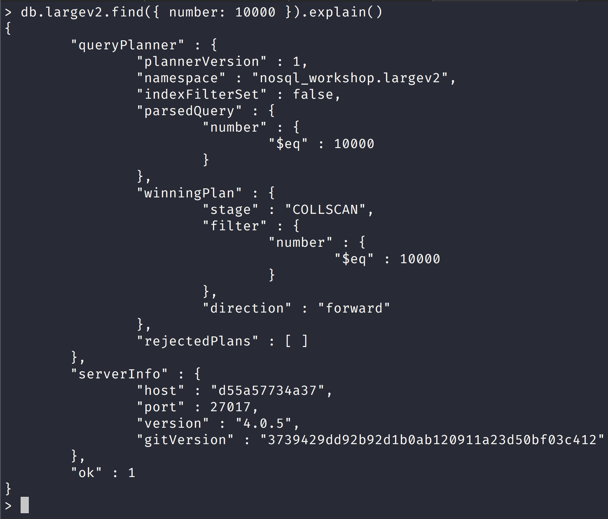

NoSQL Workshop - Mongo Indexes Part II

## Sections:

* [Load collection with large amount of data](#load-collection-with-large-amount-of-data)
* [Reading Query Plan in Mongo Shell](#reading-query-plan-in-mongo-shell)
* [Bread Crumb Navigation](#bread-crumb-navigation)

The information below comes from [MongoDB Reference on Indexes](https://docs.mongodb.com/manual/indexes/)

## Load collection with large amount of data

We will load a collection named 'large' with large amount of data into the nosql_workshop database.

The following script will load 1 million documents into a collection that you prescribe into the nosql_workshop database.


```js
"use strict";

let db = connect("localhost:27017");

class Large {
    constructor(numberOfDocuments, targetDB, collectionName) {
        this.numberOfDocuments = numberOfDocuments;
        this.targetDB = targetDB;
        this.collectionName = collectionName;
        db = this.setDB(this.targetDB);
        this.words = [
            ....
        ];
    }
    help() {
		print('------------------------------------------------------------------------------------------------');
		print('');
        print('Usage:');
        print("Pass in 3 arguments into Large Class:\n\tnumberOfDocuments should be an integer.\n\ttargetDB is the database name.\n\tcollectionName is the name of the collection to insert documents to.")
        print("\tvar collection = new Large(1000000, \"dbName\", \"collName\"");
        print("\tcollection.generateDocuments()")
		print('------------------------------------------------------------------------------------------------');
		
    }
    setDB(targetDB) {
        return db.getSiblingDB(targetDB);
    }
    dropCollection(collectionName) {
        db.getCollection(collectionName).drop();
    }
    generateDocuments() {
        this.dropCollection(this.collectionName);
        this.documents = [];
		for (let i = 0; i < this.numberOfDocuments; i++) {
            this.documents.push({
                _id: new ObjectId(),
                number: i,
                word: this.words[i]
            });
        }
        db.getCollection(this.collectionName).insertMany(this.documents);
	}
}
```

## Reading Query Plan in Mongo Shell

Now let use look at the following query for the new largev2 document that we created with the following command:

```bash
collection = new Large(1000000, "nosql_workshop", "largev2");
collection.generateDocuments();
db.largev2.updateMany({}, { 
    $set: { num: Math.floor(Math.random() * 100) } 
});
```

We will query for one document in the following query and use the *explain()* command with no argument:



#### Understanding the Query Plan Information relationship with indexes

Content

## Bread Crumb Navigation
_________________________

Previous | Next
:------- | ---:
← [MongoDB Indexes Part I](./mongodb_indexes_partI.md) | [MongoDB Security](./mongodb_security.md) →
