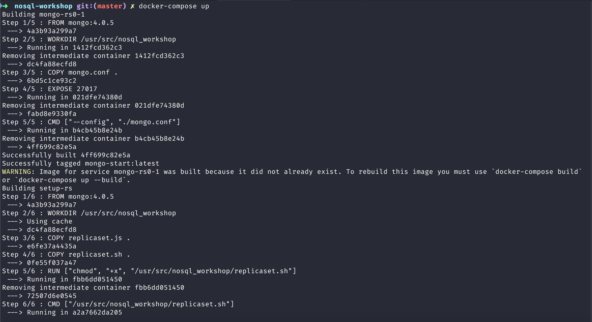
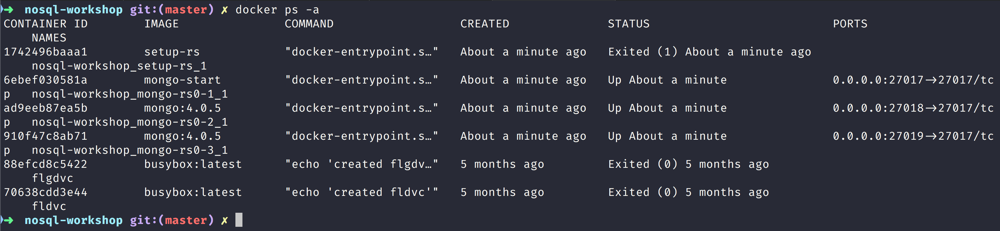

# NoSQL Workshop - Mongo Transactions

## Sections:

* [Production Considerations](#production-considerations)
* [Bread Crumb Navigation](#bread-crumb-navigation)

## Production Considerations

Please read [Production Considerations documenation in Official Documentation](https://docs.mongodb.com/manual/core/transactions-production-consideration/)

#### Transactions

Please read the official documentation on [MongoDB Transactions](https://docs.mongodb.com/manual/core/transactions/)

If you would like to try out a replicaset then run the following to stop the docker container:

```bash
docker stop $(docker ps -a | grep mongo | awk '{print $1}')
```

This will stop the running mongo container that has been running in the workshop.

Now run the docker-compose yml script with the following command in the root of the repository:

```bash
docker-compose up
```

This will build several images and get a replica set running which we can confirm like this:



Now you should have 3 running mongo replica sets like this:



Now go ahead and try to run the following script:

```js
"use strict";

// Enables or disables the features that persist data incompatible with earlier versions of MongoDB. 
// You can only issue the setFeatureCompatibilityVersion against the admin database.
db.adminCommand({ setFeatureCompatibilityVersion: "4.0" });

// Start a session.
const session = db.getMongo().startSession( { readPreference: { mode: "primary" } } );

const employeesCollection = session.getDatabase("hr").employees;

// Start a transaction
session.startTransaction({ 
    readConcern: { level: "snapshot" }, 
    writeConcern: { w: "majority" } 
});

// Operations inside the transaction
try {
   employeesCollection.updateOne( { employee: 3 }, { $set: { status: "Inactive" } } );
} catch (error) {
   // Abort transaction on error
   session.abortTransaction();
   throw error;
}

// Commit the transaction using write concern set at transaction start
session.commitTransaction();

session.endSession();
```

## Transactions and Operations

Please read the official docs on [MongoDB Transactions and Operations](https://docs.mongodb.com/manual/core/transactions-operations/).

## Bread Crumb Navigation
_________________________

Previous | Next
:------- | ---:
← [MongoDB Data Models](./mongodb_data_models.md) | [MongoDB Indexes](./mongodb_indexes.md) →
